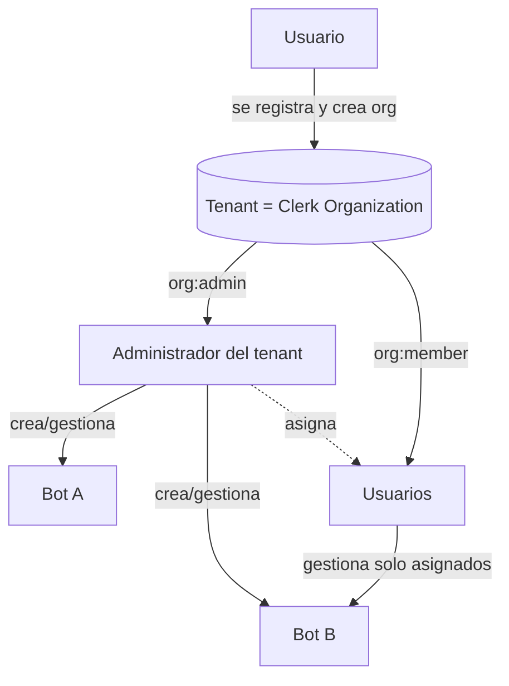

# bot-plataform

Plataforma de bots conversacionales sobre **Evolution API** (WhatsApp) y **Chatwoot** (atención humana), desplegada en la infraestructura Dokploy gestionada desde [`cloud-manager`](../../). Repo independiente, montado como submódulo en `cloud-manager/projects/bot-plataform`.

## Stack

| Capa | Tecnología | Por qué |
|---|---|---|
| **Backend** | [Hono](https://hono.dev) + TypeScript + [Drizzle ORM](https://orm.drizzle.team) | Ultraligero, rapidísimo, TS de punta a punta. |
| **Frontend** | [Vite](https://vitejs.dev) + React + [shadcn/ui](https://ui.shadcn.com) + Tailwind | SPA simple y veloz para el dashboard. |
| **Auth** | [Clerk](https://clerk.com) (managed) + Organizations | Capa liviana + multitenancy nativa (tenant = organización). |
| **DB** | Postgres `labs` compartido (Dokploy) | Reutiliza el recurso existente, DB `botplatform`. |
| **Cache** | Redis compartido (Dokploy), db index `5` | Mismo patrón que Evolution/Chatwoot/Postiz. |
| **Monorepo** | pnpm workspaces | Tipos compartidos entre backend y frontend. |

## Estructura

```
bot-plataform/
├── apps/
│   ├── backend/        # Hono API
│   │   └── src/
│   │       ├── index.ts          # entry + CORS + rutas
│   │       ├── env.ts            # validación de env (zod)
│   │       ├── db/               # drizzle: schema + client
│   │       ├── middleware/auth.ts # verificación de token Clerk
│   │       ├── routes/           # health, bots, webhooks
│   │       └── integrations/     # clientes Evolution + Chatwoot
│   └── frontend/       # Vite + React + shadcn
│       └── src/        # main, App (dashboard), lib/api (fetch + Clerk)
├── packages/
│   └── shared/         # tipos + schemas zod compartidos (contratos de API)
└── infra/
    └── dokploy/        # docker-compose + dokploy.json + README de despliegue
```

## Autenticación y multitenancy

El tenant es una **Organización de Clerk**. No mantenemos tablas de usuarios/membresías propias: Clerk gestiona registro, login, invitaciones y roles; nosotros scopeamos los datos por `tenantId` (org id).



| Concepto | Implementación |
|---|---|
| **Tenant** | Organización de Clerk (`tenantId` = org id) |
| **Admin del tenant** | rol Clerk `org:admin` — crea bots, gestiona usuarios y asignaciones |
| **Usuario** | rol Clerk `org:member` — gestiona solo los bots que le asignen |
| **Invitar/quitar usuarios** | UI nativa de Clerk (`OrganizationSwitcher` → *Manage organization*) |
| **Asignación bot ↔ usuario** | tabla propia `bot_assignments` (Clerk no lo cubre) |

Flujo: el middleware [`auth.ts`](apps/backend/src/middleware/auth.ts) verifica el token de Clerk y expone `userId`, `tenantId` (`org_id`) y `tenantRole` (`org_role`). `requireTenant` exige org activa y `requireAdmin` exige `org:admin`.

> ⚠️ **Habilita Organizations en el dashboard de Clerk** (Configure → Organizations) o el registro de tenants no funcionará.

### Endpoints

| Método | Ruta | Acceso |
|---|---|---|
| `GET` | `/api/me` | autenticado — identidad + tenant + rol |
| `GET` | `/api/bots` | admin: todos los del tenant · member: solo asignados |
| `POST` `PATCH` `DELETE` | `/api/bots[/:id]` | solo admin |
| `GET` | `/api/team/members` | solo admin — miembros del tenant (vía Clerk) |
| `GET` `POST` | `/api/team/assignments` | solo admin — asignar bots a usuarios |
| `DELETE` | `/api/team/assignments/:id` | solo admin |

## Desarrollo local

```bash
pnpm install

# Copia y rellena los .env de cada app
cp apps/backend/.env.example apps/backend/.env
cp apps/frontend/.env.example apps/frontend/.env

# Backend (:3000) y frontend (:5173) en paralelo
pnpm dev
```

El frontend hace proxy de `/api` al backend en dev (ver `vite.config.ts`).

### Base de datos

```bash
pnpm db:generate   # genera migraciones desde apps/backend/src/db/schema.ts
pnpm db:migrate    # aplica migraciones (necesita DATABASE_URL)
```

## Despliegue

Todo el flujo de despliegue en Dokploy está en [`infra/dokploy/README.md`](./infra/dokploy/README.md): crear proyecto/compose, conectar GitHub, dominios (`bots.diegop.com`, `api.bots.diegop.com`), variables y webhooks.

## Integraciones

- **Evolution API** (`https://evolutionapi.diegop.com`, header `apikey`) — envío/recepción de WhatsApp. Cliente en `apps/backend/src/integrations/evolution.ts`.
- **Chatwoot** (`https://chatwoot.diegop.com`, header `api_access_token`) — escalado a agentes humanos. Cliente en `apps/backend/src/integrations/chatwoot.ts`.

Webhooks entrantes en `POST /webhooks/evolution` y `POST /webhooks/chatwoot` (protegidos por `WEBHOOK_SECRET`).
