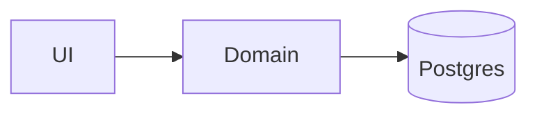
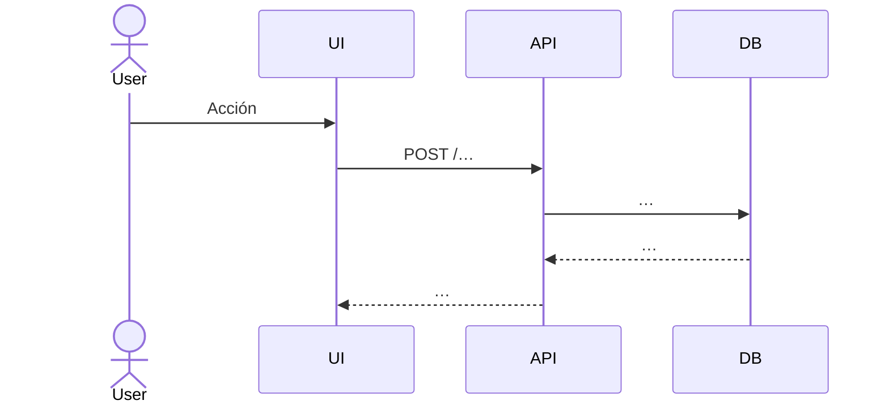

## Cuándo usarla

- `requirements.md` ya está **firmado** por el humano.
- Historia entra al estado **Creación de diseño**.
- Se necesita refactor de diseño tras feedback técnico.

## Filosofía

`design.md` responde **"¿con qué arquitectura, componentes y contratos se va a construir?"**. Es más técnico que `requirements.md`, pero sigue siendo un documento sobre el que se alinean los distintos roles del equipo de desarrollo. Se refina mediante **socialización iterativa**.

Cada bloque técnico debe poder rastrearse a un requisito del documento anterior (cita: "cubre 1.1, 1.3").

## Herramientas obligatorias

- **Mermaid** para todos los diagramas (arquitectura, secuencia, ER, estado).
- **Estructura de carpetas** explícita con los archivos a crear o modificar.
- **Fragmentos de código** cuando aclaran contratos (interfaces, tipos, SQL).
- **Pseudocódigo formal** con pre/postcondiciones para lógica no trivial.

## Anatomía según el flujo

### Flujo Feature (Design First / Requirements First)

| Sección | Propósito |
|---|---|
| Overview | Resumen ejecutivo: qué hace, qué endpoints consume, qué patrones sigue, qué reutiliza. |
| Architecture | Diagrama Mermaid con capas (presentación, dominio, infraestructura) y relaciones. |
| Sequence Diagrams | Flujos clave (carga de datos, interacción, cambio de estado) en diagramas de secuencia. |
| Components and Interfaces | Cada componente con ubicación, responsabilidades e interface (props, métodos, tipos). |
| Data Models | Interfaces de dominio, DTOs, tabla campo-a-campo con transformaciones. |
| Algorithmic Pseudocode | Lógica de negocio compleja con pre/postcondiciones. |
| Correctness Properties | Propiedades formales que deben cumplirse — verificables por property-based testing. |
| Error Handling | Escenarios, respuesta del sistema, estrategia de recuperación. |
| Testing Strategy | Unit, property-based (fast-check), integration; estructura de archivos. |
| Performance / Security / Dependencies | Consideraciones técnicas transversales. |

### Flujo Bugfix

| Sección | Propósito |
|---|---|
| Overview | Resumen técnico del problema y la solución propuesta. |
| Glossary | Definiciones del dominio del bug. |
| Bug Details | Bug condition formal + ejemplos concretos de reproducción. |
| Expected Behavior | Preservation requirements detallados y scope del fix. |
| Hypothesized Root Cause | Análisis causal numerado — causa raíz técnica. |
| Correctness Properties | Property 1 (Bug Condition / aislamiento), Property 2 (Preservation). |
| Fix Implementation | Cambios por archivo: qué añadir, qué eliminar, qué no tocar. |
| Testing Strategy | Multinivel: Exploratory Bug Condition, Fix Checking, Preservation Checking, Unit, Property-Based, Integration. |

## Plantilla — flujo Feature

```markdown
---
id: US-00X
flow: feature
---

# Design — US-00X · Título

## Overview
_(3-6 frases. Qué hace, qué endpoints consume, qué patrones reutiliza.)_

## Architecture



## Sequence Diagrams



## Components and Interfaces

### `<ComponenteX>` — `apps/<workspace>/src/…`
Responsabilidades:
- …

```ts
interface ComponenteX {
  // contrato público
}
```

## Data Models

| Campo (UI) | DTO API | DB | Transformación |
|---|---|---|---|
| … | … | … | … |

## Algorithmic Pseudocode

```
function nombre(input):
  precondición: …
  postcondición: …
  …
```

## Correctness Properties
- **P1** — Para toda entrada válida, …
- **P2** — …

## Error Handling
| Escenario | Respuesta | Recuperación |
|---|---|---|
| … | … | … |

## Testing Strategy
- Unit: …
- Property-based (fast-check): …
- Integration: …

## Performance / Security / Dependencies
- …

## Trazabilidad
Cubre requisitos: 1.1, 1.2, 2.1.
```

## Plantilla — flujo Bugfix

```markdown
---
id: US-00X
flow: bugfix
---

# Design — US-00X · Bug · Título

## Overview
_(Problema en 2 frases. Solución en 2 frases.)_

## Glossary
| Término | Definición |
|---|---|

## Bug Details
**Bug condition:** `…` (formal, citable).

**Reproducción:**
1. …
2. …

## Expected Behavior
Preservation requirements (qué NO debe cambiar):
- …

Scope del fix:
- Dentro: …
- Fuera: …

## Hypothesized Root Cause
1. …
2. …

## Correctness Properties
- **P1 (Bug Condition)** — tras el fix, la condición no se reproduce.
- **P2 (Preservation)** — comportamiento previo no cambia para entradas no afectadas.

## Fix Implementation
### `apps/<workspace>/src/<archivo>.ts`
- Añadir: …
- Eliminar: …
- No tocar: …

## Testing Strategy
- Exploratory Bug Condition Checking: …
- Fix Checking (pseudocódigo): …
- Preservation Checking (pseudocódigo): …
- Unit: …
- Property-based: …
- Integration: …

## Trazabilidad
Cubre requisitos: 1.1.
```

## Transición

Al cerrar diseño con el humano:
- Actualiza `index.md` → `status: Levantamiento de tareas`.
- Pasa el control a la skill `story-tasks`.
