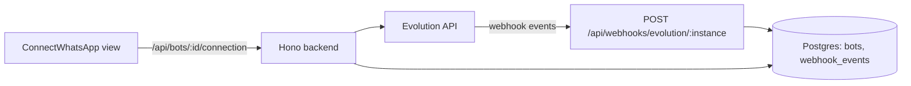
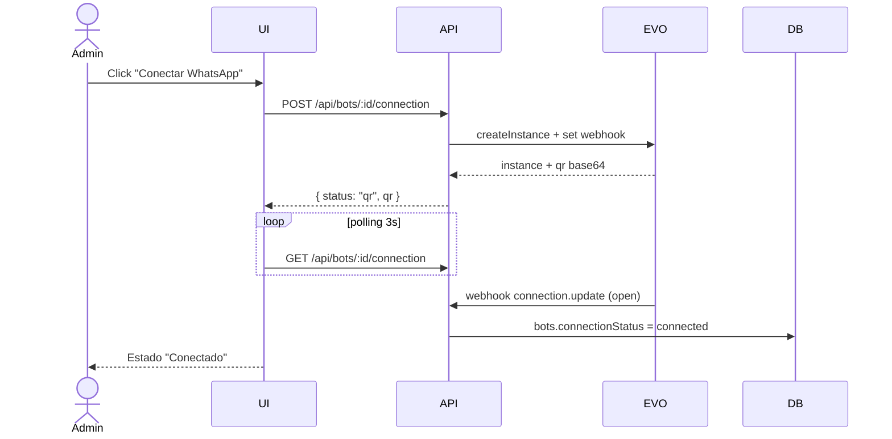

# Design — US-005 · Registro y vinculación de número WhatsApp

## Overview

Extiende `routes/bots.ts` e `integrations/evolution.ts` para gestionar el ciclo de vida de la instancia: crear, obtener QR, estado y logout. Añade columna `connectionStatus` a `bots` y un endpoint webhook `POST /api/webhooks/evolution/:instance` que procesa eventos `connection.update` y `qrcode.updated`. El frontend agrega una vista de conexión con polling del estado.

## Architecture



## Sequence Diagrams



## Components and Interfaces

### `EvolutionClient` — `apps/backend/src/integrations/evolution.ts`
Responsabilidades: encapsular el API REST de Evolution (crear instancia, QR, estado, logout, set webhook).

```ts
interface EvolutionClient {
  createInstance(name: string, webhookUrl: string): Promise<{ instance: string }>;
  getConnectionState(instance: string): Promise<"open" | "connecting" | "close">;
  getQr(instance: string): Promise<{ base64: string } | null>;
  logout(instance: string): Promise<void>;
  deleteInstance(instance: string): Promise<void>;
}
```

### `connectionRoutes` — `apps/backend/src/routes/bots.ts`
- `POST /api/bots/:id/connection` — crea/reusa instancia, devuelve QR. Cubre 1.1, 1.2, 2.1.
- `GET /api/bots/:id/connection` — estado + QR vigente. Cubre 2.2, 3.2.
- `DELETE /api/bots/:id/connection` — logout. Cubre 3.3.
- Middleware `requireOrgAdmin` para POST/DELETE. Cubre 1.4.

### `evolutionWebhook` — `apps/backend/src/routes/webhooks.ts`
- `POST /api/webhooks/evolution/:instance` — valida `x-webhook-token` (env `EVOLUTION_WEBHOOK_TOKEN`), resuelve bot por `evolutionInstance`, despacha por tipo de evento. Cubre 4.1–4.4.

### `ConnectWhatsApp` — `apps/frontend/src/pages/bots/ConnectWhatsApp.tsx`
- Render del QR (base64), polling con TanStack Query (`refetchInterval: 3000`), timeout de 5 min, estados visuales por `connectionStatus`.

## Data Models

| Campo (UI) | DTO API | DB | Transformación |
|---|---|---|---|
| Estado conexión | `status: "disconnected"\|"qr"\|"connected"` | `bots.connection_status` (pgEnum) | mapeo `open→connected`, `close→disconnected` |
| QR | `qr: string \| null` | — (efímero, no se persiste) | base64 directo de Evolution |
| Última conexión | `lastConnectedAt` | `bots.last_connected_at timestamptz` | ISO 8601 |
| Evento webhook | — | `webhook_events(id, tenant_id, bot_id, source, type, payload jsonb, created_at)` | raw JSON |

## Algorithmic Pseudocode

```
function handleEvolutionWebhook(instance, token, event):
  precondición: request recibido en endpoint público
  postcondición: estado del bot consistente con Evolution; evento persistido o descartado
  if token != env.EVOLUTION_WEBHOOK_TOKEN: return 401
  bot = findBotByInstance(instance)
  if bot == null: log("unknown instance"); return 200  // no retry storm
  persistEvent(bot.tenantId, bot.id, event)
  if event.type == "connection.update":
    bot.connectionStatus = map(event.state)
    if event.state == "open": bot.lastConnectedAt = now()
  return 200
```

## Correctness Properties

- **P1** — Para todo evento con token inválido, el estado de la DB no cambia.
- **P2** — `bots.connectionStatus` converge al último estado reportado por Evolution (orden por timestamp del evento).
- **P3** — Nunca existen dos instancias de Evolution referenciadas por el mismo bot.
- **P4** — Toda respuesta de `GET /connection` pertenece a un bot del tenant autenticado.

## Error Handling

| Escenario | Respuesta | Recuperación |
|---|---|---|
| Evolution caído al crear instancia | 502 + mensaje | UI ofrece reintentar; sin escritura en DB |
| QR expirado | `GET /connection` devuelve QR nuevo | polling lo renueva solo |
| Webhook de instancia desconocida | 200 (descartado) + log | revisar logs; no reintenta |
| Token webhook inválido | 401 | rotar `EVOLUTION_WEBHOOK_TOKEN` |

## Testing Strategy

- Unit: mapeo de estados Evolution→dominio; guard de token; `findBotByInstance`.
- Property-based (fast-check): P2 con secuencias aleatorias de eventos `connection.update`.
- Integration: flujo POST connection → webhook open → GET connection con Evolution mockeado (msw/nock).

## Performance / Security / Dependencies

- Webhook responde 200 rápido y procesa en línea (payloads pequeños); si crece, cola en memoria.
- `EVOLUTION_API_URL`, `EVOLUTION_API_KEY`, `EVOLUTION_WEBHOOK_TOKEN`, `PUBLIC_WEBHOOK_BASE_URL` en `env.ts` (Zod).
- El QR nunca se persiste ni se loguea (dato sensible de sesión).

## Trazabilidad

Cubre requisitos: 1.1–1.4, 2.1–2.4, 3.1–3.3, 4.1–4.4.
