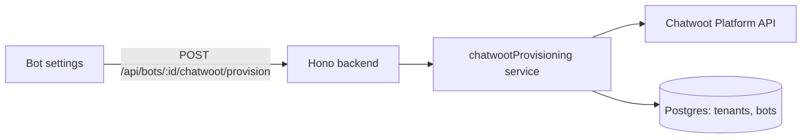
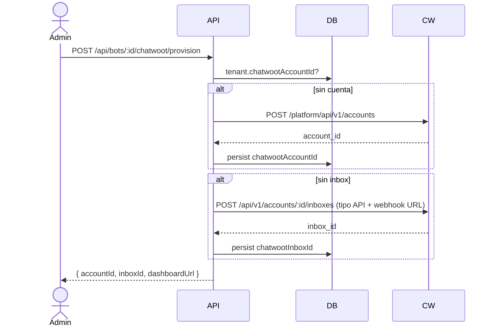

# Design — US-006 · Provisión de cuenta e inbox Chatwoot por tenant

## Overview

Servicio de provisión `provisionChatwoot(botId)` que orquesta el Platform API de Chatwoot: crear cuenta (si falta), crear inbox API (si falta), dar de alta agentes. Idempotente por diseño: cada paso verifica existencia antes de crear. Persistencia en `tenants.chatwoot_account_id` y `bots.chatwoot_inbox_id` (columna ya existente).

## Architecture



## Sequence Diagrams



## Components and Interfaces

### `ChatwootClient` — `apps/backend/src/integrations/chatwoot.ts`

```ts
interface ChatwootClient {
  createAccount(name: string): Promise<{ id: number }>;
  createApiInbox(accountId: number, name: string, webhookUrl: string): Promise<{ id: number; identifier: string }>;
  createPlatformUser(name: string, email: string): Promise<{ id: number }>;
  attachUserToAccount(accountId: number, userId: number, role: "agent" | "administrator"): Promise<void>;
  findUserByEmail(email: string): Promise<{ id: number } | null>;
}
```

### `chatwootProvisioning` — `apps/backend/src/services/chatwoot-provisioning.ts`
Responsabilidades: orquestación idempotente de cuenta → inbox → agentes. Cubre 1.1–1.3, 2.1–2.2, 4.1–4.2.

### Rutas — `apps/backend/src/routes/bots.ts`
- `POST /api/bots/:id/chatwoot/provision` (org:admin). Cubre 1.1, 2.1, 4.1.
- `POST /api/bots/:id/chatwoot/agents` body `{ userId }`. Cubre 3.1, 3.3.

### UI — `apps/frontend/src/pages/bots/ChatwootSettings.tsx`
Estado de provisión, botón provisionar, lista de agentes con alta, link al dashboard de Chatwoot. Cubre 3.2.

## Data Models

| Campo (UI) | DTO API | DB | Transformación |
|---|---|---|---|
| Cuenta | `accountId: number` | `tenants.chatwoot_account_id integer` | directo |
| Inbox | `inboxId: number` | `bots.chatwoot_inbox_id` (existe) | directo |
| Token inbox | — | `bots.chatwoot_inbox_identifier text` | secreto; nunca al frontend |
| URL dashboard | `dashboardUrl: string` | — | `CHATWOOT_URL + /app/accounts/:id` |

## Algorithmic Pseudocode

```
function provisionChatwoot(botId):
  precondición: bot existe y pertenece al tenant autenticado
  postcondición: tenant tiene exactamente 1 cuenta; bot exactamente 1 inbox
  tenant = bot.tenant
  if tenant.chatwootAccountId == null:
    tenant.chatwootAccountId = chatwoot.createAccount(tenant.name)  // persist inmediato
  if bot.chatwootInboxId == null:
    inbox = chatwoot.createApiInbox(tenant.chatwootAccountId, bot.name, webhookUrl(bot))
    bot.chatwootInboxId = inbox.id; bot.chatwootInboxIdentifier = inbox.identifier
  return { accountId, inboxId }
```

## Correctness Properties

- **P1 (idempotencia)** — N ejecuciones de `provisionChatwoot` producen exactamente 1 cuenta y 1 inbox.
- **P2 (recuperación)** — si falla el paso k, re-ejecutar completa los pasos ≥ k sin repetir los < k.
- **P3 (aislamiento)** — ningún endpoint expone `chatwoot_inbox_identifier` ni datos de cuentas de otros tenants.

## Error Handling

| Escenario | Respuesta | Recuperación |
|---|---|---|
| Chatwoot caído | 502 + paso alcanzado | reintentar; P2 garantiza reanudación |
| Email de agente ya existe en Chatwoot | reusar via `findUserByEmail` | transparente (3.3) |
| Cuenta creada pero persist falla | error 500; siguiente intento detecta cuenta por nombre/external_id | log con account_id huérfano |

## Testing Strategy

- Unit: pasos de provisión con cliente mockeado; idempotencia por paso.
- Property-based: P1 con secuencias aleatorias de ejecuciones/fallos inyectados.
- Integration: provisión completa contra Chatwoot mockeado (msw); doble ejecución → misma DB.

## Performance / Security / Dependencies

- `CHATWOOT_URL`, `CHATWOOT_PLATFORM_TOKEN` en `env.ts` (Zod). El platform token nunca sale del backend.
- Provisión es operación admin poco frecuente: sin necesidad de cola.

## Trazabilidad

Cubre requisitos: 1.1–1.3, 2.1–2.3, 3.1–3.3, 4.1–4.2.
