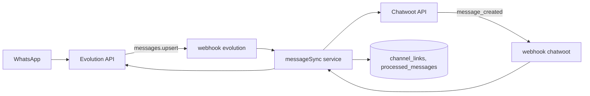
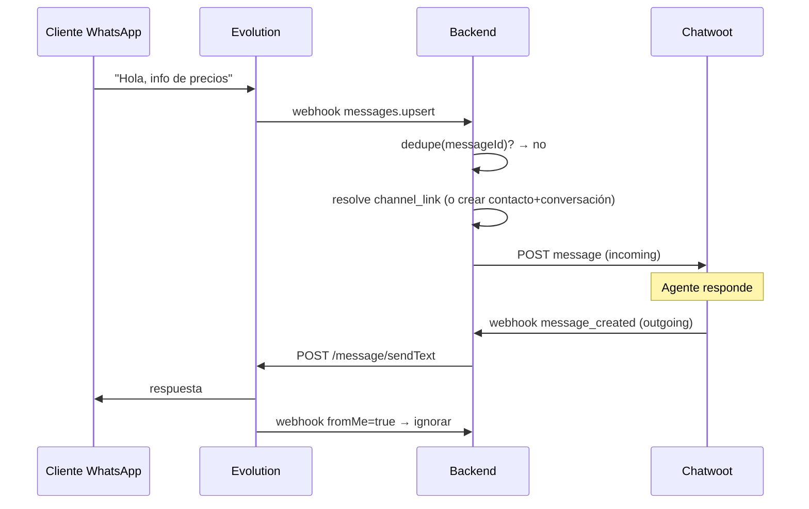

# Design — US-007 · Sincronización bidireccional de mensajes

## Overview

Dos handlers de webhook conectados por un servicio de mapeo: `messages.upsert` de Evolution crea contacto/conversación/mensaje en Chatwoot (Application API); `message_created` de Chatwoot (outgoing, no private) envía texto por Evolution. La tabla `channel_links` persiste el mapeo y `processed_messages` garantiza idempotencia. Reutiliza `webhook_events` de US-005 para auditoría.

## Architecture



## Sequence Diagrams



## Components and Interfaces

### `messageSync` — `apps/backend/src/services/message-sync.ts`

```ts
interface MessageSync {
  handleInbound(botId: string, evt: EvolutionMessageEvent): Promise<void>;  // 1.1–1.4, 4.1–4.2
  handleAgentReply(botId: string, evt: ChatwootMessageEvent): Promise<void>; // 2.1–2.3
}
```

### `ChatwootClient` (extensión) — `integrations/chatwoot.ts`
`searchContact`, `createContact`, `createConversation`, `createMessage` (Application API, scoped por account).

### `EvolutionClient` (extensión) — `integrations/evolution.ts`
`sendText(instance, toJid, text)`.

### Webhooks — `apps/backend/src/routes/webhooks.ts`
- `POST /api/webhooks/evolution/:instance` — despacha `messages.upsert` a `handleInbound`.
- `POST /api/webhooks/chatwoot/:botId` — valida token, filtra `message_type=outgoing && !private`, llama `handleAgentReply`.

## Data Models

| Concepto | DB | Notas |
|---|---|---|
| Mapeo | `channel_links(id, tenant_id, bot_id, wa_jid, phone_e164, cw_contact_id, cw_conversation_id, created_at)` | unique `(bot_id, wa_jid)` — P3/3.3 |
| Dedup | `processed_messages(id, tenant_id, bot_id, source, external_id, created_at)` | unique `(bot_id, source, external_id)` — 1.4 |
| Evento crudo | `webhook_events` (US-005) | auditoría |

## Algorithmic Pseudocode

```
function handleInbound(botId, evt):
  precondición: evt validado por token; bot resuelto
  postcondición: mensaje reflejado exactamente una vez en Chatwoot
  if evt.fromMe or isGroup(evt.remoteJid): return            // 2.3, 4.2
  if !tryInsert(processed_messages, evt.messageId): return    // 1.4 (unique constraint = lock)
  link = findLink(botId, evt.remoteJid)
  if link == null:
    contact = chatwoot.searchOrCreateContact(phone(evt))      // 1.2
    convo = chatwoot.createConversation(contact, bot.inbox)   // 1.3
    link = persistLink(botId, evt.remoteJid, contact, convo)  // 3.1
  body = evt.isText ? evt.text : "[" + evt.type + " recibido]" // 4.1
  chatwoot.createMessage(link.cwConversationId, body, "incoming")
```

## Correctness Properties

- **P1 (exactamente una vez)** — para todo `messageId`, a lo sumo un mensaje creado en Chatwoot, ante cualquier número de reintentos.
- **P2 (sin ecos)** — ningún mensaje `fromMe` ni mensaje creado por el propio backend genera un nuevo mensaje.
- **P3 (unicidad de mapeo)** — `(bot_id, wa_jid)` → exactamente un `(contact, conversation)` activo.
- **P4 (aislamiento)** — todo acceso a Chatwoot usa el `account_id` del tenant dueño del bot.

## Error Handling

| Escenario | Respuesta | Recuperación |
|---|---|---|
| Chatwoot caído en inbound | 500 al webhook → Evolution reintenta | dedupe evita duplicados al reintento |
| Evolution falla en reply | nota privada en conversación (2.2) | agente reintenta manualmente |
| Conversación cerrada en Chatwoot | crear mensaje la reabre (comportamiento Chatwoot) | — |
| Teléfono no normalizable | descartar + log | revisar formato JID |

## Testing Strategy

- Unit: normalización E.164, filtros fromMe/grupo, render de tipos no textuales.
- Property-based: P1 con secuencias de eventos duplicados y concurrentes (fast-check).
- Integration: inbound nuevo contacto / contacto existente / reintento; reply ok / reply con Evolution caído. Ambos APIs mockeados.

## Performance / Security / Dependencies

- Inserción en `processed_messages` antes de efectos = lock optimista por unique constraint.
- Webhook Chatwoot protegido por token por-bot en query string (`?token=`), verificado contra hash en DB.
- Latencia objetivo <5s (1.1): llamadas secuenciales aceptables en MVP.

## Trazabilidad

Cubre requisitos: 1.1–1.4, 2.1–2.3, 3.1–3.3, 4.1–4.2.
