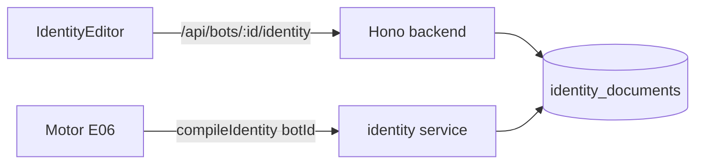
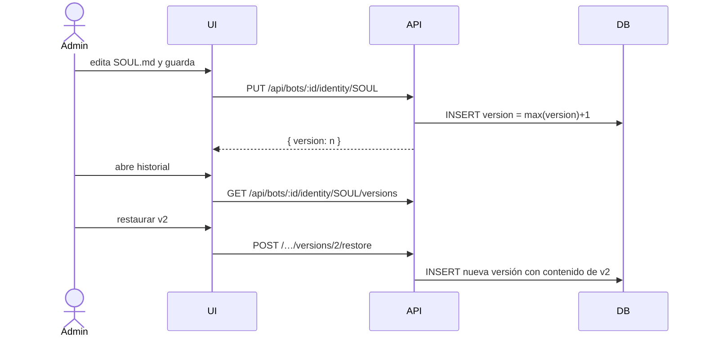

# Design — US-008 · Gestión de identidad del agente

## Overview

Tabla append-only `identity_documents` donde cada fila es una versión; la vigente es la de mayor `version` por `(bot_id, type)`. CRUD vía `/api/bots/:id/identity`, editor markdown en el frontend con preview, y un módulo interno `compileIdentity(botId)` que el motor (US-011) importa directamente (sin HTTP). Plantillas estáticas en `packages/shared`.

## Architecture



## Sequence Diagrams



## Components and Interfaces

### `identityService` — `apps/backend/src/services/identity.ts`

```ts
type IdentityType = "SOUL" | "IDENTITY" | "GUARDRAILS";

interface IdentityService {
  getCurrent(botId: string): Promise<Record<IdentityType, IdentityDoc | null>>;
  save(botId: string, type: IdentityType, content: string, userId: string): Promise<{ version: number }>; // 1.2, 2.1
  listVersions(botId: string, type: IdentityType): Promise<IdentityVersion[]>;  // 2.3
  restore(botId: string, type: IdentityType, version: number, userId: string): Promise<{ version: number }>; // 2.2
  compileIdentity(botId: string): Promise<string>;  // 3.1–3.3
}
```

### Rutas — `apps/backend/src/routes/identity.ts`
`GET /api/bots/:id/identity` · `PUT /api/bots/:id/identity/:type` (admin) · `GET /…/:type/versions` · `POST /…/:type/versions/:v/restore` (admin). Cubre 1.4 vía middleware.

### `IdentityEditor` — `apps/frontend/src/pages/bots/IdentityEditor.tsx`
Tabs por tipo, textarea/editor markdown con preview, contador de caracteres (límite 20k), panel de historial con diff simple y botón restaurar.

### Plantillas — `packages/shared/src/identity-templates.ts`
Contenido inicial por tipo (1.1), compartido por backend (seed) y frontend (preview).

## Data Models

| Campo (UI) | DTO API | DB | Transformación |
|---|---|---|---|
| Contenido | `content: string` | `identity_documents.content text` | máx 20.000 chars (Zod) |
| Tipo | `type` | `identity_documents.type` pgEnum | — |
| Versión | `version: number` | `identity_documents.version integer` | autoincremental por (bot,type) |
| Autor | `authorId` | `identity_documents.created_by text` | Clerk user id |

Unique: `(bot_id, type, version)`. Vigente = `max(version)`.

## Algorithmic Pseudocode

```
function compileIdentity(botId):
  precondición: bot existe
  postcondición: string determinístico con docs vigentes en orden fijo
  parts = []
  for type in [SOUL, IDENTITY, GUARDRAILS]:
    doc = latest(botId, type)
    if doc != null and trim(doc.content) != "":
      parts.push("## " + type + "\n" + doc.content)
  return join(parts, "\n\n")
```

## Correctness Properties

- **P1 (inmutabilidad)** — ninguna operación modifica o borra una versión existente; solo se insertan nuevas.
- **P2 (monotonía)** — `version` es estrictamente creciente por `(bot_id, type)` incluso con guardados concurrentes.
- **P3 (consistencia de compilación)** — `compileIdentity` siempre refleja la última versión guardada y el orden SOUL→IDENTITY→GUARDRAILS.

## Error Handling

| Escenario | Respuesta | Recuperación |
|---|---|---|
| Contenido > 20k chars | 422 con límite | UI bloquea antes con contador |
| Guardado concurrente | retry sobre unique violation (version+1) | transparente |
| Restaurar versión inexistente | 404 | — |
| Tipo de documento inválido | 422 (Zod enum) | — |

## Testing Strategy

- Unit: compileIdentity (omisión de vacíos, orden), límite de tamaño, restore.
- Property-based: P2 con guardados concurrentes simulados; P1 con secuencias de save/restore.
- Integration: ciclo editar→historial→restaurar→compilar por API.

## Performance / Security / Dependencies

- `compileIdentity` es 1 query (`distinct on` por tipo); cacheable en memoria 30s para el motor.
- Solo `org:admin` escribe; members leen. El contenido nunca se interpola sin escape en el frontend.

## Trazabilidad

Cubre requisitos: 1.1–1.4, 2.1–2.3, 3.1–3.3.
