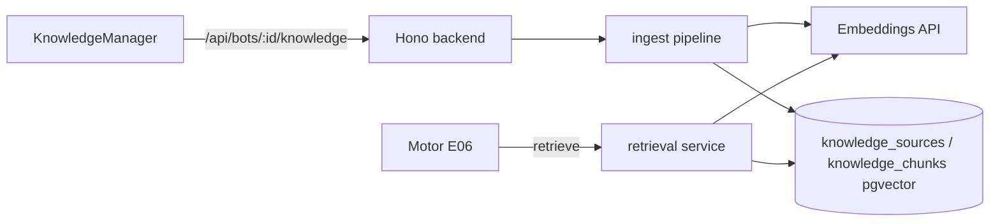
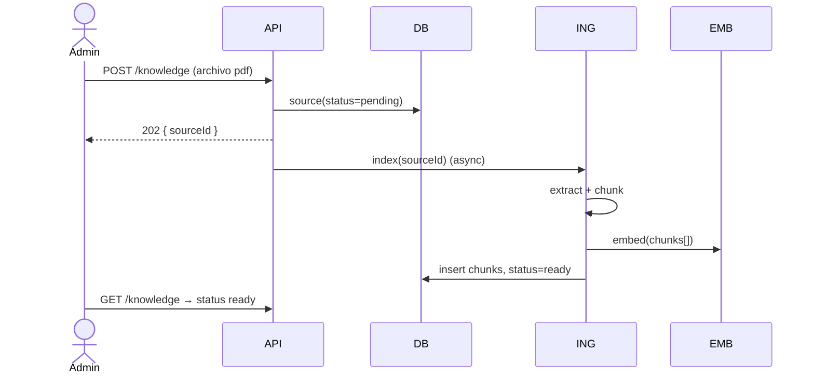

# Design — US-009 · Gestión e ingestión de conocimiento

## Overview

Tablas `knowledge_sources` y `knowledge_chunks` (pgvector). Pipeline de indexado in-process (sin cola externa en MVP): extraer texto (pdf-parse para PDF) → chunking por párrafos con solape → embeddings (OpenAI `text-embedding-3-small`, 1536 dims) → insert. `retrieve(botId, query, k)` hace búsqueda por coseno con umbral. UI de gestión con playground de búsqueda.

## Architecture



## Sequence Diagrams



## Components and Interfaces

### `knowledgeService` — `apps/backend/src/services/knowledge.ts`

```ts
interface KnowledgeService {
  createSource(botId: string, input: SourceInput, userId: string): Promise<{ id: string }>; // 1.1–1.4
  deleteSource(botId: string, sourceId: string): Promise<void>;                              // 1.5
  reindex(botId: string, sourceId: string): Promise<void>;                                   // 2.3, 2.4
  list(botId: string): Promise<SourceSummary[]>;                                             // 4.1
  retrieve(botId: string, query: string, k?: number): Promise<ScoredChunk[]>;                // 3.1–3.3
}

type SourceInput =
  | { kind: "text"; title: string; content: string }
  | { kind: "file"; title: string; buffer: Buffer; mime: string }
  | { kind: "faq"; question: string; answer: string };
```

### `chunker` — `apps/backend/src/services/chunker.ts`
Split por párrafos, target 500 tokens, solape 50. FAQs = 1 chunk (Q+A).

### `embeddings` — `apps/backend/src/integrations/embeddings.ts`
`embed(texts: string[]): Promise<number[][]>` con batching (máx 100/llamada).

### Rutas — `apps/backend/src/routes/knowledge.ts`
`POST/GET/DELETE /api/bots/:id/knowledge`, `POST /…/:sourceId/reindex`, `POST /…/search` (playground, 4.2).

### UI — `apps/frontend/src/pages/bots/KnowledgeManager.tsx`
Lista con estados, upload (drag&drop), formulario FAQ, playground de búsqueda con scores.

## Data Models

| Concepto | DB |
|---|---|
| Fuente | `knowledge_sources(id, tenant_id, bot_id, kind, title, status, error, created_by, created_at, updated_at)` |
| Chunk | `knowledge_chunks(id, tenant_id, bot_id, source_id fk cascade, seq, content text, embedding vector(1536))` |
| Índice | HNSW sobre `embedding` + índice btree `(bot_id)` |

## Algorithmic Pseudocode

```
function retrieve(botId, query, k=5, minScore=0.35):
  precondición: botId pertenece al contexto autenticado o llamada interna del motor
  postcondición: |result| <= k; todos los chunks con bot_id = botId; scores descendentes
  qv = embed([query])[0]
  rows = SELECT content, 1 - (embedding <=> qv) AS score
         FROM knowledge_chunks WHERE bot_id = botId
         ORDER BY embedding <=> qv LIMIT k
  return rows.filter(r => r.score >= minScore)
```

## Correctness Properties

- **P1 (aislamiento)** — todo chunk devuelto por `retrieve(botId)` cumple `chunk.bot_id == botId`.
- **P2 (sin huérfanos)** — borrar/reindexar una fuente elimina el 100% de sus chunks previos (FK cascade + delete-before-insert).
- **P3 (orden)** — los scores del resultado son monótonamente decrecientes.
- **P4 (estado honesto)** — una fuente `ready` tiene ≥1 chunk; una `failed` conserva `error` legible.

## Error Handling

| Escenario | Respuesta | Recuperación |
|---|---|---|
| PDF sin texto extraíble | source `failed` + error | admin reintenta o pega texto |
| Embeddings API caído | source `failed` | botón reintentar (2.3) |
| Archivo >10MB / mime no soportado | 422 | — |
| Query vacía en retrieve | lista vacía | — |

## Testing Strategy

- Unit: chunker (límites, solape, FAQ), filtros de mime/tamaño.
- Property-based: P3 orden de scores; P2 con secuencias create/reindex/delete (embeddings fake determinístico).
- Integration: ingest texto→ready→retrieve encuentra contenido; aislamiento entre 2 bots (P1).

## Performance / Security / Dependencies

- Requiere extensión `pgvector` en Postgres (migración `CREATE EXTENSION IF NOT EXISTS vector`).
- `OPENAI_API_KEY` (o proveedor equivalente) en env Zod. Indexado async in-process; si crece, mover a cola.
- HNSW index para latencia de búsqueda <50ms con miles de chunks.

## Trazabilidad

Cubre requisitos: 1.1–1.5, 2.1–2.4, 3.1–3.3, 4.1–4.2.
