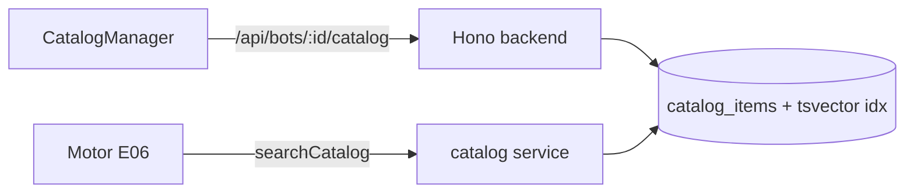
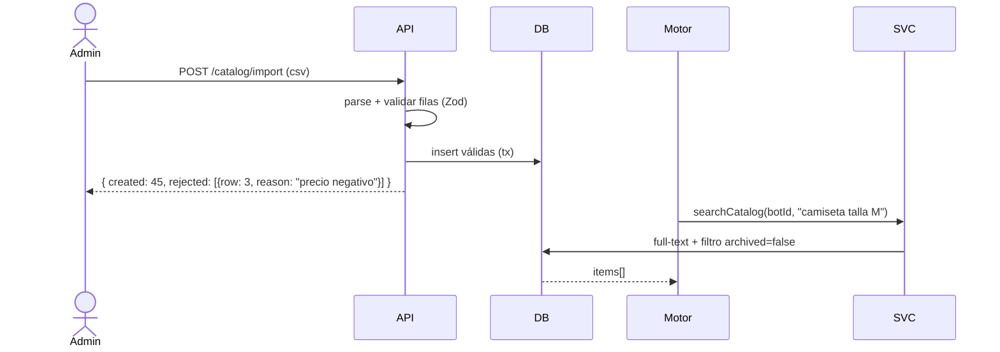

# Design — US-010 · Catálogo de productos y servicios

## Overview

Tabla `catalog_items` con búsqueda full-text en español (tsvector generado). CRUD REST en `/api/bots/:id/catalog`, importación CSV con reporte por fila, y función interna `searchCatalog(botId, term)` para el motor. Sin embeddings: la búsqueda léxica + atributos basta para catálogos de cientos de ítems.

## Architecture



## Sequence Diagrams



## Components and Interfaces

### `catalogService` — `apps/backend/src/services/catalog.ts`

```ts
interface CatalogService {
  create(botId: string, item: CatalogItemInput): Promise<{ id: string }>;       // 1.1, 1.4
  update(botId: string, id: string, patch: Partial<CatalogItemInput>): Promise<void>; // 1.2
  archive(botId: string, id: string): Promise<void>;                            // 1.3
  importCsv(botId: string, csv: Buffer): Promise<ImportReport>;                 // 1.5
  list(botId: string, filter: { q?: string; availability?: string }): Promise<CatalogItem[]>; // 3.1
  searchCatalog(botId: string, term: string, limit?: number): Promise<CatalogItem[]>;  // 2.1–2.3
}
```

### Rutas — `apps/backend/src/routes/catalog.ts`
CRUD + `POST /import` (multipart). Escritura solo `org:admin` (3.2).

### UI — `apps/frontend/src/pages/bots/CatalogManager.tsx`
Tabla con filtros, modal crear/editar, archivar, import CSV con reporte de rechazos.

## Data Models

| Campo (UI) | DTO API | DB | Transformación |
|---|---|---|---|
| Nombre | `name` | `catalog_items.name text` | requerido |
| Descripción | `description` | `text` | opcional |
| Precio | `price: string` | `numeric(12,2)` | string en DTO para evitar float |
| Moneda | `currency` | `char(3)` | Zod enum ISO 4217 común (COP, USD, EUR, MXN…) |
| Disponibilidad | `availability` | pgEnum `available\|unavailable\|on_request` | — |
| Atributos | `attributes: Record<string,string>` | `jsonb` | libre |
| Archivado | `archivedAt` | `timestamptz null` | null = activo |
| Búsqueda | — | `search tsvector GENERATED (spanish, name+description+attributes)` | índice GIN |

## Algorithmic Pseudocode

```
function searchCatalog(botId, term, limit=8):
  precondición: term no vacío
  postcondición: solo ítems activos del bot, ranking por ts_rank
  q = plainto_tsquery('spanish', term)
  return SELECT * FROM catalog_items
         WHERE bot_id = botId AND archived_at IS NULL AND search @@ q
         ORDER BY ts_rank(search, q) DESC LIMIT limit
```

## Correctness Properties

- **P1 (aislamiento)** — `searchCatalog(botId)` solo devuelve ítems con ese `bot_id`.
- **P2 (archivado efectivo)** — ningún ítem archivado aparece en `searchCatalog`, aunque sí en `list` del admin.
- **P3 (validación de dinero)** — todo ítem persistido cumple `price >= 0` y moneda ISO; nunca se almacena float binario.
- **P4 (import atómico por fila)** — una fila inválida no impide la inserción de las válidas, y toda fila rechazada aparece en el reporte con motivo.

## Error Handling

| Escenario | Respuesta | Recuperación |
|---|---|---|
| Precio negativo / moneda inválida | 422 (Zod) | — |
| CSV > 500 filas | 422 con límite | dividir archivo |
| CSV con encoding raro | rechazo de filas ilegibles en reporte | re-exportar UTF-8 |
| Término de búsqueda vacío | lista vacía | — |

## Testing Strategy

- Unit: validaciones Zod, parser CSV (filas mixtas), normalización de moneda.
- Property-based: P4 — para todo CSV mezclado, |creadas| + |rechazadas| = |filas|.
- Integration: CRUD + archive + search; aislamiento entre bots.

## Performance / Security / Dependencies

- tsvector generado + GIN: búsqueda <10ms hasta decenas de miles de ítems.
- `papaparse` (backend) para CSV. Sin dependencias nuevas de infra.

## Trazabilidad

Cubre requisitos: 1.1–1.5, 2.1–2.3, 3.1–3.2.
