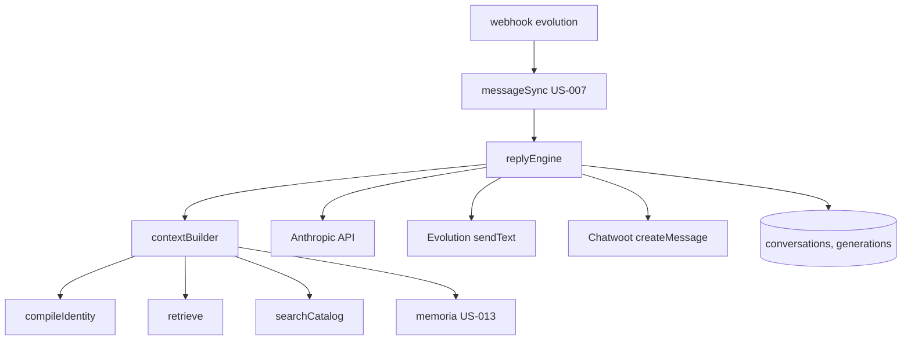
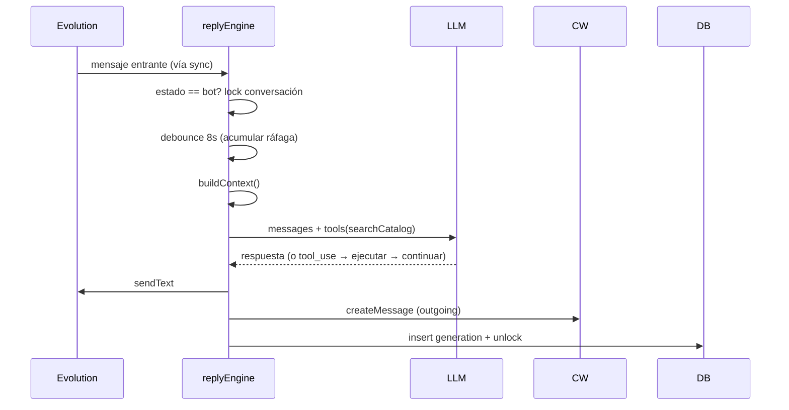

# Design — US-011 · Pipeline de respuesta automática

## Overview

Servicio `replyEngine` enganchado al webhook de Evolution (después del sync de US-007): si la conversación está en `bot`, construye contexto con `compileIdentity` (US-008), `retrieve` (US-009), `searchCatalog` (US-010) y memoria (US-013, opcional hasta que exista), llama al LLM (Anthropic API, tool-use para catálogo) y envía vía Evolution + registra en Chatwoot. Debounce de ráfagas con buffer por conversación y lock en DB. Tabla `conversations` propia para estado, y `generations` para trazas.

## Architecture



## Sequence Diagrams



## Components and Interfaces

### `replyEngine` — `apps/backend/src/services/reply-engine.ts`

```ts
interface ReplyEngine {
  onInboundMessage(botId: string, conversationId: string, msg: InboundMsg): Promise<void>; // 1.1, 1.4, 2.1–2.3
}
```

### `contextBuilder` — `apps/backend/src/services/context-builder.ts`

```ts
interface BuiltContext {
  system: string;            // identidad + instrucciones de canal + memoria
  knowledge: ScoredChunk[];  // retrieve(query = últimos mensajes)
  history: ChatMessage[];    // últimos 20 mensajes de la conversación
}
```

### `llm` — `apps/backend/src/integrations/llm.ts`
`generate(ctx, tools): Promise<{ text, usage, latencyMs }>` — Anthropic Messages API con tool `search_catalog`; timeout 12s.

### Tabla `conversations` — estado propio (no depende de Chatwoot)
`conversations(id, tenant_id, bot_id, channel_link_id fk, mode bot|human|paused, locked_at, last_msg_at)`.

### `generations`
`generations(id, tenant_id, bot_id, conversation_id, model, prompt jsonb, response text, input_tokens, output_tokens, latency_ms, error, created_at)`.

## Data Models

| Concepto | Detalle |
|---|---|
| Estado conversación | enum `mode`; default `bot`; transiciones en US-012 |
| Lock | `locked_at timestamptz` — lock si `now() - locked_at < 60s` (auto-expira) |
| Buffer ráfaga | en memoria por `conversationId` con timer de 8s (2.2, 2.3) |
| Traza | `generations` con prompt completo jsonb (4.1) |

## Algorithmic Pseudocode

```
function onInboundMessage(botId, convoId, msg):
  precondición: msg ya deduplicado por US-007 (processed_messages)
  postcondición: a lo sumo una generación por ráfaga; convo en human si LLM falló
  convo = getConversation(convoId)
  if convo.mode != "bot": return                          // 1.4
  buffer[convoId].push(msg); resetTimer(convoId, 8s)      // 2.3
  onTimer(convoId):
    if !acquireLock(convoId): return                      // 2.2 — al unlock se re-procesa buffer
    msgs = drain(buffer[convoId])
    ctx = buildContext(botId, convoId, msgs)
    try:
      out = llm.generate(ctx, tools=[searchCatalog])      // 1.2
      evolution.sendText(...); chatwoot.createMessage(...) // 1.1, 1.3
      persistGeneration(ok)
    catch err:
      setMode(convoId, "human"); privateNote(err)          // 3.1
      persistGeneration(err)                               // 3.3, 4.1
    finally: releaseLock(convoId); if buffer no vacío → reprocesar
```

## Correctness Properties

- **P1 (una respuesta por ráfaga)** — para toda secuencia de mensajes dentro de la ventana, exactamente una generación exitosa como máximo.
- **P2 (respeto de modo)** — ninguna generación ocurre con `mode != bot` al momento de adquirir el lock.
- **P3 (sin pérdida)** — todo mensaje entrante en modo `bot` termina incluido en alguna generación o la conversación queda en `human`.
- **P4 (trazabilidad total)** — toda invocación al LLM (éxito o error) tiene fila en `generations`.

## Error Handling

| Escenario | Respuesta | Recuperación |
|---|---|---|
| LLM timeout/error | modo `human` + nota privada (3.1) | agente atiende; admin puede devolver a bot |
| Envío WhatsApp falla | 1 retry → nota privada con texto generado (3.2) | agente reenvía manual |
| Lock expirado a mitad | generación duplicada posible → mitigada por idempotencia de ráfaga (drain) | lock TTL 60s |
| Contexto excede límite tokens | truncar knowledge → history (en ese orden) | log de truncamiento |

## Testing Strategy

- Unit: contextBuilder (orden y truncamiento), máquina de buffer/debounce con timers fake.
- Property-based: P1 con ráfagas aleatorias concurrentes (fast-check + clock mock).
- Integration: flujo completo con LLM mockeado — feliz, modo human, LLM caído, tool-use de catálogo.

## Performance / Security / Dependencies

- `ANTHROPIC_API_KEY`, `LLM_MODEL` (default económico), `LLM_TIMEOUT_MS` en env Zod.
- Presupuesto de latencia: debounce 8s + LLM ≤12s < 15s objetivo tras ráfaga... el criterio 1.1 se mide desde fin de ráfaga.
- Prompts en `generations` pueden contener datos personales: acceso restringido por tenant (4.2) y retención a definir.

## Trazabilidad

Cubre requisitos: 1.1–1.4, 2.1–2.3, 3.1–3.3, 4.1–4.2.
