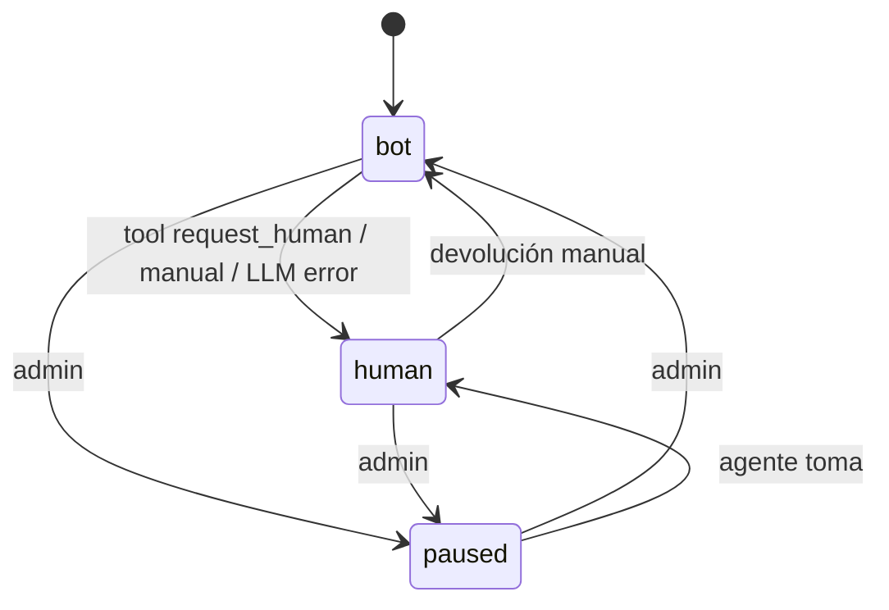
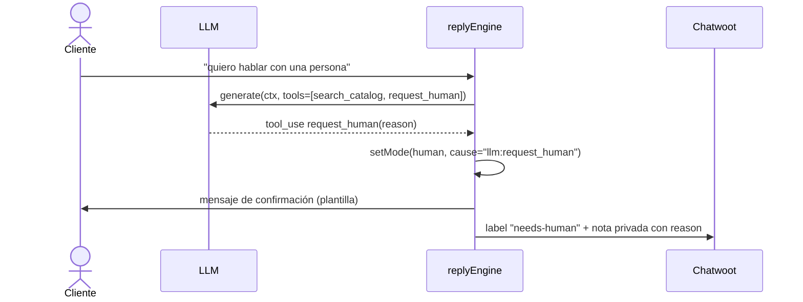

# Design — US-012 · Handoff bot ↔ agente humano

## Overview

Máquina de estados sobre `conversations.mode` (US-011) con tabla de auditoría `conversation_transitions`. Tres disparadores: tool `request_human` expuesta al LLM (cubre solicitud del cliente y escalamiento — el system prompt instruye usarla ante intención de humano), endpoint del panel, y webhook de Chatwoot (toggle por etiqueta/asignación). Etiquetas en Chatwoot reflejan el modo.

## Architecture



## Sequence Diagrams



## Components and Interfaces

### `conversationState` — `apps/backend/src/services/conversation-state.ts`

```ts
type Mode = "bot" | "human" | "paused";
type Cause = "llm:request_human" | "llm:error" | "panel:user" | "chatwoot:agent" | "system";

interface ConversationState {
  setMode(convoId: string, mode: Mode, cause: Cause, actorId?: string): Promise<void>; // 3.1–3.3, 4.3
  getMode(convoId: string): Promise<Mode>;
}
```

### Tool `request_human` — en `reply-engine.ts` (US-011)
Definición de tool para el LLM con parámetro `reason`. El handler llama `setMode("human")`, envía plantilla de confirmación (1.2) y etiqueta en Chatwoot (1.3). Cubre 1.1, 2.1, 2.2.

### Endpoint panel — `apps/backend/src/routes/conversations.ts`
`POST /api/conversations/:id/mode` body `{ mode }` — admin o member asignado. Cubre 3.1–3.3.

### Webhook Chatwoot (extensión US-007) — `routes/webhooks.ts`
Evento `conversation_updated`: asignación de agente → `human`; remoción de etiqueta `needs-human` + estado resuelto → no cambia modo automáticamente (decisión explícita). Cubre 3.1.

## Data Models

| Concepto | DB |
|---|---|
| Transición | `conversation_transitions(id, tenant_id, conversation_id, from_mode, to_mode, cause, actor_id, created_at)` |
| Plantilla handoff | `bots.handoff_message text` (default: "Te comunico con una persona del equipo, en breve te atienden.") |

## Algorithmic Pseudocode

```
function setMode(convoId, newMode, cause, actorId):
  precondición: newMode ∈ {bot, human, paused}
  postcondición: mode actualizado atómicamente + transición auditada
  tx:
    old = SELECT mode FROM conversations WHERE id=convoId FOR UPDATE
    if old == newMode: return  // idempotente
    UPDATE conversations SET mode=newMode
    INSERT conversation_transitions(old, newMode, cause, actorId)
  if newMode == human: chatwoot.addLabel("needs-human")
  if newMode == bot: chatwoot.removeLabel("needs-human")
```

## Correctness Properties

- **P1 (exclusión)** — el motor nunca genera con `mode != bot` (verificado bajo lock de US-011 P2).
- **P2 (auditoría completa)** — todo cambio efectivo de modo tiene exactamente una fila de transición.
- **P3 (idempotencia)** — `setMode` al modo actual no crea transición ni efectos en Chatwoot.
- **P4 (prioridad del handoff)** — si el LLM emite `request_human`, ningún texto del LLM de esa generación se envía al cliente; solo la plantilla.

## Error Handling

| Escenario | Respuesta | Recuperación |
|---|---|---|
| Chatwoot caído al etiquetar | modo cambia igual; label en retry best-effort + log | estado DB es la verdad |
| Carrera panel vs LLM | `FOR UPDATE` serializa; gana el primero | segunda llamada idempotente o transición válida |
| Member no asignado intenta cambiar modo | 403 | — |

## Testing Strategy

- Unit: máquina de estados (todas las transiciones válidas/yes-no), idempotencia.
- Property-based: P2 — secuencias aleatorias de setMode concurrentes ⇒ |transiciones| = |cambios efectivos|.
- Integration: tool request_human end-to-end con LLM mockeado; devolución manual y reanudación del bot.

## Performance / Security / Dependencies

- Sin dependencias nuevas. Las plantillas de handoff son configurables por bot (editable en settings).
- El panel consume cambios vía polling de TanStack Query (5s) — suficiente para 4.2.

## Trazabilidad

Cubre requisitos: 1.1–1.3, 2.1–2.2, 3.1–3.3, 4.1–4.3.
