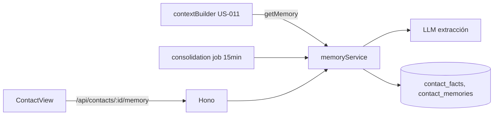
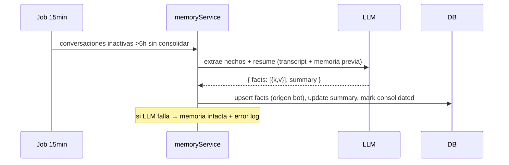

# Design — US-013 · Memoria persistente por cliente

## Overview

Tablas `contact_memories` (resumen) y `contact_facts` (clave-valor), ancladas a `channel_links` (US-007). El `contextBuilder` (US-011) inyecta memoria en el system prompt. Un job ligero (`setInterval` cada 15 min) detecta conversaciones inactivas >6h sin consolidar y ejecuta `consolidateMemory`: LLM extrae hechos nuevos + reescribe resumen (≤2.000 chars). UI de contacto con edición de hechos.

## Architecture



## Sequence Diagrams



## Components and Interfaces

### `memoryService` — `apps/backend/src/services/memory.ts`

```ts
interface MemoryService {
  getMemory(channelLinkId: string): Promise<{ facts: Fact[]; summary: string | null }>; // 1.1–1.3
  consolidate(conversationId: string): Promise<void>;                                   // 2.1–2.4
  upsertFact(channelLinkId: string, key: string, value: string, origin: "bot"|"human", actorId?: string): Promise<void>; // 2.2, 3.2
  deleteFact(channelLinkId: string, key: string): Promise<void>;                        // 3.2
  wipe(channelLinkId: string): Promise<void>;                                           // 3.3
}
```

### Job — `apps/backend/src/jobs/memory-consolidation.ts`
`setInterval` 15 min: `SELECT conversations WHERE last_msg_at < now()-6h AND consolidated_at IS NULL` → `consolidate` secuencial.

### Rutas — `apps/backend/src/routes/contacts.ts`
`GET /api/bots/:id/contacts` · `GET/PATCH/DELETE /api/contacts/:linkId/memory` (admin escribe, member lee).

### UI — `apps/frontend/src/pages/contacts/ContactView.tsx`
Hechos editables (origen visible), resumen, botón "borrar memoria" con doble confirmación.

### Integración contextBuilder (US-011)
Bloque `## Lo que sabes de este cliente` con facts + summary, insertado en el system prompt.

## Data Models

| Concepto | DB |
|---|---|
| Resumen | `contact_memories(channel_link_id pk fk, tenant_id, bot_id, summary text, updated_at)` |
| Hecho | `contact_facts(id, channel_link_id fk, tenant_id, key text, value text, origin, updated_by, updated_at)` unique `(channel_link_id, key)` |
| Marca | `conversations.consolidated_at timestamptz null` (reset a null con cada mensaje nuevo) |

## Algorithmic Pseudocode

```
function consolidate(convoId):
  precondición: convo inactiva >6h, consolidated_at IS NULL
  postcondición: memoria actualizada o intacta ante fallo; convo marcada
  link = convo.channelLink; prev = getMemory(link.id)
  transcript = lastMessages(convoId, 50)
  try:
    out = llm.extractMemory(transcript, prev)   // JSON: facts[], summary (≤2000 chars)
    tx:
      for f in out.facts: upsertFact(link.id, f.key, f.value, "bot")
      upsertSummary(link.id, truncate(out.summary, 2000))
      convo.consolidated_at = now()
  catch err:
    log(err); convo.consolidated_at = now()  // no reintentar en loop; memoria intacta (2.3)
```

## Correctness Properties

- **P1 (aislamiento)** — `getMemory` solo devuelve datos del `channel_link` consultado; un teléfono en dos tenants ⇒ dos memorias.
- **P2 (no regresión)** — un fallo de extracción nunca borra ni corrompe memoria previa.
- **P3 (unicidad de hecho)** — a lo sumo un valor vigente por `(contacto, clave)`.
- **P4 (límite de resumen)** — `len(summary) ≤ 2000` tras toda consolidación.

## Error Handling

| Escenario | Respuesta | Recuperación |
|---|---|---|
| LLM devuelve JSON inválido | descartar, log, marcar consolidada | próxima conversación reintenta naturalmente |
| Job se solapa consigo mismo | guard `isRunning` en memoria | — |
| Hecho con clave vacía | filtrado en validación Zod | — |
| Borrado de memoria (3.3) | wipe transaccional | irreversible — doble confirmación en UI |

## Testing Strategy

- Unit: truncamiento de resumen, upsert de hechos, parser del JSON del LLM.
- Property-based: P3 con secuencias de upserts concurrentes; P4 con resúmenes de tamaño aleatorio.
- Integration: ciclo conversación→consolidación→contexto siguiente incluye memoria (LLM mockeado); aislamiento entre tenants.

## Performance / Security / Dependencies

- Consolidación usa modelo económico (mismo `llm` client, prompt corto).
- La memoria contiene datos personales: solo tenant dueño la ve; wipe disponible (base para compliance futuro).
- Job in-process: aceptable con 1 réplica (misma limitación documentada en US-011).

## Trazabilidad

Cubre requisitos: 1.1–1.3, 2.1–2.4, 3.1–3.3.
