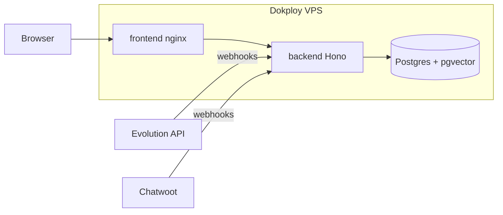
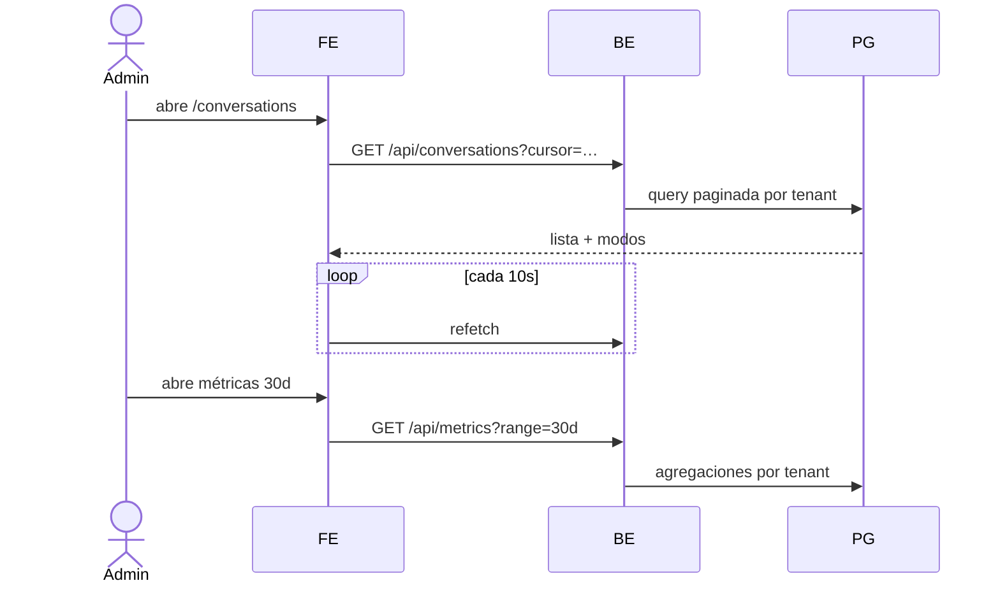

# Design — US-014 · Panel de operación y despliegue MVP

## Overview

Tres vistas frontend (conversaciones, métricas, trazas) sobre endpoints de lectura que agregan datos ya existentes (`conversations`, `generations`, `processed_messages`, `conversation_transitions`). Métricas con SQL de agregación directa (sin warehouse). Despliegue: compose de backend+frontend en Dokploy reutilizando el Postgres existente, dominios con LetsEncrypt y healthcheck extendido.

## Architecture



## Sequence Diagrams



## Components and Interfaces

### Rutas de lectura — `apps/backend/src/routes/conversations.ts`, `metrics.ts`, `generations.ts`
- `GET /api/conversations` (paginado cursor, filtro por bot/modo). Cubre 1.1.
- `GET /api/conversations/:id/messages`. Cubre 1.2.
- `GET /api/metrics?range=7d|30d`. Cubre 2.1–2.2.
- `GET /api/bots/:id/generations` + `GET /api/generations/:id`. Cubre 3.1–3.2.
- `GET /api/admin/generations` (super admin, US-003). Cubre 3.3.

### Healthcheck extendido — `apps/backend/src/routes/health.ts`

```ts
type Health = {
  status: "ok" | "degraded";
  checks: { db: boolean; evolution: boolean; chatwoot: boolean };
};
```

### UI — `apps/frontend/src/pages/`
`conversations/ConversationsList.tsx` (refetch 10s), `conversations/ConversationView.tsx` (reusa US-012), `metrics/MetricsDashboard.tsx` (recharts ya disponible vía Tailwind stack), `bots/GenerationsLog.tsx`.

### Infra — `infra/`
`docker-compose.prod.yml` (backend + frontend nginx), variables prod, healthcheck Docker apuntando a `/api/health`. Despliegue vía Dokploy (proyecto existente) con dominios `app.woofly…` / `api.woofly…` (definir DNS).

## Data Models

Sin tablas nuevas. Queries de agregación:

| Métrica | Fuente |
|---|---|
| Mensajes entrantes | `processed_messages` (source=evolution) por rango |
| Respuestas bot | `generations` (error IS NULL) |
| Handoffs | `conversation_transitions` (to_mode=human, cause LIKE 'llm:%') |
| Conversaciones únicas | `conversations` con actividad en rango |

## Algorithmic Pseudocode

```
function getMetrics(tenantId, range):
  precondición: range ∈ {7d, 30d}
  postcondición: todas las cifras filtradas por tenant_id
  since = now() - range
  return {
    inbound: COUNT(processed_messages WHERE tenant AND created_at > since),
    botReplies: COUNT(generations WHERE tenant AND error IS NULL AND created_at > since),
    handoffs: COUNT(conversation_transitions WHERE tenant AND to_mode='human' AND created_at > since),
    activeConversations: COUNT(DISTINCT conversations WHERE tenant AND last_msg_at > since)
  }
```

## Correctness Properties

- **P1 (aislamiento)** — toda query del panel filtra por `tenant_id` del token; super admin solo vía rutas `/admin`.
- **P2 (consistencia de métricas)** — `botReplies ≤ inbound` para cualquier rango (sanity check en tests).
- **P3 (paginación estable)** — cursor por `(last_msg_at, id)`: sin duplicados ni saltos al paginar con actividad concurrente.
- **P4 (health honesto)** — `status=ok` ⇔ los 3 checks pasan.

## Error Handling

| Escenario | Respuesta | Recuperación |
|---|---|---|
| Dependencia caída en health | `degraded` + check en false | alerta manual (post-MVP: alerting) |
| Rango de métricas inválido | 422 | — |
| Prompt de traza muy grande | render colapsado + descarga | — |

## Testing Strategy

- Unit: agregaciones de métricas con datos seed; cursor de paginación.
- Property-based: P3 con inserciones concurrentes simuladas.
- Integration: aislamiento tenant en los 4 endpoints; health con dependencias mockeadas caídas.
- Smoke post-deploy: script `scripts/smoke-prod.mjs` que valida health + login + webhook de prueba.

## Performance / Security / Dependencies

- Índices ya existentes por tenant cubren las agregaciones; si crecen, vistas materializadas post-MVP.
- Healthcheck de dependencias con timeout 2s y cache 30s (no martillar Evolution/Chatwoot).
- Dokploy: usar skill `dokploy-api` para crear el compose y dominios al ejecutar T6.

## Trazabilidad

Cubre requisitos: 1.1–1.4, 2.1–2.2, 3.1–3.3, 4.1–4.4.
