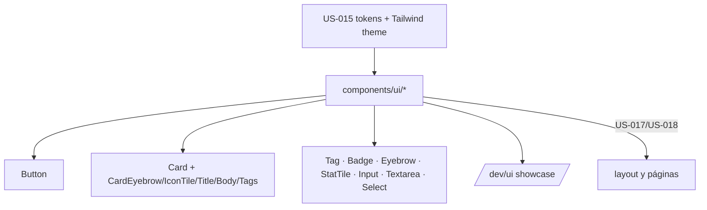

# Design — US-016 · Librería de componentes UI

## Overview

Carpeta `apps/frontend/src/components/ui/` con componentes React + CVA sobre las utilidades Tailwind creadas en US-015. Cada componente expone variantes tipadas y composición por slots/children (sin lógica de negocio). Un showcase interno (`/dev/ui`, solo `import.meta.env.DEV`) permite revisión visual.

## Architecture



## Components and Interfaces

### `components/ui/button.tsx`
```ts
type ButtonProps = VariantProps<typeof buttonVariants> & React.ComponentProps<'button'> & { withArrow?: boolean };
// variants: variant: 'primary' | 'ghost-light' | 'ghost-dark'; size: 'sm' | 'md'
```
Primary: `bg-lime text-forest rounded-pill hover:shadow-glow`; flecha `translate-x` +3px en hover. Cubre 1.1–1.3.

### `components/ui/card.tsx`
`Card` (variant `light | dark`) + subcomponentes `CardEyebrow`, `CardIconTile` (squircle 44–52px forest/lime), `CardTitle` (display 22px), `CardBody` (14.5px graphite-2), `CardTags`. Hover: lift `-translate-y-0.5` + shadow. Cubre 2.1–2.3.

### `components/ui/` restantes
- `tag.tsx` / `badge.tsx`: squircle `rounded-ds-sm` mono; tono según superficie (prop o contexto `.surface-dark`). Cubre 3.1.
- `input.tsx`, `textarea.tsx`, `select.tsx`: borde `--line-light`, placeholder graphite-3, variante dark con `backdrop-blur`. Cubre 3.2.
- `eyebrow.tsx`: `<span class="font-mono text-eyebrow uppercase">— LABEL</span>`. Cubre 3.3.
- `stat-tile.tsx`: número display lime + label mono + `border-b border-dashed`. Cubre 3.4.
- `icon-tile.tsx` + convención de iconos Lucide (`strokeWidth={1.5}`, tamaños 16/20/24). Cubre 3.5.

### Showcase — `pages/dev/UiShowcase.tsx`
Ruta `/dev/ui` registrada solo en DEV en `App.tsx`; grid con cada componente × variante sobre fondo beige y `.surface-dark`. Cubre 4.1.

## Data Models

N/A.

## Error Handling

- Variantes inválidas: imposibles por tipos CVA (Req 4.2).
- Sin estilos globales nuevos fuera de `tokens.css` — todo scoped a componentes (Req 4.3).

## Testing Strategy

- `tsc` verde (variantes tipadas).
- Revisión visual del showcase contra el DS (light y dark).
- Smoke de páginas legacy: sin colisiones (la librería no toca selectores globales).
