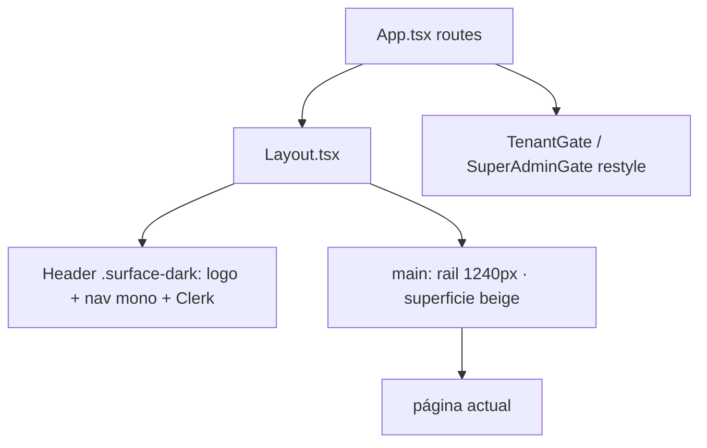

# Design — US-017 · Layout global y navegación

## Overview

Rediseño de `Layout.tsx` usando tokens (US-015) y componentes (US-016): header `surface-dark` sticky con nav mono y acento lime, `<main>` con rail `max-w-rail px-[var(--pad-x)]` y superficie beige por defecto. Appearance API de Clerk para org switcher/user button. Gates y loaders compartidos restyleados.

## Architecture



## Components and Interfaces

### `components/Layout.tsx`
- Header: `header.surface-dark` con `bg-forest border-b border-line-dark`, nav `font-mono text-eyebrow uppercase`; activo vía `NavLink` → `text-lime`. Cubre 1.1–1.2.
- Responsive: menú colapsable (disclosure button) < `md`. Cubre 1.4.
- Main: `<main class="bg-beige min-h-screen"><div class="mx-auto max-w-rail px-pad">…</div></main>`; prop/contexto opcional `surface="dark"` para páginas que lo pidan. Cubre 2.1–2.3.

### Clerk appearance — en `Layout.tsx` (o `lib/clerkAppearance.ts`)
```ts
const clerkDarkAppearance = { variables: { colorPrimary: 'var(--lime)', colorText: '…' }, elements: { … } };
```
Aplicado a `OrganizationSwitcher` y `UserButton`. Cubre 1.3.

### Gates y loaders — `App.tsx`, componentes de gate
Pantallas de bloqueo/carga con `Card`, `Eyebrow`, `Button` de US-016; loader con pulso lime (`--t-slow`, `--ease-out`). Cubre 3.1–3.2.

## Data Models

N/A.

## Error Handling

- Páginas legacy dentro del rail nuevo: el rail solo agrega contenedor; no se eliminan los contenedores internos hasta US-018.

## Testing Strategy

- Revisión visual en 360/768/1240/1600px.
- Verificar nav activa, menú móvil y Clerk widgets sobre fondo forest.
- Smoke por cada ruta existente: render sin overflow horizontal ni saltos.
