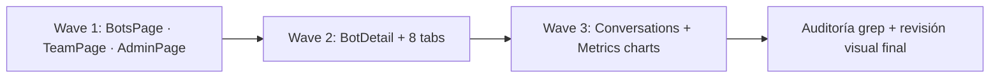

# Design — US-018 · Migración de páginas al design system

## Overview

Migración mecánica vista por vista: sustituir markup ad-hoc por componentes de `components/ui/` y utilidades de tokens, agrupada en waves por riesgo (listados simples → formularios → dashboards con charts). Cierre con auditoría grep de clases genéricas y revisión visual por ruta.

## Architecture

## Components and Interfaces

### Wave 1 — listados y tablas
- `pages/bots/BotsPage.tsx`: grid de `Card light` (eyebrow estado, icon tile bot, tags canal), CTA `Button primary`. Cubre 1.1.
- `pages/team/TeamPage.tsx`, `pages/admin/AdminPage.tsx`: tablas con tipografía body/mono, badges de rol/estado, acciones ghost. Cubre 1.4.

### Wave 2 — detalle de bot
- `pages/bots/BotDetailPage.tsx`: tab bar mono uppercase con indicador lime. Cubre 2.1.
- 8 tabs (`ConnectWhatsApp`, `ChatwootSettings`, `IdentityEditor`, `KnowledgeManager`, `CatalogManager`, `ConversationsPanel`, `ContactsPanel`, `GenerationsLog`): formularios con Input/Textarea/Select del DS, estados vacío/carga/error con Card + Eyebrow; QR en card light con fondo blanco interior. Cubre 2.2–2.3.

### Wave 3 — conversaciones y métricas
- `pages/conversations/ConversationsList.tsx` / `ConversationView.tsx`: filas como cards compactas, badges de modo (bot=lime tag, humano=graphite), burbujas con superficies del DS. Cubre 1.2.
- `pages/metrics/MetricsDashboard.tsx`: KPIs con `StatTile`; theme recharts central (`lib/chartTheme.ts`) con stroke/fill desde tokens. Cubre 1.3.

### Auditoría — cierre
- Grep sin matches: `bg-(gray|slate|blue|zinc|neutral)-`, `text-(gray|slate|blue)-`, `#[0-9a-fA-F]{3,6}` fuera de `tokens.css`/`chartTheme.ts`. Cubre 3.2.
- Checklist de revisión visual por ruta (3.3) y de paridad funcional por flujo (3.1).

## Data Models

N/A — cero cambios en hooks, queries o tipos de API.

## Error Handling

- Estados vacío/carga/error estandarizados en un patrón compartido (`EmptyState` ligero sobre Card) para no divergir entre tabs.

## Testing Strategy

- Por wave: `tsc` + build verdes, smoke funcional de cada flujo migrado (crear bot, conectar WhatsApp, editar identidad, subir conocimiento, cambiar modo de conversación).
- Auditoría grep automatizable en `scripts/` o comando documentado.
- Revisión visual final side-by-side contra el DS (criterio de salida de E09).
