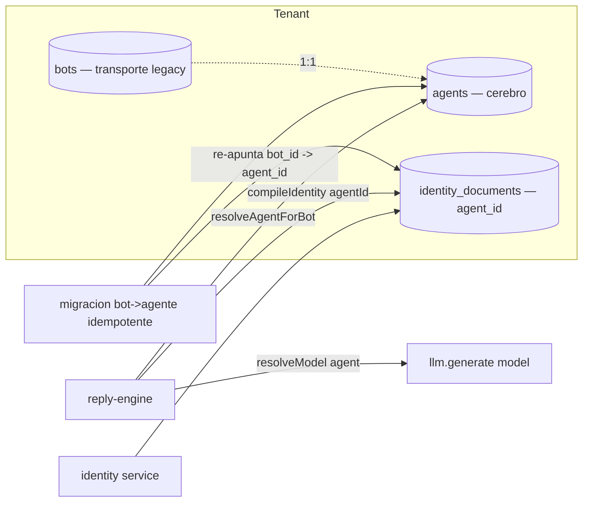
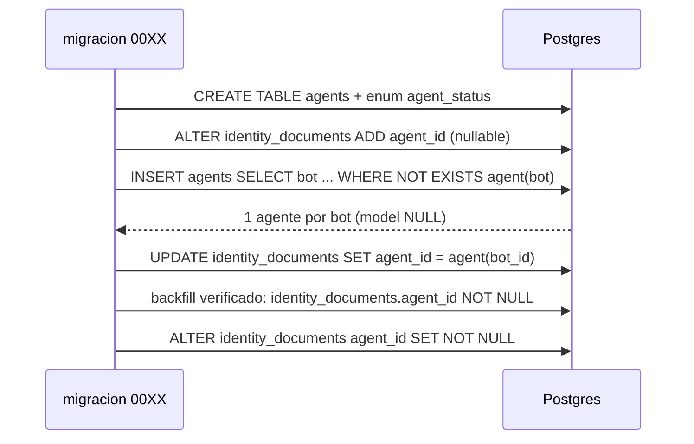
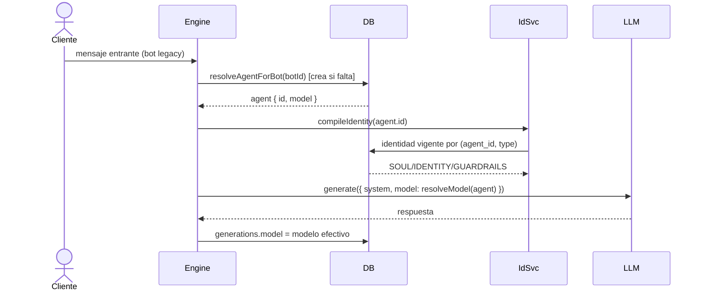

# Design — US-030 · Entidad Agente y migracion bot->agente

## Overview

Se introduce la tabla `agents` (aislada por `tenant_id`) que captura el "cerebro" hoy fusionado en `bots`: `name`, `status`, `model` (NULL = global), `extraction_schema`, `whitelist_enabled`, `handoff_message`. Una migracion Drizzle idempotente crea **1 agente por bot** copiando esos campos (con `model = NULL`) y re-apunta `identity_documents` de `bot_id` a `agent_id` preservando todas las versiones. El servicio de identidad (`apps/backend/src/services/identity.ts`) pasa a operar por `agentId`; el cliente LLM (`apps/backend/src/integrations/llm.ts`) acepta un `model` explicito y se resuelve por agente via `resolveModel(agent)`. El bot conserva su rol de transporte legacy: en esta fase mantenemos un mapeo 1:1 bot->agente para que `reply-engine`/`context-builder` resuelvan el agente sin cambiar el ruteo del webhook.

## Architecture



## Sequence Diagrams

### Migracion idempotente



### Respuesta tras la migracion (modelo efectivo)



## Components and Interfaces

### Esquema — `apps/backend/src/db/schema.ts`

Nueva tabla `agents` + enum `agent_status`; `identity_documents` gana `agent_id`.

```ts
export const agentStatus = pgEnum("agent_status", ["draft", "active", "paused"]);

export const agents = pgTable(
  "agents",
  {
    id: uuid("id").primaryKey().defaultRandom(),
    tenantId: text("tenant_id").notNull(),
    createdBy: text("created_by").notNull(),
    name: text("name").notNull(),
    status: agentStatus("status").notNull().default("draft"),
    // NULL => usa env.LLM_MODEL (modelo global).
    model: text("model"),
    extractionSchema: jsonb("extraction_schema").$type<Record<string, unknown> | null>(),
    whitelistEnabled: boolean("whitelist_enabled").notNull().default(false),
    handoffMessage: text("handoff_message").notNull(),
    createdAt: timestamp("created_at", { withTimezone: true }).notNull().defaultNow(),
    updatedAt: timestamp("updated_at", { withTimezone: true }).notNull().defaultNow(),
  },
  (t) => ({ byTenant: index("agents_tenant_idx").on(t.tenantId) }),
);
```

### `agentService` — `apps/backend/src/services/agents.ts`

Responsabilidades: crear/consultar agentes con aislamiento por tenant; resolver el agente de un bot legacy (idempotente); resolver el modelo efectivo.

```ts
interface AgentService {
  create(tenantId: string, input: { name: string; status?: AgentStatus }, userId: string): Promise<AgentRow>; // 1.1, 1.2
  getForTenant(tenantId: string, agentId: string): Promise<AgentRow | null>;                                   // 1.4, 1.5
  resolveAgentForBot(bot: BotRow): Promise<AgentRow>;   // crea si falta, idempotente — 5.1, 5.2
  resolveModel(agent: Pick<AgentRow, "model">): string; // agent.model ?? env.LLM_MODEL — 4.1, 4.2
}
```

### `identity` — `apps/backend/src/services/identity.ts`

Se reescribe la firma de `getCurrent/save/listVersions/restore/compileIdentity` para usar `agentId` en lugar de `botId`, operando sobre `identity_documents.agentId`. El invariante append-only (version = max+1 por `(agentId, type)`) se mantiene (3.3, 3.4, 3.5).

### `llm` — `apps/backend/src/integrations/llm.ts`

`generate` acepta `model?: string`; si se pasa lo usa, si no cae a `env.LLM_MODEL` (4.1, 4.2). `reply-engine.ts` pasa `model: resolveModel(agent)` y registra ese mismo modelo en `generations.model` (4.3, 4.4).

### Migracion — `apps/backend/drizzle/00XX_agents.sql`

DDL de `agents` + `agent_status`; `ALTER identity_documents ADD COLUMN agent_id`; backfill por bloques idempotentes (ver pseudocodigo); `SET NOT NULL` final tras verificar backfill.

## Data Models

### Tabla `agents`

| Campo | Tipo DB | Origen en migracion | Notas |
|---|---|---|---|
| id | uuid pk default random | nuevo | — |
| tenant_id | text not null | `bots.tenant_id` | aislamiento (1.4, 1.5, 2.4) |
| created_by | text not null | `bots.created_by` | autor (1.1) |
| name | text not null | `bots.name` | (2.2) |
| status | agent_status not null default 'draft' | `bots.status` | enum draft/active/paused (1.3) |
| model | text NULL | `NULL` | NULL = global (2.3, 4.1, 4.2) |
| extraction_schema | jsonb NULL | `bots.extraction_schema` | (2.2) |
| whitelist_enabled | bool not null default false | `bots.whitelist_enabled` | (2.2) |
| handoff_message | text not null | `bots.handoff_message` | (2.2) |
| created_at / updated_at | timestamptz not null default now | now | — |

### Tabla `identity_documents` (modificada)

| Campo | Cambio | Notas |
|---|---|---|
| agent_id | nuevo uuid FK -> agents.id on delete cascade | NOT NULL tras backfill (3.1, 3.2) |
| bot_id | se conserva durante la transicion | permite rollback; unique de version migra a `(agent_id, type, version)` |
| index | `identity_documents_agent_idx (agent_id, type)` | lectura de identidad vigente (3.3) |

## Algorithmic Pseudocode

```
function migrate():
  precondición: tabla agents existe; identity_documents.agent_id existe (nullable)
  postcondición: |agents| con bot de origen == |bots distintos|; cada identity_document
                 tiene agent_id == agent(bot_id); ejecutar de nuevo no crea filas nuevas

  -- 1 agente por bot, idempotente
  INSERT INTO agents (tenant_id, created_by, name, status, model, extraction_schema,
                      whitelist_enabled, handoff_message)
  SELECT b.tenant_id, b.created_by, b.name, b.status, NULL, b.extraction_schema,
         b.whitelist_enabled, b.handoff_message
  FROM bots b
  WHERE NOT EXISTS (SELECT 1 FROM agent_bot_map m WHERE m.bot_id = b.id)
  -- el mapeo bot->agente se materializa por columna puente o tabla auxiliar de migracion

  -- re-apuntar identidad preservando versiones
  UPDATE identity_documents d
  SET agent_id = agent_of(d.bot_id)
  WHERE d.agent_id IS NULL

function resolveModel(agent) -> string:
  return agent.model != null ? agent.model : env.LLM_MODEL
  postcondición: nunca devuelve null/vacio
```

> Nota de diseño: el mapeo `bot -> agente` 1:1 se materializa en esta fase con una columna puente (p.ej. `agents.legacy_bot_id` unique) o tabla auxiliar; se documenta su retiro cuando US-031 normalice el transporte como canal. El tratamiento del transporte legacy WhatsApp/Evolution como canal es propiedad de US-031 (decision Q1 del research).

## Correctness Properties

- **P1 (un agente por bot)** — tras la migracion, para todo bot existe exactamente un agente de origen; ejecutarla N veces no aumenta el conteo de agentes migrados.
- **P2 (sin perdida de identidad)** — tras la migracion, todo `identity_document` tiene `agent_id` no nulo y conserva contenido, tipo, autor y version originales; ninguna version se pierde ni duplica.
- **P3 (aislamiento por tenant)** — toda lectura de agente en contexto de tenant T devuelve solo agentes con `tenant_id == T`; el agente migrado conserva el tenant del bot.
- **P4 (modelo efectivo total)** — `resolveModel(agent)` siempre devuelve un modelo no vacio: el del agente si esta definido, el global en caso contrario; `generations.model` registra ese valor.
- **P5 (continuidad)** — para un bot ya migrado, un mensaje entrante resuelve su agente e identidad y produce una respuesta sin error; `resolveAgentForBot` crea el agente si falta (idempotente) antes de procesar.

## Error Handling

| Escenario | Respuesta | Recuperación |
|---|---|---|
| Migracion re-ejecutada | INSERT con `WHERE NOT EXISTS` no inserta; UPDATE solo toca filas con `agent_id IS NULL` | no-op (P1, P2) |
| Bot sin agente al llegar un mensaje | `resolveAgentForBot` crea el agente desde el bot | flujo continua (5.2, P5) |
| `agent.model` apunta a un modelo invalido | el LLM responde error; se registra en `generations.error` con el modelo intentado | operador corrige el modelo del agente |
| Acceso a agente de otro tenant | `getForTenant` devuelve null -> 404 | — (1.5, P3) |
| Backfill incompleto antes de `SET NOT NULL` | la migracion aborta la transaccion si quedan `agent_id IS NULL` | re-ejecutar migracion |

## Testing Strategy

- Unit: `resolveModel` (con y sin `model`); `agentService.create` aplica defaults (`status='draft'`).
- Property-based (fast-check): P1 ejecutando la migracion 1..N veces sobre un set de bots -> conteo estable; P2 sobre secuencias de versiones de identidad -> biyeccion bot_id->agent_id sin perdida.
- Integration: migrar un tenant con bots + identidad multi-version -> agentes correctos, identidad vigente igual antes/despues; aislamiento cross-tenant (P3); mensaje entrante a bot migrado produce respuesta y `generations.model` correcto (P4, P5).

## Performance / Security / Dependencies

- Migracion en una transaccion con backfill en bloques; idempotente para poder re-correr en dev y prod.
- Sin nuevas dependencias externas. Reutiliza `env.LLM_MODEL` ya existente (`apps/backend/src/env.ts`).
- Aislamiento por `tenant_id` en todas las consultas de agente (Clerk org id), igual que `bots`.

## Trazabilidad

Cubre requisitos: 1.1, 1.2, 1.3, 1.4, 1.5, 2.1, 2.2, 2.3, 2.4, 2.5, 2.6, 3.1, 3.2, 3.3, 3.4, 3.5, 4.1, 4.2, 4.3, 4.4, 5.1, 5.2, 5.3, 5.4.
