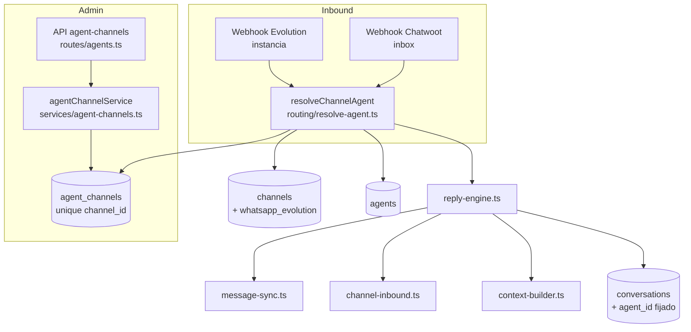
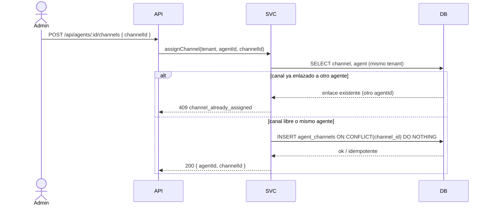

# Design — US-031 · Asignación N:M canal-agente y ruteo de inbound por agente

## Overview

Introduce la tabla join `agent_channels` (N:M agente ↔ canal) con un `unique` sobre `channel_id` que impone, en fase 1, el invariante un-canal-un-agente. El transporte legacy WhatsApp/Evolution —hoy en columnas de la tabla de agentes (ex-`bots`)— se normaliza añadiendo el tipo `whatsapp_evolution` al enum `channel_type` y creando una fila real en `channels` por agente con instancia de Evolution (decisión de diseño propiedad de esta historia, ver "Decisión de diseño: normalización del canal legacy"). El ruteo de inbound se reescribe: `message-sync.ts`, `channel-inbound.ts`, `reply-engine.ts` y `context-builder.ts` dejan de resolver `bot` por `channel.botId`/instancia y pasan a resolver el **canal** y, vía `agent_channels`, el **agente**. `conversations` gana `agent_id`, que se fija al crear la conversación con el agente vigente del canal (fundación de D3). Reutiliza el patrón de idempotencia por `processed_messages` y el mapeo a Chatwoot por `channel_links`.

## Decisión de diseño: normalización del canal legacy

**Elegida: añadir el tipo `whatsapp_evolution` a `channel_type` y materializar una fila en `channels`** (frente a mantener una representación virtual del canal legacy en la API).

Motivos:
- `agent_channels.channel_id` es FK a `channels`. Una representación virtual obligaría a un caso especial (`channelId = null`) en la tabla join y en cada `JOIN` del ruteo, replicando la deuda que ya existe hoy en `channel_links` (donde `channelId null` = Evolution legado).
- Un único modelo de canal hace el resolver de inbound uniforme: webhook → fila de `channels` → `agent_channels` → agente, sin ramas por transporte.
- La migración es idempotente: una fila `channels(type=whatsapp_evolution)` por agente con `evolutionInstance`, reusando sus columnas Chatwoot/credenciales.
- `channel_links.channelId`, que hoy queda `null` para Evolution, se rellena apuntando al nuevo canal, eliminando la rama virtual.

Las credenciales/estado de Evolution (`evolutionInstance`, `connectionStatus`, `lastConnectedAt`, inbox Chatwoot) se reflejan en la fila `channels` (`credentials.evolutionInstance`, `status`, `chatwootInboxId`). Las columnas en la tabla de agentes quedan como espejo de solo lectura hasta su retirada en una historia posterior.

## Architecture



## Sequence Diagrams

### Asignación de canal a agente (con invariante)



### Ruteo de inbound y fijación del agente

```mermaid
sequenceDiagram
  participant WH as Webhook
  participant R as resolveChannelAgent
  participant E as reply-engine
  participant DB as Postgres
  WH->>R: inbound (inbox Chatwoot / instancia Evolution)
  R->>DB: canal por inbox/instancia (tenant scope)
  R->>DB: agente por agent_channels.channel_id
  alt sin agente enlazado
    R-->>WH: log webhook_event; sin respuesta del motor
  else agente resuelto
    R->>E: onInbound(agent, channel, payload)
    E->>DB: tryMarkProcessed(agent, source, externalId)
    E->>DB: ensureConversation(channelLink) → fija agent_id si nueva
    E->>E: context-builder(agentId) + knowledge.retrieve(agentId)
    E->>DB: INSERT generation, outbound vía Chatwoot/Evolution
  end
```

## Components and Interfaces

### `agentChannelService` — `apps/backend/src/services/agent-channels.ts`
Responsabilidades: asignar/desasignar canal-agente respetando el invariante y el aislamiento por tenant; listar canales de un agente y agente de un canal.

```ts
interface AgentChannelService {
  assignChannel(tenantId: string, agentId: string, channelId: string): Promise<void>;     // 1.1–1.5, 2.1
  unassignChannel(tenantId: string, agentId: string, channelId: string): Promise<void>;   // 3.1, 3.2
  listChannelsForAgent(tenantId: string, agentId: string): Promise<ChannelRow[]>;         // 2.2, 6.1
  resolveAgentForChannel(tenantId: string, channelId: string): Promise<AgentRow | null>;  // 2.3, 4.1
}
```

### `resolveChannelAgent` — `apps/backend/src/services/routing/resolve-agent.ts`
Resuelve canal + agente desde el origen del webhook. En fase 1 el agente es determinístico (el único enlazado al canal).

```ts
interface ResolvedRoute { channel: ChannelRow; agent: AgentRow; }
// retorna null si el canal no tiene agente enlazado (4.4)
function resolveByInbox(tenantId: string, chatwootInboxId: number): Promise<ResolvedRoute | null>;   // 4.1
function resolveByEvolutionInstance(instance: string): Promise<ResolvedRoute | null>;                // 4.2
```

### Pipeline reescrito (botId → agentId)
- `apps/backend/src/services/message-sync.ts` — Evolution↔Chatwoot; `tryMarkProcessed` y audiencia pasan a operar sobre el agente/canal resuelto. (4.2, 4.3, 4.5)
- `apps/backend/src/services/channel-inbound.ts` — entrada de canales nativos; resuelve el agente vía `agent_channels` en lugar de `channel.botId`. (4.1, 4.3)
- `apps/backend/src/services/reply-engine.ts` — `onInboundMessage(agent, channel, ...)`; usa `agentId` para identidad/modelo. (4.3, 6.2)
- `apps/backend/src/services/context-builder.ts` — construye contexto por `agentId` (identidad por agente, conocimiento por agente). (4.3, 6.2)
- `apps/backend/src/services/conversation-state.ts` — `ensureConversation` recibe y fija `agentId` en conversaciones nuevas. (5.1, 5.4)

### Rutas — `apps/backend/src/routes/agents.ts`
`POST /api/agents/:id/channels` (asignar, 1.x), `DELETE /api/agents/:id/channels/:channelId` (desasignar, 3.x), `GET /api/agents/:id/channels` (listar, 2.2). Solo `org:admin`; member lee. UI fuera de alcance (US-034).

### Migración — `apps/backend/src/db/migrations/00XX_agent_channels.ts` (script idempotente)
Normaliza el canal legacy y siembra `agent_channels` desde el estado actual. (7.1–7.3)

## Data Models

### `agent_channels` (nueva)

| Campo | Tipo | Notas |
|---|---|---|
| `id` | uuid pk | `defaultRandom()` |
| `tenant_id` | text notNull | aislamiento (7.4) |
| `agent_id` | uuid notNull FK agents(cascade) | agente destino |
| `channel_id` | uuid notNull FK channels(cascade) | canal enlazado |
| `created_at` | timestamptz notNull default now | |
| — | `unique(channel_id)` | invariante fase 1 (2.1); se relaja en E14 |
| — | `index(agent_id)` | canales de un agente (2.2, 6.1) |
| — | `index(tenant_id)` | scope (7.4) |

### `channel_type` (enum, ampliado)

| Antes | Después |
|---|---|
| `telegram, whatsapp_cloud, instagram, messenger` | `+ whatsapp_evolution` |

### `channels` (canal legacy materializado, 7.1)

| Campo | Valor en migración |
|---|---|
| `type` | `whatsapp_evolution` |
| `credentials.evolutionInstance` | `agents.evolution_instance` |
| `status` | derivado de `connection_status` |
| `chatwoot_inbox_id` | `agents.chatwoot_inbox_id` |

### `conversations` (alterada, 5.1)

| Campo | Tipo | Notas |
|---|---|---|
| `agent_id` | uuid notNull FK agents | agente fijado al crear (5.1–5.4) |
| — | `index(agent_id)` | reemplaza/acompaña a `byBot` |

### `channel_links` (alterada, 7.1)

| Campo | Cambio |
|---|---|
| `channel_id` | se rellena para Evolution (deja de ser `null`) apuntando al canal legacy |

## Algorithmic Pseudocode

```
function resolveByInbox(tenantId, inboxId):
  precondición: inbound autenticado por token de webhook del tenant
  postcondición: retorna {channel, agent} con channel.tenant_id == tenantId
                 y agent enlazado por agent_channels, o null
  channel = SELECT * FROM channels
            WHERE tenant_id = tenantId AND chatwoot_inbox_id = inboxId LIMIT 1
  if channel is null: return null
  agent = SELECT a.* FROM agent_channels ac JOIN agents a ON a.id = ac.agent_id
          WHERE ac.channel_id = channel.id AND ac.tenant_id = tenantId LIMIT 1
  if agent is null: return null            // 4.4
  return { channel, agent }

function ensureConversation(channelLink, agent):
  precondición: agent resuelto por el canal del channelLink
  postcondición: existe una conversación viva para channelLink con agent_id fijado;
                 si ya existía, su agent_id NO se modifica (5.2, 5.3)
  conv = SELECT * FROM conversations WHERE channel_link_id = channelLink.id
  if conv exists: return conv               // agente ya fijado, no se toca
  return INSERT conversations(tenant_id, agent_id = agent.id,
                              channel_link_id, mode='bot')

function assignChannel(tenantId, agentId, channelId):
  precondición: agent y channel existen y pertenecen a tenantId
  postcondición: existe enlace (agentId, channelId); a lo sumo un agente por canal
  assertSameTenant(agentId, channelId, tenantId)        // 1.3, 1.5
  existing = SELECT agent_id FROM agent_channels WHERE channel_id = channelId
  if existing and existing != agentId: reject 409       // 1.2, 2.1
  INSERT agent_channels(tenantId, agentId, channelId)
    ON CONFLICT(channel_id) DO NOTHING                  // 1.4 idempotente
```

## Correctness Properties

- **P1 (invariante un-canal-un-agente)** — para todo `channel_id` existe a lo sumo una fila en `agent_channels` (garantizado por `unique(channel_id)`).
- **P2 (ruteo determinístico)** — para un inbound por un canal con agente enlazado, `resolveChannelAgent` retorna siempre el mismo y único agente.
- **P3 (fijación del agente)** — una vez creada, `conversations.agent_id` no cambia, aun si el enlace del canal se reasigna; una conversación nueva por el mismo canal toma el agente vigente.
- **P4 (aislamiento por tenant)** — toda resolución/consulta de enlace, canal o agente sólo accede a filas con `tenant_id` igual al del contexto; un inbound nunca resuelve un agente de otro tenant.
- **P5 (cobertura multicanal)** — para todo canal enlazado a un agente A, el inbound de ese canal se atribuye a A, con su identidad y modelo propios.
- **P6 (migración idempotente)** — ejecutar la migración una o N veces deja exactamente un canal legacy por agente con instancia y exactamente un enlace por canal preexistente, sin duplicados ni pérdida de conversaciones/mensajes.

## Error Handling

| Escenario | Respuesta | Recuperación |
|---|---|---|
| Asignar canal ya enlazado a otro agente | 409 `channel_already_assigned` | admin desasigna primero (3.x) |
| Agente o canal de otro tenant / inexistente | 404/403 | — |
| Reasignar al mismo agente | 200 idempotente (no-op) | — |
| Inbound por canal sin agente enlazado | `webhook_event` registrado; motor no se invoca (4.4) | admin asigna un agente |
| Carrera de doble asignación concurrente | `unique(channel_id)` aborta la segunda | reintento devuelve 409 |

## Testing Strategy

- Unit: `assignChannel` (libre / ocupado / mismo agente / cross-tenant); `resolveByInbox` y `resolveByEvolutionInstance` (con y sin agente).
- Property-based (fast-check): P1 (nunca dos enlaces por canal tras secuencias aleatorias de assign/unassign); P3 (agent_id estable de la conversación bajo reasignaciones intercaladas); P6 (idempotencia de la migración ejecutada N veces).
- Integration: inbound Evolution y Chatwoot → agente correcto → conversación con `agent_id` fijado; agente con 2 canales recibe inbound de ambos (P5); aislamiento entre tenants (P4); migración sobre fixture con Evolution legado.

## Performance / Security / Dependencies

- Índices `unique(channel_id)` e `index(agent_id, tenant_id)` mantienen la resolución O(1) por inbound.
- Depende de US-030 (renombrado bot→agent y tabla `agents`). La estructura N:M no se relaja hasta E14 (US-036..US-038).
- Seguridad: rutas de asignación sólo `org:admin`; toda query filtra por `tenant_id` (P4). Credenciales de Evolution en `channels.credentials` nunca se devuelven al frontend.

## Trazabilidad

Cubre requisitos: 1.1–1.5, 2.1–2.3, 3.1–3.4, 4.1–4.5, 5.1–5.4, 6.1–6.3, 7.1–7.4.
