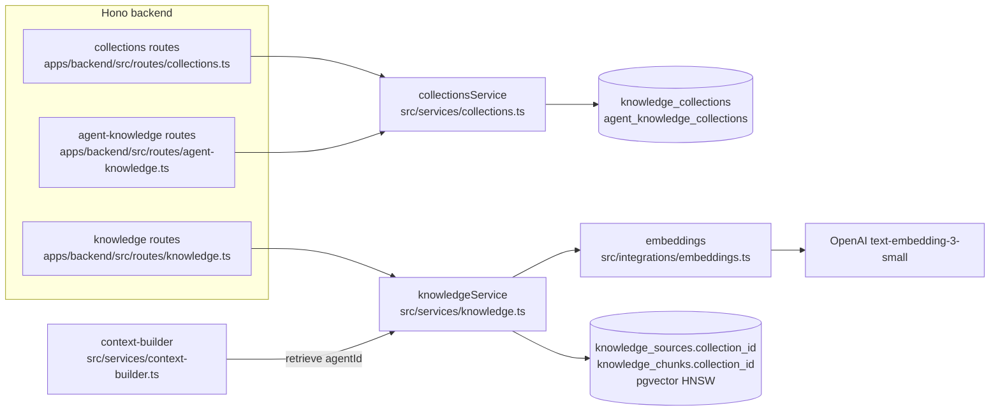
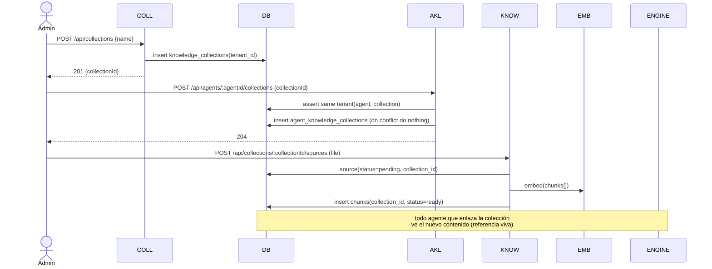
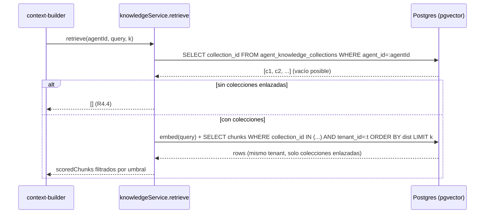

# Design — US-032 · Biblioteca de conocimiento reutilizable y enlace a agentes

## Overview

Se introduce `knowledge_collections` como entidad propia del tenant y un join N:M `agent_knowledge_collections` (agente↔colección). `knowledge_sources` y `knowledge_chunks` dejan de colgar de `bot_id` y pasan a `collection_id` (FK cascade), conservando `tenant_id` para aislamiento. La recuperación cambia de `retrieve(botId, query, k)` a `retrieve(agentId, query, k)`: resuelve las colecciones enlazadas al agente y busca chunks SOLO en esas colecciones (`collection_id IN linked`), mismo tenant. El enlace es referencia **viva**: editar una colección impacta a todos los agentes que la enlazan, sin copiar. Una migración idempotente crea una colección por bot con su conocimiento actual y la enlaza al agente de ese bot (US-031). La UI vive en US-034; aquí solo migración, servicios, contratos y endpoints. Reutiliza el pipeline de ingestión de US-009 (`chunker`, `embeddings`, índice HNSW) reapuntándolo a colecciones.

## Architecture



## Sequence Diagrams

### Enlace de colección y carga de fuente (referencia viva)



### Recuperación por agente



## Components and Interfaces

### `collectionsService` — `apps/backend/src/services/collections.ts`

Responsabilidades: CRUD de colecciones, enlace/desenlace N:M con agentes, resolución de colecciones visibles por agente. Aísla por `tenantId` en cada operación.

```ts
interface CollectionsService {
  create(tenantId: string, input: { name: string; description?: string }, userId: string): Promise<{ id: string }>; // 1.1, 1.2, 1.7
  update(tenantId: string, collectionId: string, patch: { name?: string; description?: string }): Promise<boolean>;   // 1.3
  list(tenantId: string): Promise<CollectionSummary[]>;                                                               // 1.4
  remove(tenantId: string, collectionId: string): Promise<boolean>;                                                   // 1.5, 1.6
  linkAgent(tenantId: string, agentId: string, collectionId: string): Promise<void>;                                  // 3.1, 3.2, 3.3
  unlinkAgent(tenantId: string, agentId: string, collectionId: string): Promise<void>;                                // 3.4
  collectionsForAgent(tenantId: string, agentId: string): Promise<CollectionSummary[]>;                               // 3.5, 3.6
}

type CollectionSummary = { id: string; name: string; description: string | null; sourceCount: number };
```

### `knowledgeService` — `apps/backend/src/services/knowledge.ts` (modificado)

Las firmas pasan de `botId` a `collectionId` para ingestión y a `agentId` para recuperación. Reutiliza `chunker` y `embeddings` de US-009.

```ts
// Antes: createSource(tenantId, botId, input, userId)
createSource(tenantId: string, collectionId: string, input: SourceInput, userId: string): Promise<{ id: string }>; // 2.1, 2.2
reindex(tenantId: string, collectionId: string, sourceId: string): Promise<boolean>;                               // 2.4
deleteSource(tenantId: string, collectionId: string, sourceId: string): Promise<boolean>;                          // 2.4
listSources(tenantId: string, collectionId: string): Promise<KnowledgeSourceRow[]>;                                // 1.4, 2.5

// Antes: retrieve(botId, query, k, minScore)
retrieve(agentId: string, query: string, k?: number, minScore?: number): Promise<ScoredChunk[]>;                   // 4.1–4.5, 5.1–5.3
```

### Rutas

- `apps/backend/src/routes/collections.ts` — `POST/GET/PATCH/DELETE /api/collections`, `GET /api/collections/:id/sources`. (R1, R2)
- `apps/backend/src/routes/agent-knowledge.ts` — `POST/DELETE /api/agents/:agentId/collections`, `GET /api/agents/:agentId/collections`. (R3)
- `apps/backend/src/routes/knowledge.ts` — la carga de fuentes pasa a `POST /api/collections/:collectionId/sources` (en vez de `/api/bots/:id/knowledge`). (R2)

### Caller del motor — `apps/backend/src/services/context-builder.ts` (modificado)

Hoy llama `retrieve(bot.id, query, MAX_KNOWLEDGE_CHUNKS)`. Pasa a `retrieve(agentId, query, MAX_KNOWLEDGE_CHUNKS)`, donde `agentId` es el agente fijado en la conversación (D3, propiedad de US-031/US-035).

## Data Models

### `knowledge_collections` (nueva)

| Campo | Tipo | Notas |
|---|---|---|
| id | uuid pk | `defaultRandom()` |
| tenant_id | text not null | Clerk org id; frontera de aislamiento (índice por tenant) |
| name | text not null | no vacío (R1.2) |
| description | text null | |
| created_by | text not null | Clerk user id |
| created_at | timestamptz not null | `defaultNow()` |
| updated_at | timestamptz not null | `defaultNow()` |

### `agent_knowledge_collections` (nueva, join N:M)

| Campo | Tipo | Notas |
|---|---|---|
| agent_id | uuid not null fk agents(id) cascade | (US-031) |
| collection_id | uuid not null fk knowledge_collections(id) cascade | |
| created_at | timestamptz not null | `defaultNow()` |
| (unique) | `(agent_id, collection_id)` | idempotencia del enlace (R3.3) |

### `knowledge_sources` (modificada)

| Campo | Antes | Después |
|---|---|---|
| bot_id | uuid fk bots cascade | **eliminado** |
| collection_id | — | uuid not null fk `knowledge_collections(id)` cascade (R2.1, R1.5) |
| tenant_id | text not null | sin cambios (aislamiento, R2.5) |
| (resto: kind, title, raw_text, status, error, created_by, timestamps) | sin cambios | sin cambios |

### `knowledge_chunks` (modificada)

| Campo | Antes | Después |
|---|---|---|
| bot_id | uuid fk bots cascade | **eliminado** |
| collection_id | — | uuid not null fk `knowledge_collections(id)` cascade (R2.3) |
| source_id | uuid fk knowledge_sources cascade | sin cambios (sin huérfanos al reindexar, R2.4) |
| tenant_id | text not null | sin cambios (R4.3) |
| embedding | vector(1536) | sin cambios; índice HNSW `vector_cosine_ops` conservado |
| (índices) | `(bot_id)` | reemplazado por índice `(collection_id)` para el `IN (...)` de retrieve |

## Algorithmic Pseudocode

```
function retrieve(agentId, query, k=5, minScore=0.35):
  precondición: agentId pertenece al tenant del contexto; el motor lo pasa fijado en la conversación
  postcondición: |result| <= k; todo chunk en una colección enlazada a agentId y del mismo tenant;
                 scores monótonamente decrecientes
  tenant = tenantOf(agentId)
  linked = SELECT collection_id FROM agent_knowledge_collections WHERE agent_id = agentId
  if linked is empty: return []                                   # R4.4
  qv = embed([query])[0]
  rows = SELECT content, 1 - (embedding <=> qv) AS score
         FROM knowledge_chunks
         WHERE collection_id = ANY(linked) AND tenant_id = tenant # R4.2, R4.3
         ORDER BY embedding <=> qv LIMIT k                        # R4.1
  return rows.filter(r => r.score >= minScore)                    # R4.5
```

```
function migrate():
  precondición: existe ya un agente por cada bot (US-031, D4)
  postcondición: |sources_after| == |sources_before|; |chunks_after| == |chunks_before|;
                 cada source/chunk con exactamente un collection_id; idempotente
  for each bot with conocimiento:
    coll = SELECT id FROM knowledge_collections
           WHERE tenant_id = bot.tenant_id AND name = canonicalName(bot)   # detección idempotente
    if coll is null:
      coll = INSERT knowledge_collections(tenant_id=bot.tenant_id, name=canonicalName(bot), created_by=bot.created_by)
    UPDATE knowledge_sources SET collection_id = coll WHERE bot_id = bot.id AND collection_id IS NULL
    UPDATE knowledge_chunks  SET collection_id = coll WHERE bot_id = bot.id AND collection_id IS NULL
    agent = agentOf(bot)                                          # 1:1 por D4
    INSERT agent_knowledge_collections(agent.id, coll) ON CONFLICT DO NOTHING   # R6.5
```

## Correctness Properties

- **P1 (aislamiento por agente)** — todo chunk devuelto por `retrieve(agentId)` pertenece a una colección presente en `agent_knowledge_collections` para ese `agentId`. (R4.2)
- **P2 (aislamiento por tenant)** — todo chunk devuelto por `retrieve(agentId)` cumple `chunk.tenant_id == tenantOf(agentId)`; el enlace solo se crea entre agente y colección del mismo tenant. (R3.2, R4.3)
- **P3 (orden)** — los scores del resultado de `retrieve` son monótonamente decrecientes y `|result| <= k`. (R4.1)
- **P4 (sin huérfanos)** — borrar una colección elimina el 100% de sus fuentes, chunks y enlaces; reindexar una fuente reemplaza sus chunks sin dejar previos. (R1.5, R1.6, R2.4)
- **P5 (referencia viva)** — para dos agentes A y B que enlazan la colección C, tras editar C ambos recuperan el contenido actualizado sin copia por agente; desenlazar C de A no altera lo que ve B. (R5.1, R5.2, R5.3)
- **P6 (idempotencia)** — enlazar dos veces la misma (agente, colección) deja un solo enlace; ejecutar la migración N veces produce el mismo estado (mismo conteo de colecciones, enlaces, fuentes y chunks). (R3.3, R6.3, R6.4, R6.5)

## Error Handling

| Escenario | Respuesta | Recuperación |
|---|---|---|
| Crear colección con nombre vacío | 422 | corregir nombre (R1.2) |
| Cargar fuente en colección inexistente o de otro tenant | 404/403 | usar colección válida (R2.2) |
| Enlazar agente y colección de distinto tenant | 403 | — (R3.2) |
| Enlace duplicado (mismo agente+colección) | 204 idempotente (on conflict do nothing) | — (R3.3) |
| `retrieve` con agente sin colecciones enlazadas | lista vacía | enlazar al menos una colección (R4.4) |
| Embeddings API caído durante ingestión | source `failed` + error | reintentar (reusa US-009) |

## Testing Strategy

- Unit: `collectionsService` (create/update/remove con cascada de enlaces; linkAgent idempotente; rechazo cross-tenant); resolución de colecciones por agente.
- Property-based (fast-check): P3 (orden y cota k), P5 (referencia viva: editar C y comprobar A y B; desenlazar y comprobar aislamiento), P6 (idempotencia de enlace y de migración con secuencias aleatorias), P4 (secuencias create/reindex/delete sin huérfanos). Embeddings fake determinístico.
- Integration: ingestión sobre colección → `retrieve(agentId)` la encuentra; agente sin enlace devuelve vacío; aislamiento cross-tenant (P2) y cross-colección (P1); migración sobre fixture de 2 bots con conocimiento conservando conteos (R6.3).

## Performance / Security / Dependencies

- Reutiliza pgvector + índice HNSW `vector_cosine_ops` de US-009; añade índice btree `(collection_id)` para el filtro `collection_id = ANY(...)`.
- Depende de la entidad `agents` y su migración 1:1 bot→agente (US-031, D4): la migración de esta historia presupone que ese agente ya existe.
- `retrieve` resuelve colecciones enlazadas en una consulta previa; con pocas colecciones por agente el coste es despreciable frente al embed + búsqueda HNSW.
- Aislamiento: toda consulta filtra por `tenant_id`; el enlace valida mismo tenant antes de insertar (defensa en profundidad sobre la frontera de Clerk org).

## Trazabilidad

Cubre requisitos: 1.1, 1.2, 1.3, 1.4, 1.5, 1.6, 1.7, 2.1, 2.2, 2.3, 2.4, 2.5, 3.1, 3.2, 3.3, 3.4, 3.5, 3.6, 4.1, 4.2, 4.3, 4.4, 4.5, 5.1, 5.2, 5.3, 6.1, 6.2, 6.3, 6.4, 6.5.
