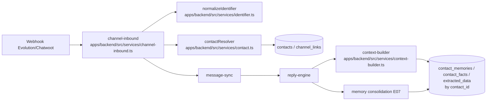
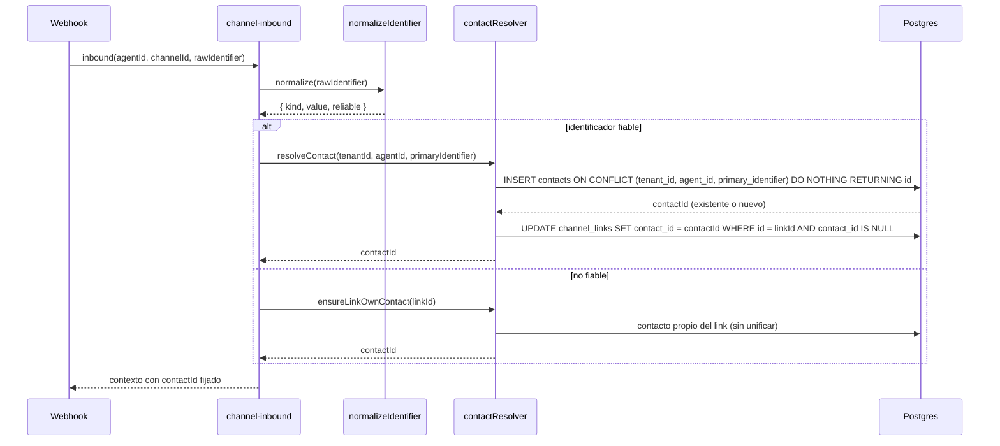
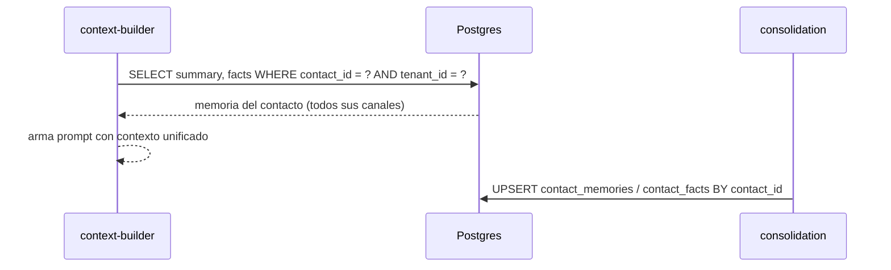

# Design — US-033 · Identidad de contacto unificada entre canales

## Overview

Introduce la tabla `contacts` (propia del agente: `tenant_id` + `agent_id` + `primary_identifier`), añade `contact_id` a `channel_links`, y re-ancla `contact_memories` / `contact_facts` / `extracted_data` de `channel_link_id` a `contact_id`. En cada inbound, el `channel-inbound` resuelve el contacto de forma idempotente: normaliza el identificador (teléfono → E.164, email → minúsculas) y hace un upsert por `(tenant_id, agent_id, primary_identifier)`; varios `channel_links` con el mismo identificador convergen al mismo contacto (D6). El pipeline (`context-builder`, `identity`, memoria/facts/extracción) deja de leer por `channel_link_id` y lee por `contact_id`. El aislamiento es estricto por `(tenant_id, agent_id)`: no se unifica cross-agent ni cross-tenant. Reutiliza la normalización de teléfono ya existente para `phone_rules`/`channel_links` (E.164). Depende de que la entidad `agents` ya exista (US-031); donde aún no esté disponible, esta historia opera contra `agent_id` ya resuelto por el inbound.

## Architecture



## Sequence Diagrams

### Inbound: resolución y unificación de contacto



### Lectura/escritura de memoria por contacto



## Components and Interfaces

### `normalizeIdentifier` — `apps/backend/src/services/identifier.ts`
Responsabilidades:
- Normalizar teléfono a E.164 y email a minúsculas/sin espacios.
- Decidir si el identificador es fiable.

```ts
type NormalizedIdentifier =
  | { kind: "phone"; value: string; reliable: true }   // E.164
  | { kind: "email"; value: string; reliable: true }   // lower-cased
  | { kind: "none"; value: null; reliable: false };

function normalizeIdentifier(raw: string | null | undefined): NormalizedIdentifier; // 1.1–1.4
```

### `contactResolver` — `apps/backend/src/services/contact.ts`
Responsabilidades:
- Resolver/crear el contacto del agente de forma idempotente.
- Asociar `channel_links` al contacto y unificar por identificador.
- Crear contacto propio del link cuando no hay identificador fiable.

```ts
interface ContactResolver {
  // 2.1–2.4, 3.1–3.3, 5.1–5.3
  resolveContact(args: {
    tenantId: string; agentId: string; channelLinkId: string;
    identifier: NormalizedIdentifier;
  }): Promise<{ contactId: string; created: boolean; unified: boolean }>;
  // 6.1–6.3
  ensureLinkOwnContact(args: {
    tenantId: string; agentId: string; channelLinkId: string;
  }): Promise<{ contactId: string }>;
}
```

### `channel-inbound` — `apps/backend/src/services/channel-inbound.ts`
Modificación: tras crear/encontrar el `channel_link`, invoca `resolveContact`/`ensureLinkOwnContact` y propaga `contactId` al resto del pipeline. Deja de pasar solo `channelLinkId`.

### `context-builder` — `apps/backend/src/services/context-builder.ts`
Modificación: lee `contact_memories`/`contact_facts`/`extracted_data` por `contact_id` (no por `channel_link_id`).

### Servicios de memoria/extracción — `apps/backend/src/services/memory.ts`, `apps/backend/src/services/extraction.ts`
Modificación: upsert/lectura por `contact_id`. Mantienen `tenant_id`/`agent_id` para aislamiento.

### Migración — `apps/backend/drizzle/0008_contacts.sql` (`drizzle-kit generate`) + `apps/backend/scripts/migrate-contacts.ts`
Crea `contacts`, añade `contact_id` a las tablas, y backfill idempotente (ver pseudocódigo).

## Data Models

### Tabla nueva `contacts`

| Campo | Tipo DB | Notas |
|---|---|---|
| `id` | `uuid pk default random` | — |
| `tenant_id` | `text not null` | Clerk org id. Aislamiento. |
| `agent_id` | `uuid not null` | FK al agente (US-031). Contacto **por agente**. |
| `primary_identifier` | `text not null` | E.164 o email normalizado. |
| `display_name` | `text` | Nombre visible cacheado, opcional. |
| `created_at` | `timestamptz not null default now()` | — |
| Índice único | `unique (tenant_id, agent_id, primary_identifier)` | Idempotencia + P1/P5. |
| Índice | `index (agent_id)` | Lookups por agente. |

### Tablas modificadas

| Tabla | Cambio | Notas |
|---|---|---|
| `channel_links` | `+ contact_id uuid references contacts(id) on delete set null` | Unificación. Conserva `cwContactId`/`cwConversationId` por canal. Índice `(contact_id)`. |
| `contact_memories` | `+ contact_id` (pasa a ser el ancla); migrar desde `channel_link_id` | Hoy `channel_link_id` es PK; se conserva durante la transición y el ancla de lectura/escritura pasa a `contact_id`. Resumen compartido entre canales del contacto. |
| `contact_facts` | `+ contact_id`; unique pasa de `(channel_link_id, key)` a `(contact_id, key)` | Un valor vigente por clave por contacto (4.3). |
| `extracted_data` | `+ contact_id` (ancla); migrar desde `channel_link_id` | Hoy `channel_link_id` es PK; se conserva durante la transición y el ancla pasa a `contact_id`. Datos extraídos compartidos. |

> Decisión de transición (re-anclaje): se añade `contact_id`, se hace backfill, y se conmuta la lectura/escritura a `contact_id`. La columna `channel_link_id` se conserva durante la transición para rollback; su retirada se difiere a una limpieza posterior (no en esta historia) para no romper conversaciones en vuelo.

## Algorithmic Pseudocode

```
function resolveContact(tenantId, agentId, channelLinkId, identifier):
  precondición: agentId pertenece a tenantId; channelLinkId pertenece al mismo agente
  postcondición: existe exactamente 1 contacto para (tenantId, agentId, identifier.value);
                 channel_links[channelLinkId].contact_id apunta a él (si estaba libre)
  if not identifier.reliable:
    return ensureLinkOwnContact(tenantId, agentId, channelLinkId)
  contactId = INSERT INTO contacts(tenant_id, agent_id, primary_identifier)
              VALUES(tenantId, agentId, identifier.value)
              ON CONFLICT (tenant_id, agent_id, primary_identifier) DO NOTHING
              RETURNING id
  if contactId is null:                       # ya existía (concurrencia o histórico)
    contactId = SELECT id FROM contacts
                WHERE tenant_id=tenantId AND agent_id=agentId
                  AND primary_identifier=identifier.value
  UPDATE channel_links SET contact_id = contactId
    WHERE id = channelLinkId AND contact_id IS NULL   # 3.3: no reasignar
  return { contactId, created: <RETURNING devolvió fila>, unified: <link compartía contacto> }

function backfillContacts():                  # idempotente, decisión D6
  precondición: contacts.contact_id aún sin poblar
  postcondición: cada channel_link tiene contact_id; sin pérdida de memoria/facts/datos
  for each link in channel_links:
    if link.contact_id is not null: continue            # idempotencia
    pid = normalizeIdentifier(link.phone_e164 or link.wa_jid)
    if pid.reliable:
      # MVP: 1 contacto por channel_link; la unificación histórica por tel/email es OPCIONAL
      contactId = upsert contacts(tenant_id, agent_id, primary_identifier=pid.value)
    else:
      contactId = create contact propio (primary_identifier sintético del link)
    UPDATE link SET contact_id = contactId
  re-anclar contact_memories / contact_facts / extracted_data:
    SET contact_id = (SELECT contact_id FROM channel_links WHERE id = channel_link_id)
```

## Correctness Properties

- **P1 (unicidad)** — para todo `(tenant_id, agent_id, primary_identifier)` existe a lo sumo un `contacts.id` (garantizado por el índice único + upsert `ON CONFLICT`).
- **P2 (idempotencia)** — resolver el mismo identificador N veces en el mismo agente devuelve siempre el mismo `contact_id` y no crea filas adicionales.
- **P3 (aislamiento)** — ningún contacto, memoria, fact o dato leído/escrito para `(tenantId, agentId)` proviene de otro agente o tenant.
- **P4 (unificación)** — dos `channel_links` del mismo agente con identificador fiable coincidente comparten exactamente el mismo `contact_id`.
- **P5 (no-fusión sin identificador)** — un `channel_link` sin identificador fiable nunca queda asociado a un contacto que agrupe otros links.
- **P6 (preservación en migración)** — el backfill no pierde ni duplica memoria/facts/datos: cada fila de memoria queda anclada a exactamente un contacto y el conteo total se conserva.
- **P7 (no reasignación)** — un `channel_link` ya asociado a un contacto conserva su `contact_id` en inbounds posteriores.

## Error Handling

| Escenario | Respuesta | Recuperación |
|---|---|---|
| Identificador no normalizable | Contacto propio del link (no fiable, 6.1) | Si luego llega uno fiable, se puede asociar (6.3) |
| Carrera al crear el mismo contacto | `ON CONFLICT DO NOTHING` + re-SELECT (2.3) | Sin duplicados; ambos hilos convergen |
| Identificador coincide en otro tenant/agente | Se ignora; se crea/usa el contacto del agente consultado (5.1, 5.2) | — |
| `channel_link` ya tiene `contact_id` | No se reasigna (3.3, P7) | — |
| Backfill interrumpido | Reintentar; es idempotente (filas con `contact_id` ya poblado se saltan) | Re-ejecutar el script |

## Testing Strategy

- Unit: `normalizeIdentifier` (teléfonos válidos/inválidos, emails con mayúsculas/espacios, vacío → no fiable).
- Property-based (fast-check): P1/P2 sobre secuencias de `resolveContact` con el mismo y distintos identificadores; P4 (links con identificador coincidente convergen); P5 (links sin identificador nunca comparten contacto).
- Integration: inbound por dos canales del mismo agente con el mismo teléfono → un contacto, memoria compartida (4.1, 4.4); mismo teléfono en dos agentes → dos contactos (5.1); backfill sobre fixture y verificación de conteos (P6).

## Performance / Security / Dependencies

- Depende de la entidad `agents` (US-031) y de `channel_links` con `agent_id` resuelto por el inbound. Si `agents` aún no está disponible en el entorno, esta historia se apila tras esa migración.
- El upsert `ON CONFLICT` requiere el índice único `(tenant_id, agent_id, primary_identifier)`; sin él la idempotencia (P1/P2) no se garantiza.
- Privacidad (riesgo Q4 del research): la unificación cruza canales; la fusión histórica por tel/email en el backfill es **opcional** y queda desactivada por defecto (1 contacto por link) para evitar colisiones (un mismo número reasignado a otra persona) y problemas de consentimiento. Documentado en la migración.
- Aislamiento por tenant/agente reforzado a nivel de índice y de todas las queries (P3).

## Trazabilidad

Cubre requisitos: 1.1, 1.2, 1.3, 1.4, 2.1, 2.2, 2.3, 2.4, 3.1, 3.2, 3.3, 4.1, 4.2, 4.3, 4.4, 5.1, 5.2, 5.3, 6.1, 6.2, 6.3.
