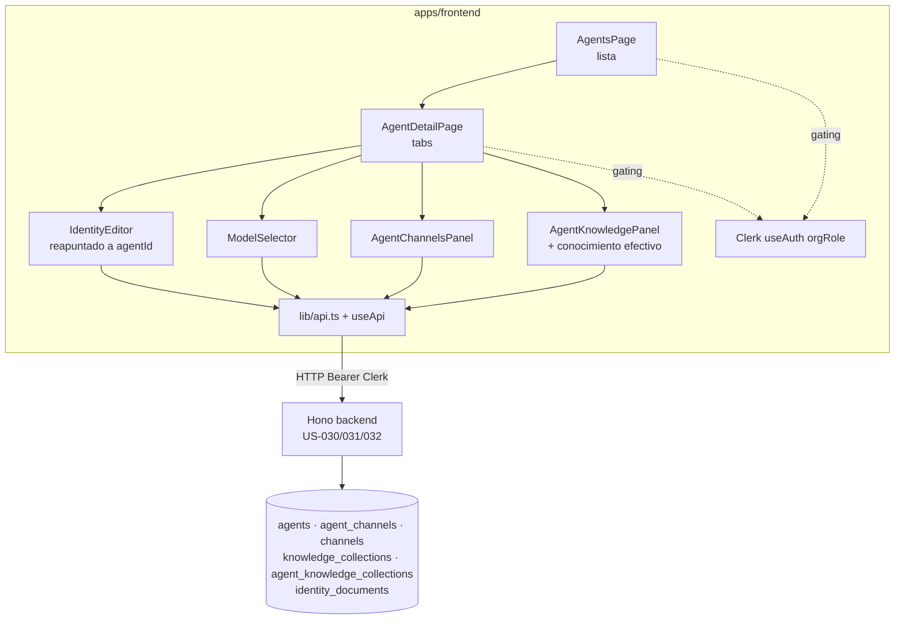

# Design — US-034 · UI de gestion de agentes

## Overview

UI de administracion de agentes en `apps/frontend` montada sobre el stack existente (React + Vite + TanStack Query + Clerk `useAuth().orgRole` + primitivas de `@/components/ui` + cliente `useApi`). Replica el patron lista/detalle de `BotsPage` + `BotDetailPage`, pero contra los recursos de agente del backend de E13 (US-030/031/032): `GET/POST /api/agents`, identidad `GET/POST /api/agents/:id/identity*`, modelo en `PATCH /api/agents/:id`, canales `GET/POST/DELETE /api/agents/:id/channels*` y colecciones `GET/POST/DELETE /api/agents/:id/collections*`. El detalle organiza el trabajo en pestanas (Identidad, Modelo, Canales, Conocimiento). Esta historia no crea backend: consume contratos definidos por US-030/031/032; los permisos se derivan del rol de Clerk y el aislamiento por tenant lo garantiza el backend (esta UI solo lo respeta). Reutiliza `IdentityEditor` (hoy por bot) reapuntandolo al agente.

## Architecture



## Sequence Diagrams

### Carga del detalle y enlace de un canal

```mermaid
sequenceDiagram
  actor Admin
  participant UI as AgentDetailPage / AgentChannelsPanel
  participant API as useApi
  participant BE as Backend US-031
  Admin->>UI: abre detalle del agente
  UI->>API: getAgent(agentId)
  UI->>API: listAgentChannels(agentId)
  API->>BE: GET /api/agents/:id, /api/agents/:id/channels
  BE-->>API: agente + {linked[], available[]}
  API-->>UI: render (sin credenciales)
  Admin->>UI: enlazar canal C
  UI->>API: linkChannel(agentId, C)
  API->>BE: POST /api/agents/:id/channels { channelId: C }
  alt canal ya enlazado a otro agente
    BE-->>API: 409 conflicto
    API-->>UI: error; C permanece disponible
  else ok
    BE-->>API: 200
    API-->>UI: invalida query; C pasa a enlazados
  end
```

### Enlace de coleccion y conocimiento efectivo

```mermaid
sequenceDiagram
  actor Admin
  participant UI as AgentKnowledgePanel
  participant API as useApi
  participant BE as Backend US-032
  Admin->>UI: abre pestana Conocimiento
  UI->>API: listAgentCollections(agentId)
  API->>BE: GET /api/agents/:id/collections
  BE-->>API: { linked[], available[] }
  API-->>UI: render enlazadas + efectivo = linked
  Admin->>UI: enlazar coleccion K
  UI->>API: linkCollection(agentId, K)
  API->>BE: POST /api/agents/:id/collections { collectionId: K }
  BE-->>API: 200
  API-->>UI: invalida query; efectivo recalculado (incluye K)
```

## Components and Interfaces

### `AgentsPage` — `apps/frontend/src/pages/agents/AgentsPage.tsx`
Responsabilidades: listar agentes visibles (1.1, 1.2, 1.3, 1.5), gatear creacion por rol (2.1, 2.2), crear agente (2.3–2.6), navegar a detalle (1.6). Patron espejo de `BotsPage`.

```ts
interface AgentListItem {
  id: string;
  name: string;
  status: "draft" | "active" | "paused";
  channelCount: number;
}
```

### `AgentDetailPage` — `apps/frontend/src/pages/agents/AgentDetailPage.tsx`
Responsabilidades: cargar el agente, gatear acciones por `orgRole`, renderizar pestanas (Identidad, Modelo, Canales, Conocimiento), manejar acceso no permitido para member sin asignacion (6.4). Patron espejo de `BotDetailPage`.

```ts
type AgentTabKey = "identity" | "model" | "channels" | "knowledge";
```

### `IdentityEditor` (reapuntado) — `apps/frontend/src/pages/agents/IdentityEditor.tsx`
Responsabilidades: editar identidad versionada por tipo del agente (3.1, 3.2, 3.3), solo lectura para member (3.6, 6.2). Reutiliza el componente existente cambiando `botId` por `agentId` y los endpoints de identidad a `/api/agents/:id/identity*`.

### `ModelSelector` — `apps/frontend/src/pages/agents/ModelSelector.tsx`
Responsabilidades: elegir entre "global por defecto" (model = null) y un modelo concreto (3.4, 3.5), persistir via `updateAgent`, manejar error sin perder seleccion (3.7).

```ts
interface ModelSelectorProps {
  agentId: string;
  model: string | null; // null = global por defecto
  isAdmin: boolean;
}
```

### `AgentChannelsPanel` — `apps/frontend/src/pages/agents/AgentChannelsPanel.tsx`
Responsabilidades: mostrar canales enlazados y disponibles (4.1, 4.4), enlazar/desenlazar (4.2, 4.3, 4.6), bloquear canal ya tomado por otro agente (4.5), solo lectura para member (4.7).

### `AgentKnowledgePanel` — `apps/frontend/src/pages/agents/AgentKnowledgePanel.tsx`
Responsabilidades: mostrar colecciones enlazadas y disponibles (5.1), enlazar/desenlazar (5.2, 5.3, 5.6), presentar conocimiento efectivo y su vacio (5.4, 5.5), solo lectura para member (5.7).

### Cliente API — `apps/frontend/src/lib/api.ts`
Añade metodos al cliente `useApi` (todos con Bearer de Clerk, mismo `request`/`json.data` que el resto):

```ts
interface AgentsApi {
  listAgents(): Promise<AgentListItem[]>;                                  // 1.1, 1.4, 6.3
  getAgent(id: string): Promise<Agent>;                                    // 3.1, 6.4
  createAgent(input: { name: string }): Promise<Agent>;                    // 2.3
  updateAgent(id: string, patch: { model: string | null }): Promise<Agent>; // 3.4
  // identidad (reapuntada a agentId; mismos contratos que la de bot)
  getAgentIdentity(id: string): Promise<Record<IdentityType, IdentityDoc | null>>; // 3.1
  listAgentIdentityVersions(id: string, type: IdentityType): Promise<IdentityVersion[]>; // 3.3
  saveAgentIdentity(id: string, type: IdentityType, content: string): Promise<void>;     // 3.2
  // canales
  listAgentChannels(id: string): Promise<{ linked: AgentChannel[]; available: AgentChannel[] }>; // 4.1
  linkChannel(id: string, channelId: string): Promise<void>;              // 4.2, 4.5
  unlinkChannel(id: string, channelId: string): Promise<void>;            // 4.3
  // colecciones
  listAgentCollections(id: string): Promise<{ linked: KnowledgeCollection[]; available: KnowledgeCollection[] }>; // 5.1
  linkCollection(id: string, collectionId: string): Promise<void>;        // 5.2
  unlinkCollection(id: string, collectionId: string): Promise<void>;      // 5.3
}

interface AgentChannel { id: string; type: string; displayName: string | null; linkedAgentId?: string | null }
interface KnowledgeCollection { id: string; name: string; description: string | null }
```

### Ruteo — `apps/frontend/src/App.tsx` y `apps/frontend/src/components/Layout.tsx`
Rutas `/agents` y `/agents/:agentId`; entrada de navegacion "Agentes". Puede coexistir con `/bots` durante la transicion de E13.

## Data Models

La UI no crea tablas; consume el modelo de E13. Mapeo UI ↔ DTO ↔ DB (nombres canonicos de US-030/031/032):

| Campo (UI) | DTO API | DB | Transformacion |
|---|---|---|---|
| Nombre del agente | `agent.name` | `agents.name` | passthrough |
| Estado | `agent.status` | `agents.status` enum(draft/active/paused) | passthrough |
| Modelo / "global por defecto" | `agent.model` | `agents.model` text NULL | `null` ⇒ etiqueta "global por defecto" |
| Identidad vigente por tipo | `identityDoc.{content,version}` | `identity_documents(agent_id,type,version,content)` | vigente = max version por (agent_id,type) |
| Canales enlazados | `linked[]` | `agent_channels(agent_id,channel_id)` ⋈ `channels` | unique en `channel_id` (Fase 1: un canal → un agente) |
| Canal: credenciales | — | `channels.credentials` | NUNCA se proyecta al DTO |
| Colecciones enlazadas | `linked[]` | `agent_knowledge_collections(agent_id,collection_id)` ⋈ `knowledge_collections` | referencia viva |
| Conocimiento efectivo | derivado de `linked[]` | colecciones enlazadas (mismo tenant) | conjunto = colecciones enlazadas |
| `channelCount` | `agent.channelCount` | `count(agent_channels)` por agente | agregado en backend |

## Algorithmic Pseudocode

```
function effectiveKnowledge(agentId):
  precondicion: agentId pertenece al tenant activo; usuario autorizado a verlo
  postcondicion: devuelve exactamente el conjunto de colecciones enlazadas (sin duplicados)
  { linked } = listAgentCollections(agentId)
  return uniqueById(linked)   # vacio => "sin conocimiento efectivo" (5.5)
```

```
function canWrite(orgRole, agent, assignment):
  precondicion: orgRole en {org:admin, org:member}
  postcondicion: true solo si el usuario puede mutar el agente
  if orgRole == "org:admin": return true            # 6.1
  if orgRole == "org:member": return false          # 6.2 (member es solo lectura sobre lo asignado)
```

## Correctness Properties

- **P1 (aislamiento por tenant)** — toda entidad mostrada (agente, canal, coleccion) pertenece al tenant activo; la UI no presenta recursos de otro tenant.
- **P2 (no fuga de secretos)** — ningun panel renderiza `channels.credentials` ni otro secreto de conexion; el DTO de canal no incluye esos campos.
- **P3 (gating por rol)** — para `org:member`, todos los controles de escritura (crear, guardar identidad, cambiar modelo, enlazar/desenlazar) estan deshabilitados u ocultos; solo admin escribe.
- **P4 (consistencia tras mutacion)** — tras un enlace/desenlace o guardado exitoso, la vista refleja el nuevo estado (invalidacion de query); tras un fallo, el estado mostrado es el previo a la operacion.
- **P5 (conocimiento efectivo = enlazadas)** — el conjunto presentado como conocimiento efectivo es exactamente el de colecciones enlazadas, sin omisiones ni duplicados.
- **P6 (exclusividad de canal en Fase 1)** — un canal ya enlazado a otro agente no puede enlazarse a un segundo; la UI lo indica y no envia la mutacion.

## Error Handling

| Escenario | Respuesta | Recuperacion |
|---|---|---|
| Falla `listAgents` / `getAgent` | mensaje de error + boton reintentar | reintento manual (1.3) |
| Crear agente con nombre vacio | envio bloqueado + aviso inline | corregir nombre (2.4) |
| Crear agente falla en backend | error inline, datos conservados | reenviar (2.6) |
| Guardar identidad/modelo falla | error visible, cambios pendientes conservados | reintentar (3.7) |
| Enlazar canal ya tomado | aviso "enlazado a otro agente", sin mutacion | — (4.5, P6) |
| Enlace/desenlace falla | error + estado previo restaurado | reintentar (4.6, 5.6, P4) |
| Member abre agente no asignado | pantalla de acceso no permitido | volver a la lista (6.4) |

## Testing Strategy

- Unit: `ModelSelector` (null ⇄ modelo concreto y etiqueta "global por defecto"); `effectiveKnowledge` (vacio, duplicados); gating de controles por `orgRole`.
- Property-based (fast-check): P3 (para cualquier rol member, ningun control de escritura habilitado); P5 (efectivo = enlazadas para cualquier multiset de colecciones); P4 (mutacion ok ⇒ estado nuevo, mutacion error ⇒ estado previo) con cliente API fake.
- Integration (componentes con cliente mockeado): flujo lista→detalle→enlazar canal→ver reflejado; enlazar coleccion y ver efectivo; member entra en solo lectura; verificacion de que el DTO de canal renderizado no contiene credenciales (P2).

## Performance / Security / Dependencies

- Depende de los contratos de backend de US-030 (agentes/identidad/modelo), US-031 (canales N:M) y US-032 (colecciones); si esos endpoints cambian, ajustar `lib/api.ts`.
- Seguridad: la autorizacion real vive en backend (esta UI no es la frontera de seguridad); la UI solo refleja permisos y nunca solicita ni muestra credenciales (P2). El token de Clerk con claims de org viaja en cada request (patron `useApi` existente).
- Performance: queries cacheadas con TanStack Query e invalidacion selectiva por agente; sin polling salvo el ya existente para estados de conexion (no aplica a esta UI).
- Reutiliza `IdentityEditor`, `Card`, `Badge`, `Button`, `Tabs`, `EmptyState`, `Loading`, `ErrorText`, `Input`, `PageHeader` del design system (E09).

## Trazabilidad

Cubre requisitos: 1.1, 1.2, 1.3, 1.4, 1.5, 1.6, 2.1, 2.2, 2.3, 2.4, 2.5, 2.6, 3.1, 3.2, 3.3, 3.4, 3.5, 3.6, 3.7, 4.1, 4.2, 4.3, 4.4, 4.5, 4.6, 4.7, 5.1, 5.2, 5.3, 5.4, 5.5, 5.6, 5.7, 6.1, 6.2, 6.3, 6.4, 6.5.
