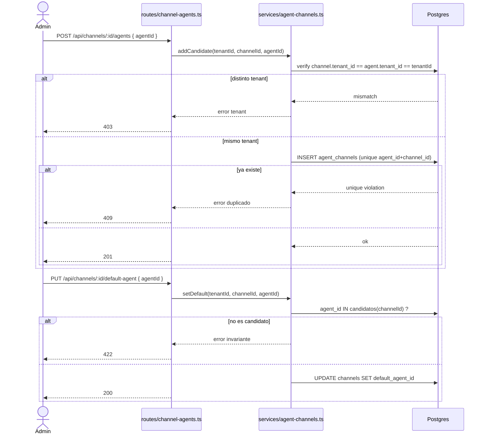
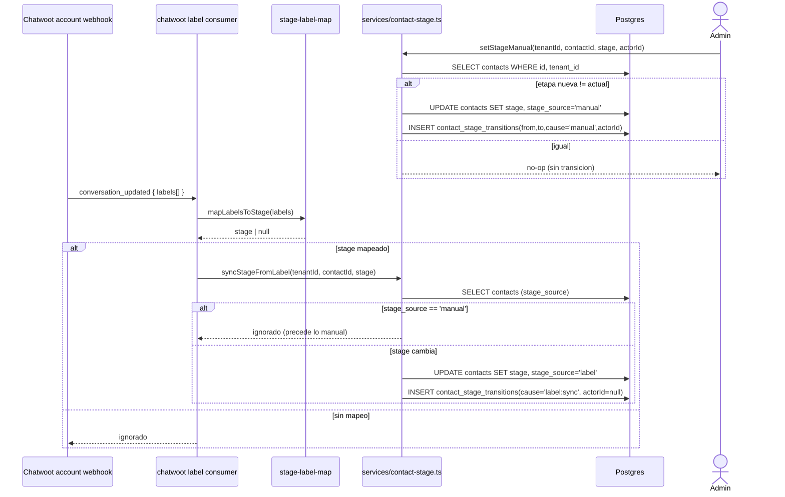

# Design — US-035 · Multiples agentes por canal y etapa del contacto

## Overview

Esta historia es el cimiento de datos de E14 sobre las entidades ya introducidas en E13 (`agents`, `channels`, `agent_channels`, `contacts`). Hace tres cosas: (1) relaja la unicidad de `agent_channels` para permitir varios agentes por canal manteniendo unicidad del par agente-canal; (2) añade `channels.default_agent_id` con la invariante "el default debe ser candidato del canal"; (3) añade `contacts.stage` con escritura manual, sincronización desde labels de Chatwoot y auditoría en `contact_stage_transitions`. Expone endpoints Hono CRUD para candidatos, default y etapa, y un consumidor que mapea labels de Chatwoot a etapas reusando el webhook de cuenta existente. No incluye ruteo: nadie elige todavía qué agente atiende (eso es US-036/037/038).

## Architecture

```mermaid
flowchart LR
  subgraph FE[apps/frontend - fuera de esta historia US-039]
    UI[Gestion canales/contactos]
  end
  subgraph BE[apps/backend - Hono]
    RCH[routes/channel-agents.ts]
    RST[routes/contact-stage.ts]
    SVC_AC[services/agent-channels.ts]
    SVC_ST[services/contact-stage.ts]
    CWH[routes/webhooks.ts chatwoot-account label consumer]
    MAP[services/stage-label-map.ts]
  end
  subgraph DB[(PostgreSQL - aislado por tenant_id)]
    AC[(agent_channels)]
    CH[(channels.default_agent_id)]
    CO[(contacts.stage)]
    CST[(contact_stage_transitions)]
  end
  CW[[Chatwoot account webhook]]

  UI -->|/api/channels/:id/agents| RCH
  UI -->|/api/contacts/:id/stage| RST
  RCH --> SVC_AC --> AC
  RCH -->|set default| SVC_AC --> CH
  RST --> SVC_ST --> CO
  SVC_ST --> CST
  CW -->|label event| CWH --> MAP --> SVC_ST
```

## Sequence Diagrams

### Asignar agente candidato y fijar el agente por defecto



### Cambio de etapa: manual y sincronizado desde label



## Components and Interfaces

### `agentChannelsService` — `apps/backend/src/services/agent-channels.ts`

Responsabilidades: gestionar los candidatos y el agente por defecto del canal, garantizando aislamiento por tenant y la invariante del default.

```ts
interface AgentSummary { id: string; name: string; status: "draft" | "active" | "paused"; }

interface AgentChannelsService {
  addCandidate(tenantId: string, channelId: string, agentId: string): Promise<void>; // 1.1-1.4
  removeCandidate(tenantId: string, channelId: string, agentId: string): Promise<void>; // 1.5, 2.4
  listCandidates(tenantId: string, channelId: string): Promise<AgentSummary[]>; // 1.6
  setDefault(tenantId: string, channelId: string, agentId: string): Promise<void>; // 2.1-2.3
  getDefault(tenantId: string, channelId: string): Promise<string | null>; // 2.5
}
```

### `contactStageService` — `apps/backend/src/services/contact-stage.ts`

Responsabilidades: leer/escribir la etapa, registrar transiciones, aplicar la precedencia manual sobre label.

```ts
type StageCause = "manual" | "label:sync";
type StageSource = "manual" | "label";
interface StageTransition {
  fromStage: string | null;
  toStage: string;
  cause: StageCause;
  actorId: string | null;
  createdAt: string;
}

interface ContactStageService {
  getStage(tenantId: string, contactId: string): Promise<{ stage: string | null; source: StageSource }>; // 3.2, 3.4
  setStageManual(tenantId: string, contactId: string, stage: string, actorId: string): Promise<void>;    // 3.1, 3.3, 3.5, 4.1, 4.2
  syncStageFromLabel(tenantId: string, contactId: string, stage: string): Promise<void>;                 // 5.1, 5.3, 5.5, 4.3
  listTransitions(tenantId: string, contactId: string): Promise<StageTransition[]>;                       // 4.4
}
```

### `stageLabelMap` — `apps/backend/src/services/stage-label-map.ts`
Mapeo configurable label de Chatwoot → etapa. `mapLabelsToStage(labels: string[]): string | null` devuelve la primera etapa mapeada o `null` (5.2). El mapa por defecto: `pre_venta → pre_sale`, `post_venta → post_sale`.

### Consumidor de label — `apps/backend/src/routes/webhooks.ts` (extensión)
El webhook de cuenta de Chatwoot (E11/US-022, `POST /webhooks/chatwoot-account/:tenantId`) ya recibe `conversation_updated`. Se añade un paso que resuelve el `contactId` por `channel_links.cw_contact_id`/`cw_conversation_id`, mapea labels y delega en `syncStageFromLabel`. Eventos de contactos inexistentes se ignoran (5.4).

### Rutas — `apps/backend/src/routes/channel-agents.ts` y `apps/backend/src/routes/contact-stage.ts`
`POST/GET/DELETE /api/channels/:id/agents`, `PUT/GET /api/channels/:id/default-agent`, `PUT/GET /api/contacts/:id/stage`, `GET /api/contacts/:id/stage/history`. Solo rol admin escribe; aislamiento por `tenantId` del contexto Clerk.

## Data Models

### `agent_channels` (modificada)

| Campo | Tipo | Notas |
|---|---|---|
| `id` | uuid pk | |
| `tenant_id` | text not null | aislamiento |
| `agent_id` | uuid fk agents.id (cascade) | candidato |
| `channel_id` | uuid fk channels.id (cascade) | canal |
| `created_at` | timestamptz default now | |
| _constraint_ | `unique(agent_id, channel_id)` | **se ELIMINA** el `unique(channel_id)` de E13 para permitir N:M; se conserva la unicidad del par |
| _index_ | `(channel_id)`, `(agent_id)` | lecturas por canal y por agente |

### `channels` (campo añadido)

| Campo | Tipo | Notas |
|---|---|---|
| `default_agent_id` | uuid null fk agents.id (set null) | agente por defecto del canal; null = sin default. Invariante de aplicación: si no-null, debe existir `agent_channels(default_agent_id, channels.id)` |

### `contacts` (campos añadidos)

| Campo | Tipo | Notas |
|---|---|---|
| `stage` | `contact_stage` enum null | `pre_sale` \| `post_sale` (extensible); null = sin etapa |
| `stage_source` | `stage_source` enum not null default `manual` | `manual` \| `label`; gobierna precedencia (5.3) |
| `stage_updated_at` | timestamptz null | último cambio efectivo |

### `contact_stage_transitions` (nueva, append-only)

| Campo | Tipo | Notas |
|---|---|---|
| `id` | uuid pk | |
| `tenant_id` | text not null | aislamiento |
| `contact_id` | uuid fk contacts.id (cascade) | |
| `from_stage` | `contact_stage` null | etapa previa (null si era sin etapa) |
| `to_stage` | `contact_stage` not null | etapa nueva |
| `cause` | text not null | `manual` \| `label:sync` |
| `actor_id` | text null | Clerk user id si manual; null si sync (4.2, 4.3) |
| `created_at` | timestamptz default now | orden del historial |
| _index_ | `(contact_id, created_at)` | historial descendente (4.4) |

## Algorithmic Pseudocode

```
function setStageManual(tenantId, contactId, newStage, actorId):
  precondición: contacto pertenece a tenantId; newStage en valores permitidos
  postcondición: contacts.stage == newStage y stage_source == 'manual';
                 transición registrada solo si hubo cambio real
  c = SELECT * FROM contacts WHERE id=contactId AND tenant_id=tenantId  -- 404/403 si no
  if newStage not in ALLOWED_STAGES: reject (3.3)
  if c.stage == newStage and c.stage_source == 'manual': return  -- no-op (3.5)
  UPDATE contacts SET stage=newStage, stage_source='manual', stage_updated_at=now WHERE id=contactId
  if c.stage != newStage:
    INSERT contact_stage_transitions(from=c.stage, to=newStage, cause='manual', actor_id=actorId)
```

```
function syncStageFromLabel(tenantId, contactId, newStage):
  precondición: contacto pertenece a tenantId; newStage ya mapeado (no null)
  postcondición: la etapa manual nunca es pisada; resultado idempotente
  c = SELECT * FROM contacts WHERE id=contactId AND tenant_id=tenantId
  if c is null: return                       -- 5.4
  if c.stage_source == 'manual': return      -- 5.3 precedencia manual
  if c.stage == newStage: return             -- 5.5 idempotente, sin transición
  UPDATE contacts SET stage=newStage, stage_source='label', stage_updated_at=now WHERE id=contactId
  INSERT contact_stage_transitions(from=c.stage, to=newStage, cause='label:sync', actor_id=null)
```

```
function setDefault(tenantId, channelId, agentId):
  precondición: canal y agente del mismo tenant
  postcondición: channels.default_agent_id == agentId solo si es candidato
  if not exists agent_channels(agent_id=agentId, channel_id=channelId): reject (2.2)
  if agent.tenant_id != tenantId or channel.tenant_id != tenantId: reject (2.3)
  UPDATE channels SET default_agent_id=agentId WHERE id=channelId AND tenant_id=tenantId
```

## Correctness Properties

- **P1 (N:M sin duplicados)** — un canal puede tener ≥1 agentes candidatos, pero nunca el mismo par (agente, canal) dos veces (`unique(agent_id, channel_id)`).
- **P2 (aislamiento por tenant)** — toda operación sobre candidatos, default, etapa o transiciones solo lee/escribe filas cuyo `tenant_id` == tenant del contexto; ninguna devuelve datos de otro tenant.
- **P3 (invariante del default)** — si `channels.default_agent_id` no es null, ese agente es candidato del canal (`agent_channels(default_agent_id, channel_id)` existe). Nunca se puede fijar ni dejar un default que no sea candidato.
- **P4 (precedencia manual)** — una etapa con `stage_source == 'manual'` jamás es sobrescrita por una sincronización desde label.
- **P5 (auditoría completa)** — todo cambio efectivo de etapa (from != to) produce exactamente una fila en `contact_stage_transitions` con su causa; un set al mismo valor no produce ninguna.
- **P6 (idempotencia de sync)** — procesar el mismo evento de label N veces deja la etapa en el mismo valor final y no añade transiciones más allá de la del primer cambio efectivo.

## Error Handling

| Escenario | Respuesta | Recuperación |
|---|---|---|
| Asignar agente ya candidato | 409 (1.3) | — |
| Agente/canal de otro tenant | 403 (1.4, 2.3, 3.4) | — |
| Default que no es candidato | 422 (2.2) | el admin asigna primero el candidato |
| Quitar candidato que es el default | 409 (2.4) | el admin cambia el default antes |
| Etapa con valor inválido | 422 (3.3) | — |
| Label sin mapeo | ignorado, 200 (5.2) | configurar el mapa |
| Sync sobre etapa manual | ignorado, sin transición (5.3) | — |
| Evento de contacto inexistente | ignorado (5.4) | — |

## Testing Strategy

- Unit: `stage-label-map` (mapeo y null), validación de valores de etapa, validación de invariante del default.
- Property-based (fast-check): P1 (secuencias add/remove no duplican), P4/P6 (intercalar manual y label en cualquier orden conserva precedencia e idempotencia), P5 (cuenta de transiciones == cambios efectivos).
- Integration: dos agentes sobre un canal (P1); set default no-candidato rechazado y candidato aceptado (P3); aislamiento cross-tenant en candidatos/etapa (P2); webhook de Chatwoot con label mapeado fija etapa salvo si es manual (P4); historial ordenado desc (4.4).

## Performance / Security / Dependencies

- Reutiliza el webhook de cuenta de Chatwoot ya existente (E11); no añade endpoints expuestos nuevos al exterior.
- Migración Drizzle: drop del `unique(channel_id)` de `agent_channels`, add `channels.default_agent_id`, enum `contact_stage`/`stage_source`, columnas en `contacts`, tabla `contact_stage_transitions`. Idempotente y sin pérdida de datos (los enlaces 1:1 de E13 siguen válidos como N:M).
- Solo rol admin (Clerk `org:admin`) puede escribir candidatos, default y etapa; lectura para member con canal/contacto del tenant.

## Trazabilidad

Cubre requisitos: 1.1, 1.2, 1.3, 1.4, 1.5, 1.6, 2.1, 2.2, 2.3, 2.4, 2.5, 3.1, 3.2, 3.3, 3.4, 3.5, 4.1, 4.2, 4.3, 4.4, 5.1, 5.2, 5.3, 5.4, 5.5.
