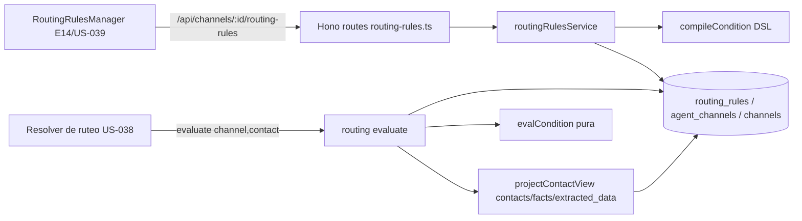
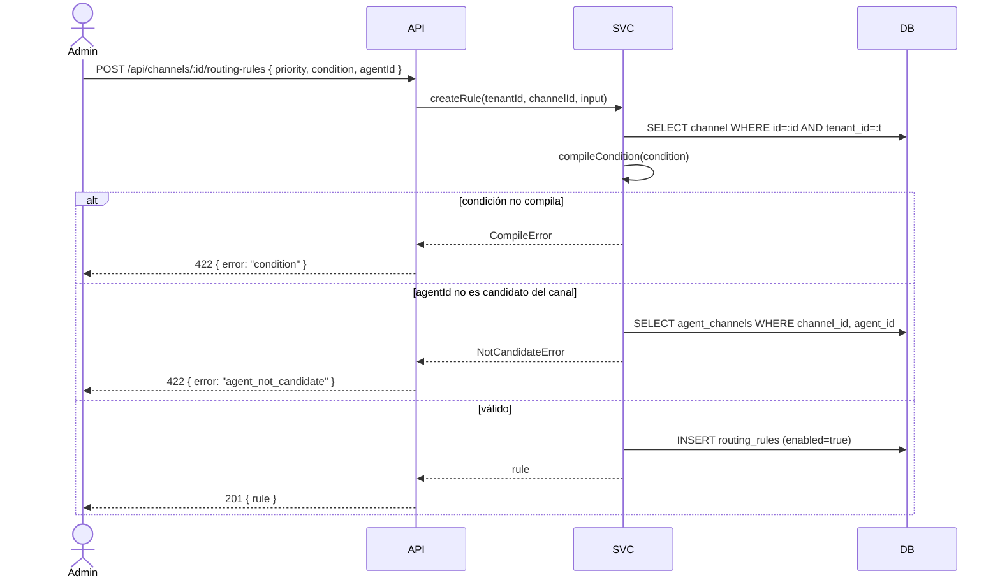
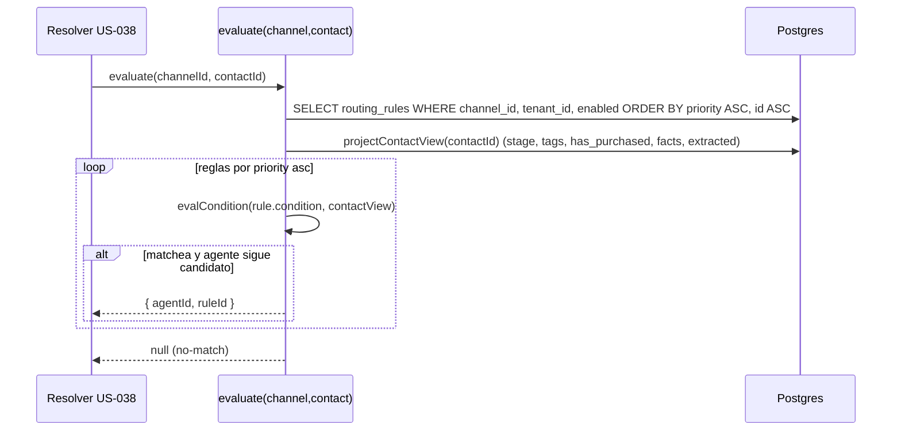

# Design — US-036 · Motor de reglas de ruteo declarativas

## Overview

Tabla `routing_rules` (FK a `channels`, `agents`) con `priority`, `condition jsonb`, `enabled` y `agent_id` destino, sobre el cimiento de US-035 (`agent_channels`, `channels.default_agent_id`, `contacts.stage`). Un DSL cerrado representado como árbol JSON (operadores `eq|ne|in|exists|gt|gte|lt|lte` + combinadores `and|or|not` sobre `stage|tags|has_purchased|facts.<k>|extracted.<k>`) con un compilador (`compileCondition`) que lo valida y un evaluador puro (`evalCondition`). La función `evaluate(channel, contact)` recorre las reglas habilitadas por `priority asc` y devuelve `{ agentId, ruleId }` de la primera que matchea o `null`. CRUD vía rutas Hono con validación de tenant y de agente candidato. El evaluador es una función pura sin I/O: los datos del contacto se proyectan a un `ContactView` plano que se le inyecta, lo que lo hace testeable con property-based (fast-check).

## Architecture



## Sequence Diagrams

Alta de regla (CRUD con validación):



Evaluación determinista (la consume US-038, aquí solo la función):



## Components and Interfaces

### `routingRulesService` — `apps/backend/src/services/routing-rules.ts`

Responsabilidades: CRUD de reglas con validación de tenant, de compilación de condición y de agente candidato; ordenación/reordenación por prioridad.

```ts
interface RoutingRulesService {
  createRule(tenantId: string, channelId: string, input: RuleInput): Promise<RoutingRule>; // 1.1, 1.3, 1.4, 1.5, 5.1
  updateRule(tenantId: string, ruleId: string, patch: Partial<RuleInput>): Promise<RoutingRule>; // 1.2, 1.3, 1.4, 5.1
  deleteRule(tenantId: string, ruleId: string): Promise<void>;                            // 2.1
  reorder(tenantId: string, channelId: string, order: { ruleId: string; priority: number }[]): Promise<void>; // 2.2
  list(tenantId: string, channelId: string): Promise<RoutingRule[]>;                       // 2.3, 6.4
}

interface RuleInput {
  priority: number;
  condition: Condition; // árbol DSL crudo (jsonb)
  agentId: string;
  enabled?: boolean;    // default true (1.1)
}
```

### `routingEngine` — `apps/backend/src/services/routing-engine.ts`

Responsabilidades: la función pura de evaluación y el compilador/evaluador del DSL. Sin I/O en `evalCondition`/`evalRules`; `evaluate` solo hace los `SELECT` y delega en las funciones puras.

```ts
// Resultado auditable (6.1, 6.2)
type RouteDecision = { agentId: string; ruleId: string } | null;

// Vista plana del contacto que consume el DSL (4.1)
interface ContactView {
  stage: string | null;
  tags: string[];
  hasPurchased: boolean;
  facts: Record<string, string>;        // contact_facts.key -> value
  extracted: Record<string, unknown>;   // extracted_data.data
}

function compileCondition(raw: unknown): Condition;            // 1.3, 4.4 (lanza CompileError)
function evalCondition(cond: Condition, view: ContactView): boolean; // 4.2, 4.3, 4.5 (pura)
function evalRules(rules: CompiledRule[], view: ContactView): RouteDecision; // 3.1, 3.2, 3.3 (pura)
function evaluate(tenantId: string, channelId: string, contactId: string): Promise<RouteDecision>; // 3.4, 6.3
```

### DSL de condición — `apps/backend/src/services/routing-dsl.ts`

Tipos y gramática del árbol de condición.

```ts
type Field =
  | { var: "stage" }
  | { var: "has_purchased" }
  | { var: "tags" }
  | { var: "fact"; key: string }       // facts.<key>
  | { var: "extracted"; key: string }; // extracted.<key>

type Leaf =
  | { op: "eq" | "ne" | "gt" | "gte" | "lt" | "lte"; field: Field; value: string | number | boolean }
  | { op: "in"; field: Field; value: (string | number)[] }
  | { op: "exists"; field: Field };

type Condition =
  | Leaf
  | { op: "and"; of: Condition[] }
  | { op: "or"; of: Condition[] }
  | { op: "not"; of: Condition };
```

Gramática (EBNF informal):

```
condition := leaf | and | or | not
and       := { "op":"and", "of": condition[>=1] }
or        := { "op":"or",  "of": condition[>=1] }
not       := { "op":"not", "of": condition }
leaf      := cmp | inOp | existsOp
cmp       := { "op": ("eq"|"ne"|"gt"|"gte"|"lt"|"lte"), "field": field, "value": scalar }
inOp      := { "op":"in", "field": field, "value": scalar[] }
existsOp  := { "op":"exists", "field": field }
field     := { "var": ("stage"|"has_purchased"|"tags") } | { "var":"fact", "key": string } | { "var":"extracted", "key": string }
scalar    := string | number | boolean
```

Reglas semánticas del DSL:
- `tags` es lista; `in`/`eq` sobre `tags` significan pertenencia (`value ∈ tags`). `exists` sobre `tags` = lista no vacía.
- `gt|gte|lt|lte` solo válidos sobre valores numéricos coercibles; si el valor del contacto no es numérico la subcondición es falsa (4.3).
- Campo ausente (`fact`/`extracted` inexistente) con operador ≠ `exists` ⇒ falso (4.3).

### Rutas — `apps/backend/src/routes/routing-rules.ts`

`GET/POST /api/channels/:id/routing-rules`, `PATCH/DELETE /api/channels/:id/routing-rules/:ruleId`, `PUT /api/channels/:id/routing-rules/order` (reorder). Solo rol `org:admin`. Validación de tenant en cada handler (6.4). Registro en `apps/backend/src/index.ts`.

## Data Models

`routing_rules` — `apps/backend/src/db/schema.ts`:

| Campo | Tipo DB | Notas |
|---|---|---|
| `id` | `uuid pk default random` | identidad citable de la regla (6.1). |
| `tenant_id` | `text not null` | Clerk org id; frontera de aislamiento (6.3, 6.4). |
| `channel_id` | `uuid not null fk channels.id on delete cascade` | canal dueño de la regla. |
| `priority` | `integer not null` | orden ascendente; menor = primero (3.1). |
| `condition` | `jsonb not null` | árbol DSL compilado y validado (4.x). |
| `agent_id` | `uuid not null fk agents.id on delete restrict` | destino; debe ser candidato del canal (5.1). |
| `enabled` | `boolean not null default true` | reglas deshabilitadas se excluyen (3.5). |
| `created_by` | `text not null` | Clerk user id que la creó (auditoría). |
| `created_at` | `timestamptz not null default now()` | desempate estable secundario (2.4). |
| `updated_at` | `timestamptz not null default now()` | — |

Índices: `routing_rules_channel_idx` sobre `(channel_id, priority, id)` (orden de evaluación, 3.1/2.4); `routing_rules_tenant_idx` sobre `(tenant_id)`; `routing_rules_agent_idx` sobre `(agent_id)` (validación 5.2). Desempate de prioridades iguales: `ORDER BY priority ASC, created_at ASC, id ASC` (2.4).

Proyección `ContactView` (solo lectura, no es tabla):

| Campo view | Origen |
|---|---|
| `stage` | `contacts.stage` (US-035). |
| `tags` | labels/tags del contacto (Chatwoot, vía la fuente que defina US-035); vacío si no hay. |
| `hasPurchased` | derivado: `true` si existe el fact/dato que marca compra (configurable); por defecto `facts.has_purchased == "true"` o `stage == "post_sale"`. |
| `facts` | `contact_facts.key -> value` del contacto. |
| `extracted` | `extracted_data.data` del contacto. |

## Algorithmic Pseudocode

```
function evalRules(rules, view):
  precondición: rules ordenadas por (priority asc, created_at asc, id asc); todas enabled
  postcondición: devuelve {agentId, ruleId} de la PRIMERA regla aplicable, o null; función pura
  for rule in rules:                       # ya vienen ordenadas
    if rule.agentStillCandidate == false:  # 5.3
      continue
    if evalCondition(rule.condition, view) == true:
      return { agentId: rule.agentId, ruleId: rule.id }
  return null                              # 3.3

function evalCondition(cond, view):
  precondición: cond es un Condition ya compilado
  postcondición: booleano; sin efectos secundarios; total (nunca lanza)
  match cond.op:
    "and": return cond.of.every(c => evalCondition(c, view))
    "or" : return cond.of.some(c  => evalCondition(c, view))
    "not": return !evalCondition(cond.of, view)
    "exists": return resolve(cond.field, view) "está presente / lista no vacía"
    "in": v = resolve(cond.field, view); return isList(field) ? overlap(view.tags, cond.value)
                                                              : cond.value.includes(v)
    cmp("eq"|"ne"|...): v = resolve(cond.field, view)
                        if v ausente: return false        # 4.3
                        return compare(cond.op, v, cond.value)  # gt/lt solo si numérico
```

## Correctness Properties

- **P1 (primera por prioridad)** — para cualquier conjunto de reglas y cualquier contacto, `evalRules` devuelve el `agentId` de la regla aplicable con menor `priority` (desempate `created_at`,`id`); ninguna regla de mayor prioridad puede ganarle.
- **P2 (determinismo / pureza)** — `evalCondition` y `evalRules` son funciones puras: misma entrada ⇒ misma salida, sin I/O ni dependencia de reloj/orden de inserción más allá del orden dado.
- **P3 (no-match ⇒ null)** — si ninguna regla habilitada y aplicable matchea, el resultado es `null` (nunca un agente arbitrario).
- **P4 (deshabilitadas excluidas)** — una regla con `enabled=false` jamás aparece en una decisión, aunque su condición matchee.
- **P5 (destino candidato)** — toda regla persistida tiene `agent_id ∈ agent_channels(channel_id)`; y el motor nunca devuelve un `agentId` que no sea candidato del canal en el momento de evaluar (5.3).
- **P6 (aislamiento)** — `evaluate(tenant, channel, contact)` solo considera reglas con `tenant_id == tenant` y `channel_id == channel`.
- **P7 (totalidad del DSL)** — `evalCondition` nunca lanza para un `Condition` compilado: campo ausente ⇒ subcondición falsa; tipo incompatible en comparación ⇒ falso.
- **P8 (auditabilidad)** — toda decisión no nula expone el `ruleId` que la produjo, y ese `ruleId` corresponde a una regla cuyo `agentId` es el devuelto.

## Error Handling

| Escenario | Respuesta | Recuperación |
|---|---|---|
| Condición no compila (campo/op inválido, estructura mala) | 422 `{ error: "condition", detail }` (1.3, 4.4) | admin corrige el árbol |
| Agente destino no candidato del canal | 422 `{ error: "agent_not_candidate" }` (1.4, 5.1) | admin lo asigna primero (US-035) o cambia destino |
| Canal/agente/regla de otro tenant | 404/403 (no se filtra existencia cross-tenant) (1.5, 6.4) | — |
| Quitar agente candidato aún referenciado por reglas | 409 `{ error: "agent_in_use", ruleIds }` (5.2) | borrar/reasignar reglas o reasignar destino |
| Prioridades duplicadas tras reorder | aceptado; desempate determinista por `created_at`,`id` (2.4) | — |
| `evaluate` sobre canal sin reglas habilitadas | `null` (3.3) | fallback lo resuelve US-038 |
| Contacto inexistente o sin facts/extracted | `ContactView` con campos vacíos; subcondiciones a falso (4.3) | — |

## Testing Strategy

- Unit: `compileCondition` (acepta gramática válida, rechaza campos/ops inválidos 4.4); `evalCondition` por operador (`eq/ne/in/exists/gt..lte/and/or/not`), incluyendo campo ausente ⇒ falso (4.3) y `tags` como pertenencia.
- Property-based (fast-check): P1 — generar N reglas con prioridades aleatorias y un contacto; el agente devuelto es el de la regla aplicable de menor prioridad. P2 — invariancia ante permutaciones de igual orden y ante reejecución. P3 — si todas las condiciones son falsas ⇒ `null`. P4 — toggling `enabled` no cambia el resultado salvo por reglas habilitadas. P7 — `evalCondition` nunca lanza para árboles compilados con vistas arbitrarias.
- Integration: CRUD vía rutas con aislamiento por tenant (P6); crear regla con agente no candidato ⇒ 422 (P5); `evaluate` end-to-end con `agent_channels`/`contacts` reales devolviendo `{agentId, ruleId}` y el desempate por prioridad.

## Performance / Security / Dependencies

- Depende del modelo de US-035 (`agent_channels`, `channels.default_agent_id`, `contacts.stage`) y de E13 (`agents`, `contacts`, `contact_facts`, `extracted_data`). No introduce dependencias externas nuevas.
- Una sola query indexada por `(channel_id, priority, id)` + una proyección del contacto por evaluación; conjuntos de reglas por canal pequeños (decenas). Evaluación en memoria O(reglas).
- Seguridad: todas las operaciones scopeadas por `tenant_id`; solo `org:admin` escribe reglas; el evaluador no acepta `tenant`/`channel` cruzados (P6). El DSL es un árbol cerrado validado: sin ejecución de código arbitrario ni interpolación a SQL.

## Trazabilidad

Cubre requisitos: 1.1, 1.2, 1.3, 1.4, 1.5, 2.1, 2.2, 2.3, 2.4, 3.1, 3.2, 3.3, 3.4, 3.5, 4.1, 4.2, 4.3, 4.4, 4.5, 5.1, 5.2, 5.3, 6.1, 6.2, 6.3, 6.4.
