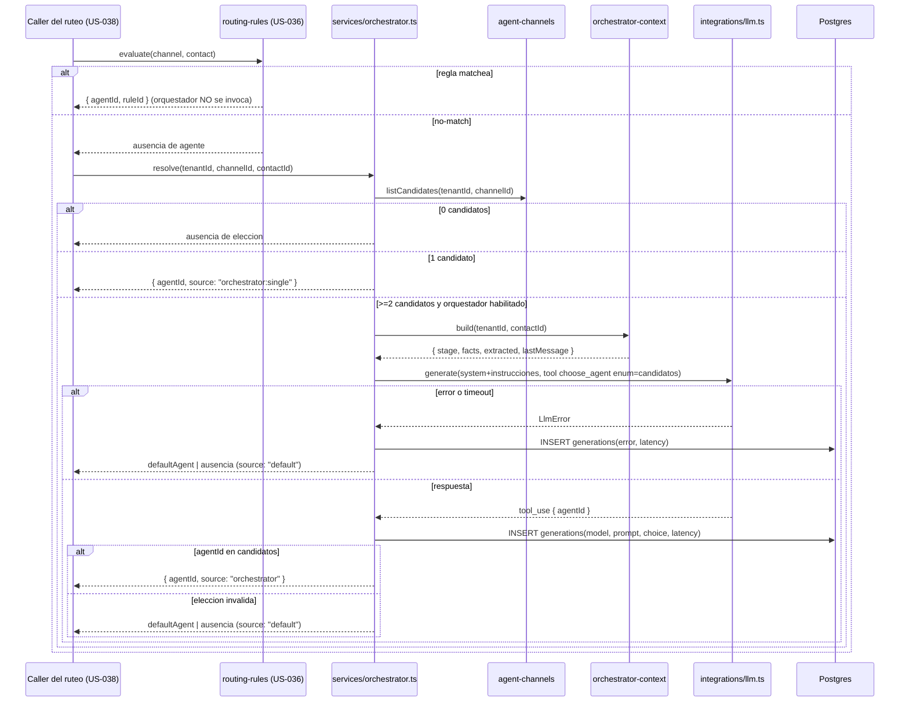
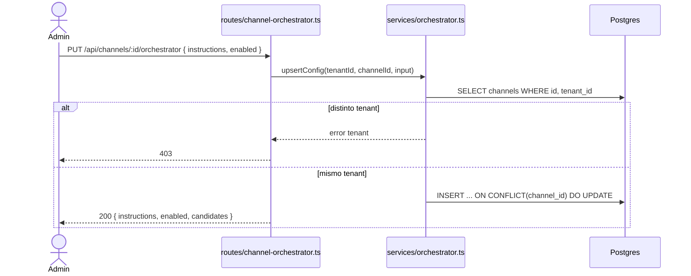

# Design — US-037 · Agente orquestador de ruteo (fallback LLM)

## Overview

Esta historia añade el segundo escalón del ruteo híbrido de E14: un orquestador por canal que se invoca solo cuando el motor de reglas (US-036) devuelve no-match. Se apoya en lo ya introducido en E13/US-035 (`agents`, `channels`, `agent_channels`, `contacts`, `channels.default_agent_id`) y reutiliza la infraestructura LLM existente (`apps/backend/src/integrations/llm.ts`, modelo global `env.LLM_MODEL`) y la traza `generations`. La pieza central es `orchestratorService.resolve(tenantId, channelId, contactId)`: arma el contexto del contacto (etapa, facts, datos extraídos, último mensaje), invoca un router LLM con **salida restringida** vía forced tool-use (`tool_choice: {type: "tool"}` y un `enum` de IDs candidatos en el `input_schema`), valida que la elección pertenezca a los candidatos del canal, y ante cualquier fallo/timeout/salida inválida cae al `channels.default_agent_id`. La configuración del orquestador (instrucciones + habilitación) vive en una tabla nueva `channel_orchestrators` (1:1 con canal). No se decide aquí dónde se llama `resolve` dentro del ciclo de la conversación: esa cadena y la fijación en `conversations.agent_id` son propiedad de US-038.

## Architecture

```mermaid
flowchart LR
  subgraph FE[apps/frontend - fuera de esta historia, US-039]
    UI[Config orquestador del canal]
  end
  subgraph BE[apps/backend - Hono]
    RORC[routes/channel-orchestrator.ts]
    SVC[services/orchestrator.ts]
    RULES[services/routing-rules.ts - US-036]
    AC[services/agent-channels.ts - US-035]
    CTX[services/orchestrator-context.ts]
    LLM[integrations/llm.ts - generate]
  end
  subgraph DB[(PostgreSQL - aislado por tenant_id)]
    CO[(channel_orchestrators)]
    ACH[(agent_channels)]
    CH[(channels.default_agent_id)]
    CON[(contacts: stage / facts / extracted)]
    GEN[(generations - traza)]
  end
  LLMAPI[[Anthropic Messages API]]

  UI -->|/api/channels/:id/orchestrator| RORC --> SVC
  SVC -->|candidatos del canal| AC --> ACH
  SVC -->|default del canal| CH
  SVC -->|contexto del contacto| CTX --> CON
  SVC -->|router LLM salida restringida| LLM --> LLMAPI
  SVC -->|traza| GEN
  RULES -.no-match.-> SVC
```

## Sequence Diagrams

### Resolución del orquestador en no-match de reglas



### Configurar el orquestador de un canal



## Components and Interfaces

### `orchestratorService` — `apps/backend/src/services/orchestrator.ts`

Responsabilidades: configuración por canal, decisión de invocar o no, invocación del router LLM con salida restringida, validación de la elección, fallback y traza.

```ts
type OrchestratorSource = "orchestrator" | "orchestrator:single" | "default";

interface OrchestratorResolution {
  agentId: string | null;            // null = sin elección y sin default (5.4)
  source: OrchestratorSource;        // de dónde salió el agente (5.5, 6.4)
}

interface OrchestratorService {
  upsertConfig(tenantId: string, channelId: string, input: { instructions: string | null; enabled: boolean }): Promise<void>; // 1.1, 1.2, 1.5
  getConfig(tenantId: string, channelId: string): Promise<{ instructions: string | null; enabled: boolean; candidates: AgentSummary[] }>; // 1.3, 1.4
  resolve(tenantId: string, channelId: string, contactId: string): Promise<OrchestratorResolution>; // 2.x, 3.x, 4.x, 5.x, 6.x
}
```

### `orchestratorContext` — `apps/backend/src/services/orchestrator-context.ts`

`build(tenantId, contactId)` devuelve `{ stage, facts, extracted, lastMessage }`. Lee `contacts.stage`, los `contact_facts` y `extracted_data` reanclados al contacto (E13), y el último mensaje del cliente de la conversación viva del contacto. Tolera ausencias (4.2).

### Router LLM — salida restringida (3.1, 3.2)

Reutiliza `generate()` de `apps/backend/src/integrations/llm.ts` (Anthropic Messages API, `env.LLM_MODEL`). La elección se restringe forzando tool-use con un único tool cuyo parámetro es un `enum` de los IDs candidatos:

```ts
const tool: LlmTool = {
  name: "choose_agent",
  description: "Elige el agente que debe atender al contacto.",
  input_schema: {
    type: "object",
    properties: {
      agent_id: { type: "string", enum: candidateIds }, // restringe la salida al conjunto candidato
    },
    required: ["agent_id"],
  },
};
// generate({ system, messages, tools: [tool] })  + tool_choice: { type: "tool", name: "choose_agent" }
```

El `enum` y `tool_choice` forzado garantizan que el modelo devuelva uno de los candidatos; aun así se valida en código contra el conjunto (defensa en profundidad, 3.2). `tool_choice` no se expone hoy en `generate()`: se añade un parámetro opcional `toolChoice` a su firma.

### Rutas — `apps/backend/src/routes/channel-orchestrator.ts`

`PUT /api/channels/:id/orchestrator` (upsert config), `GET /api/channels/:id/orchestrator`. Solo rol admin escribe; aislamiento por `tenantId` del contexto Clerk. Se monta en `apps/backend/src/index.ts`.

### Integración con el ruteo (US-036 → US-037)

US-037 expone `resolve()` como función pura de servicio; el caller que la encadena tras el no-match de reglas y fija el resultado en la conversación es US-038. Aquí solo se garantiza que `resolve()` puede invocarse de forma independiente y determinista dada la misma entrada.

## Data Models

### `channel_orchestrators` (nueva, 1:1 con canal)

| Campo | Tipo | Notas |
|---|---|---|
| `channel_id` | uuid pk fk channels.id (cascade) | clave 1:1 con el canal |
| `tenant_id` | text not null | aislamiento |
| `instructions` | text null | instrucciones de clasificación; null = sin instrucciones (1.4) |
| `enabled` | boolean not null default true | habilitación del orquestador (1.2, 2.3) |
| `created_at` | timestamptz default now | |
| `updated_at` | timestamptz default now | |
| _index_ | `(tenant_id)` | aislamiento/listados |

### `generations` (reutilizada de US-011) — traza del orquestador

| Campo | Uso en orquestador |
|---|---|
| `model` | modelo del router (`env.LLM_MODEL`) (6.1) |
| `prompt` | jsonb con system+instrucciones+contexto+candidatos enviados (6.1) |
| `response` | id del agente elegido o marca de fallback (6.2, 6.4) |
| `latency_ms` | latencia de la invocación (6.1) |
| `error` | mensaje de error/timeout del router (6.3) |
| `tenant_id` | aislamiento de trazas (6.5) |

> Nota: `generations` hoy exige `conversation_id` notNull y `bot_id`. Como el orquestador puede invocarse antes de fijar la conversación, esta historia relaja `generations` para soportar una traza de ruteo no atada a una conversación (migración: `bot_id`/`conversation_id` nullable, o columna `kind` con valor `orchestrator`). La decisión exacta se documenta en la tarea de migración; el contrato funcional es el de la tabla anterior.

### Lecturas (sin cambios de esquema)

| Concepto | Fuente |
|---|---|
| Candidatos del canal | `agent_channels(channel_id) → agents` (US-035) |
| Agente por defecto | `channels.default_agent_id` (US-035) |
| Contexto del contacto | `contacts.stage`, `contact_facts`, `extracted_data` (E13) |

## Algorithmic Pseudocode

```
function resolve(tenantId, channelId, contactId) -> { agentId, source }:
  precondición: canal y contacto pertenecen a tenantId; se invoca tras no-match de reglas (US-036)
  postcondición: agentId, si no es null, es candidato del canal; toda invocación al router deja traza

  cfg = getConfig(tenantId, channelId)
  candidates = listCandidates(tenantId, channelId)        -- 3.4 (mismo tenant/canal)

  if candidates.isEmpty(): return { null, "default" }      -- 2.4 (sin default tampoco hay agente)
  if not cfg.enabled: return defaultOr(channelId)          -- 2.3
  if candidates.size == 1: return { candidates[0].id, "orchestrator:single" }  -- 3.3

  ctx = orchestratorContext.build(tenantId, contactId)     -- 4.1, 4.2
  tool = chooseAgentTool(candidates)                       -- enum = ids de candidatos (3.1)
  started = now()
  try:
    res = llm.generate(system(cfg.instructions, candidates), userMsg(ctx), [tool], toolChoice=tool) within env.LLM_TIMEOUT_MS
  catch (LlmError e):                                      -- error o timeout (5.1, 5.2)
    trace(tenantId, model, prompt, error=e, latency=now()-started)
    return defaultOr(channelId)

  choice = parseToolUse(res, "choose_agent").agent_id
  trace(tenantId, model, prompt, response=choice, latency=now()-started)  -- 6.1, 6.2
  if choice in candidates.ids: return { choice, "orchestrator" }          -- 3.1
  return defaultOr(channelId)                                              -- 5.3 elección inválida

function defaultOr(channelId) -> { agentId, source }:
  d = channels.default_agent_id(channelId)
  if d is null: return { null, "default" }                 -- 5.4
  traceFallback(tenantId)                                   -- 6.4
  return { d, "default" }                                   -- 5.5
```

## Correctness Properties

- **P1 (salida restringida)** — todo `agentId` no-null devuelto por `resolve` con `source == "orchestrator"` o `"orchestrator:single"` es candidato del canal (`agent_channels(agentId, channelId)` existe). El orquestador nunca devuelve un agente no candidato ni inventado.
- **P2 (invocación condicionada)** — el router LLM solo se invoca cuando el motor de reglas devolvió no-match, el orquestador está habilitado y hay ≥2 candidatos; en cualquier otro caso `resolve` no llama al LLM.
- **P3 (fallback total)** — ante error, timeout o elección inválida del router, `resolve` devuelve `channels.default_agent_id` si existe, o `null` si no; nunca propaga la excepción del LLM al caller.
- **P4 (traza honesta)** — toda invocación al router produce exactamente una traza en `generations`: con `response` si hubo elección, con `error` si falló/agotó tiempo; toda resolución por fallback queda marcada como tal.
- **P5 (aislamiento por tenant)** — `resolve`, `getConfig` y `upsertConfig` solo leen/escriben filas cuyo `tenant_id` == tenant del contexto; los candidatos y trazas considerados son del canal/tenant consultado.
- **P6 (determinismo de gating)** — para la misma entrada (mismas reglas en no-match, misma config, mismos candidatos, mismo default), la rama de `resolve` que se toma (single / fallback / invocar LLM / sin agente) es siempre la misma, con independencia de la respuesta no determinista del LLM.

## Error Handling

| Escenario | Respuesta | Recuperación |
|---|---|---|
| Router LLM devuelve error (5xx, API) | fallback a default, traza con error (5.1, 6.3) | reintento en siguiente conversación |
| Router LLM excede `env.LLM_TIMEOUT_MS` | fallback a default, traza con error (5.2, 6.3) | — |
| Respuesta no contiene tool_use válido / id fuera de enum | elección inválida → fallback a default (5.3) | — |
| Canal sin candidatos | ausencia de elección, sin invocar LLM (2.4) | el admin asigna candidatos (US-035) |
| Canal con candidatos pero sin default y elección inválida | ausencia de agente (5.4) | el admin fija un default (US-035) |
| Orquestador deshabilitado | fallback a default sin invocar LLM (2.3) | — |
| Config/consulta de orquestador de otro tenant | 403 (1.5) | — |

## Testing Strategy

- Unit: construcción del tool con `enum` de candidatos; validación de la elección contra el conjunto; ramas de gating (0/1/≥2 candidatos, habilitado/deshabilitado); `defaultOr` con y sin default.
- Property-based (fast-check): P1 (con un LLM fake que devuelve ids arbitrarios, `resolve` nunca emite un id fuera de candidatos); P3 (inyectando error/timeout/elección inválida en cualquier orden, siempre cae a default o null); P6 (la rama de gating es función pura de la config y los candidatos).
- Integration: no-match de reglas → orquestador elige candidato y traza queda en `generations`; LLM caído → fallback a default con traza de error; deshabilitado → no se invoca el LLM; aislamiento cross-tenant en config y trazas (P5).

## Performance / Security / Dependencies

- Coste/latencia: el router LLM solo se invoca en no-match con ≥2 candidatos y orquestador habilitado (P2); el caso de 1 candidato y los fallbacks no pagan llamada al LLM. `env.LLM_TIMEOUT_MS` acota la latencia del peor caso.
- Reutiliza `integrations/llm.ts` (Anthropic Messages API, `env.LLM_MODEL` global) y la traza `generations`; se añade `toolChoice` opcional a `generate()` sin romper sus callers actuales.
- Migración Drizzle: tabla `channel_orchestrators` (1:1 canal, cascade) y relajación de `generations` para trazar ruteo no atado a conversación. Idempotente y sin pérdida de datos.
- Seguridad: solo rol admin (Clerk `org:admin`) escribe la config; lectura para member del tenant. La elección restringida (enum + validación en código) impide enrutar a agentes ajenos al canal o al tenant.

## Trazabilidad

Cubre requisitos: 1.1, 1.2, 1.3, 1.4, 1.5, 2.1, 2.2, 2.3, 2.4, 3.1, 3.2, 3.3, 3.4, 4.1, 4.2, 4.3, 5.1, 5.2, 5.3, 5.4, 5.5, 6.1, 6.2, 6.3, 6.4, 6.5.
