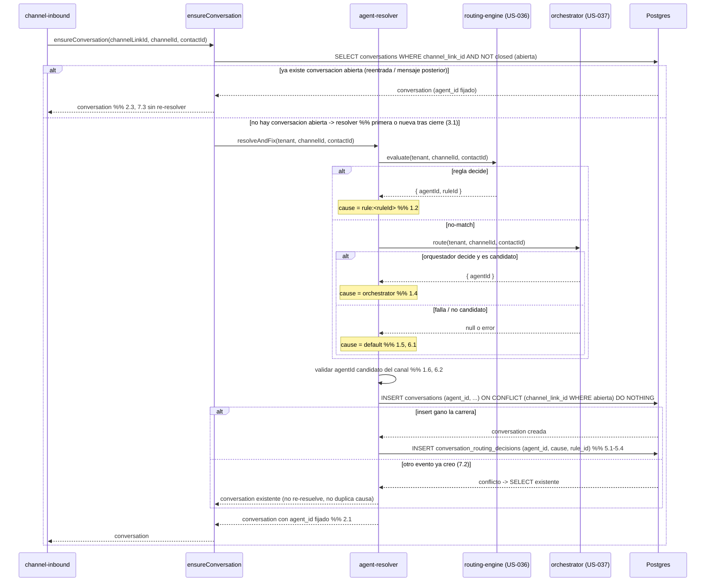
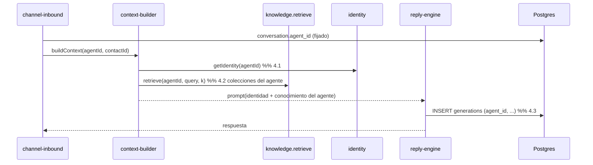

# Design — US-038 · Resolucion y fijacion del agente al inicio de la conversacion

## Overview

Un servicio `agentResolver.resolveAndFix(tenantId, channelId, contactId)` que encadena los tres mecanismos ya construidos: `routingEngine.evaluate` (US-036) -> `orchestrator.route` (US-037) -> `channels.default_agent_id` (US-035), y devuelve `{ agentId, cause }`. La resolucion ocurre exactamente una vez por conversacion, en el punto de creacion: se inserta `conversations` con `agent_id` no nulo dentro de la misma operacion. La idempotencia y la re-resolucion se concilian con un `unique` PARCIAL sobre `channel_link_id` limitado a la conversacion ABIERTA (no cerrada): reentradas y carreras del webhook que abren la primera conversacion no crean duplicados ni reasignan (D3, R7), mientras que una conversacion nueva tras un cierre SI crea una fila nueva y vuelve a resolver, coexistiendo con la cerrada (D3, R3). La causa se persiste en una tabla append-only `conversation_routing_decisions` (una fila por conversacion). El pipeline de inbound (`channel-inbound`, `context-builder`, `knowledge.retrieve`, `identity`, `reply-engine`) deja de leer `botId` para identidad/conocimiento/generacion y usa el `agent_id` fijado de la conversacion. Se reutiliza el patron de auditoria de `conversation_transitions`/`bot_status_transitions`.

## Architecture

```mermaid
flowchart TB
  WH[[Webhook entrante Evolution / Chatwoot]]
  subgraph BE[apps/backend - Hono]
    CI[services/channel-inbound.ts handleChannelMessage]
    CS[services/conversation-state.ts ensureConversation]
    AR[services/agent-resolver.ts resolveAndFix]
    RE[services/routing-engine.ts evaluate · US-036]
    OR[services/orchestrator.ts route · US-037]
    PIPE[context-builder / knowledge.retrieve / identity / reply-engine]
    RR[routes/conversations.ts GET routing]
  end
  subgraph DB[(PostgreSQL - aislado por tenant_id)]
    CONV[(conversations.agent_id)]
    DEC[(conversation_routing_decisions)]
    CHN[(channels.default_agent_id · US-035)]
    AC[(agent_channels · US-035)]
    AKC[(agent_knowledge_collections · E13)]
  end

  WH --> CI
  CI --> CS
  CS -->|conversacion nueva| AR
  CS -->|conversacion existente| PIPE
  AR -->|1 reglas| RE
  AR -->|2 no-match| OR
  AR -->|3 fallback| CHN
  RE --> AC
  OR --> AC
  AR -->|INSERT con agent_id| CONV
  AR -->|INSERT causa| DEC
  PIPE -->|agent_id fijado| CONV
  PIPE --> AKC
  RR --> CONV
  RR --> DEC
```

## Sequence Diagrams

### Resolucion y fijacion al crear la conversacion (con idempotencia)



### Pipeline de inbound usando el agente fijado



## Components and Interfaces

### `agentResolver` — `apps/backend/src/services/agent-resolver.ts`

Responsabilidades: encadenar reglas -> orquestador -> default, validar candidatura, fijar el agente al crear la conversacion de forma idempotente, registrar la causa.

```ts
type RoutingCause =
  | { kind: "rule"; ruleId: string }
  | { kind: "orchestrator" }
  | { kind: "default" };

interface ResolveResult {
  agentId: string;
  cause: RoutingCause;
}

interface AgentResolver {
  // Resuelve sin persistir (pura sobre I/O de lectura). 1.1-1.6, 6.1-6.2
  resolve(tenantId: string, channelId: string, contactId: string): Promise<ResolveResult>;
  // Crea la conversacion fijando el agente + causa, idempotente por channel_link_id. 2.1, 5.1-5.4, 6.3, 7.1-7.4
  resolveAndFix(input: {
    tenantId: string;
    channelId: string;
    channelLinkId: string;
    contactId: string;
  }): Promise<{ conversation: ConversationRow; created: boolean; cause: RoutingCause | null }>;
}
```

### `conversation-state` — `apps/backend/src/services/conversation-state.ts` (modificado)

`ensureConversation` deja de crear la conversacion con solo `botId`: cuando no existe conversacion ABIERTA para el `channel_link_id`, delega en `agentResolver.resolveAndFix` para que la creacion incluya `agent_id` (esto cubre tanto la primera conversacion como una nueva tras cierre, 3.1). Si ya existe una conversacion abierta, la devuelve tal cual sin re-resolver (2.3, 7.3). Se anade `getAgentForConversation(convo): agentId` y se conserva la lectura por el `unique` parcial de conversacion abierta por `channel_link_id` como lock natural anti-duplicado.

### `channel-inbound` — `apps/backend/src/services/channel-inbound.ts` (modificado)

`handleChannelMessage` obtiene el `channelLinkId`/`contactId` (E13/US-033) y llama a `ensureConversation`; a partir de aqui usa `conversation.agent_id` en lugar de `findBotForChannel`/`botId` para todo el pipeline (4.1-4.3).

### `orchestrator` — `apps/backend/src/services/orchestrator.ts` (consumido, definido en US-037)

`route(tenantId, channelId, contactId): Promise<{ agentId: string } | null>`. El resolver lo invoca solo en no-match de reglas y trata cualquier excepcion o agente no candidato como ausencia de decision (6.1, 6.2).

### Rutas — `apps/backend/src/routes/conversations.ts` (extension)

`GET /api/conversations/:id/routing` devuelve `{ agentId, cause }` leyendo `conversations.agent_id` y `conversation_routing_decisions`. Solo lectura, aislado por `tenantId` del contexto Clerk (5.5).

## Data Models

### `conversations` (campo anadido) — `apps/backend/src/db/schema.ts`

| Campo | Tipo DB | Notas |
|---|---|---|
| `agent_id` | `uuid not null fk agents.id on delete restrict` | agente FIJADO al crear la conversacion (D3). `restrict` para no perder la trazabilidad del agente que atendio. |
| `closed_at` | `timestamptz null` | marca de cierre de la conversacion; `null` = abierta. Discriminador para el `unique` parcial y para re-resolver una conversacion nueva (3.1, 3.3). |
| _index_ | `conversations_agent_idx (agent_id)` | lecturas del pipeline por agente. |
| _constraint_ | `unique(channel_link_id) WHERE closed_at IS NULL` (partial) | a lo sumo UNA conversacion abierta por channel_link; actua de lock anti-duplicado de la conversacion viva (7.1, 7.2) y a la vez permite que una conversacion cerrada coexista con una nueva (3.3). Reemplaza al `unique(channel_link_id)` total legacy. |

> Migracion (E13/E14): el `botId` historico ya fue migrado a `agentId` por la migracion 1-bot-1-agente (US-030). Aqui `agent_id` se vuelve no nulo poblando las conversaciones existentes con el agente del bot migrado, se anade `closed_at` (null por defecto) y se sustituye el `unique(channel_link_id)` total por el `unique` parcial sobre conversaciones abiertas.

### `conversation_routing_decisions` (nueva, append-only)

| Campo | Tipo DB | Notas |
|---|---|---|
| `id` | `uuid pk default random` | |
| `tenant_id` | `text not null` | aislamiento (5.5). |
| `conversation_id` | `uuid not null fk conversations.id on delete cascade` | conversacion fijada. |
| `agent_id` | `uuid not null fk agents.id on delete restrict` | agente que quedo fijado. |
| `cause` | `text not null` | `rule` \| `orchestrator` \| `default` (5.1, 5.3, 5.4, 6.4). |
| `rule_id` | `uuid null fk routing_rules.id on delete set null` | regla que decidio, solo si `cause = rule` (5.2). |
| `created_at` | `timestamptz not null default now()` | |
| _constraint_ | `unique(conversation_id)` | una sola causa por conversacion (7.4). |

## Algorithmic Pseudocode

```
function resolve(tenantId, channelId, contactId) -> ResolveResult:
  precondicion: contacto y canal del mismo tenant; canal con >=1 agente candidato
  postcondicion: agentId devuelto es candidato del canal; cause coherente con el eslabon usado
  # 1) reglas (US-036)
  d = routingEngine.evaluate(tenantId, channelId, contactId)   # {agentId,ruleId} | null
  if d != null and isCandidate(channelId, d.agentId):          # 1.1, 1.2, 6.2
    return { agentId: d.agentId, cause: {kind:"rule", ruleId:d.ruleId} }
  # 2) orquestador (US-037)
  try:
    o = orchestrator.route(tenantId, channelId, contactId)     # {agentId} | null  # 1.3
    if o != null and isCandidate(channelId, o.agentId):        # 1.4, 6.2
      return { agentId: o.agentId, cause: {kind:"orchestrator"} }
  catch: pass                                                  # 6.1 fallo => sigue al default
  # 3) agente por defecto (US-035)
  def = channels.default_agent_id(channelId)
  if def != null and isCandidate(channelId, def):              # 1.5
    return { agentId: def, cause: {kind:"default"} }
  raise NoServiceableAgentError                                # 6.3
```

```
function resolveAndFix({tenantId, channelId, channelLinkId, contactId}):
  precondicion: channelLinkId pertenece al tenant
  postcondicion: existe exactamente una conversation ABIERTA por channel_link_id con agent_id no nulo;
                 a lo sumo una fila en conversation_routing_decisions por conversacion
  existing = SELECT conversations WHERE channel_link_id = channelLinkId AND closed_at IS NULL  # conversacion abierta
  if existing: return { conversation: existing, created: false, cause: null }   # 2.3, 7.3
  r = resolve(tenantId, channelId, contactId)                                   # cadena 1.x/6.x; re-resuelve tras cierre (3.1)
  inserted = INSERT conversations (tenant_id, agent_id=r.agentId, channel_link_id, mode='bot', closed_at=null)
             ON CONFLICT (channel_link_id) WHERE closed_at IS NULL DO NOTHING RETURNING *   # 7.1, 7.2
  if inserted is null:                                                          # otro evento gano la carrera
    return { conversation: SELECT ... channel_link_id AND closed_at IS NULL, created: false, cause: null }
  INSERT conversation_routing_decisions (conversation_id=inserted.id,
         agent_id=r.agentId, cause=r.cause.kind, rule_id=r.cause.ruleId?)       # 5.1-5.4, 6.4
    ON CONFLICT (conversation_id) DO NOTHING                                    # 7.4
  return { conversation: inserted, created: true, cause: r.cause }
```

## Correctness Properties

- **P1 (orden de la cadena)** — para todo contacto, el agente resuelto proviene de reglas si una regla decide; en su defecto del orquestador si decide; en su defecto del agente por defecto. Nunca se consulta un eslabon posterior si uno anterior decidio un agente candidato.
- **P2 (fijacion una sola vez)** — una conversacion conserva el mismo `agent_id` desde su creacion hasta su cierre; ninguna operacion del pipeline lo modifica (D3).
- **P3 (no re-resolucion en caliente)** — para una conversacion ya existente, `ensureConversation` devuelve el agente fijado sin invocar el resolver.
- **P4 (re-resolucion por conversacion)** — al iniciar una conversacion nueva (no existe conversacion ABIERTA para el `channel_link_id`, p.ej. tras cerrar la anterior), el resolver se ejecuta de nuevo y puede fijar un agente distinto al de una conversacion anterior cerrada, que coexiste sin verse alterada.
- **P5 (candidatura del resultado)** — todo `agent_id` fijado es candidato del canal (`agent_channels(channelId, agentId)`) en el momento de fijarlo; un agente no candidato decidido por una regla u orquestador se descarta y se avanza en la cadena.
- **P6 (idempotencia/unicidad)** — ante N reentradas o eventos concurrentes del primer mensaje de un contacto en un canal, existe a lo sumo una conversacion abierta (`unique(channel_link_id) WHERE closed_at IS NULL`) y a lo sumo una fila de causa por conversacion (`unique(conversation_id)`).
- **P7 (causa fiel)** — la causa registrada coincide con el eslabon que realmente fijo el agente (rule/orchestrator/default), incluido el caso en que un fallo de orquestador derivo al default.
- **P8 (siempre atendible o rechazo explicito)** — el resolver o devuelve un agente candidato atendible, o lanza `NoServiceableAgentError` cuando el canal no tiene default ni ningun eslabon decide; nunca fija un agente invalido ni deja la conversacion sin agente.
- **P9 (aislamiento por tenant)** — la resolucion solo lee reglas, candidatos, default y datos del contacto del mismo `tenant_id`; la consulta de ruteo nunca devuelve datos de otro tenant.

## Error Handling

| Escenario | Respuesta | Recuperación |
|---|---|---|
| Orquestador lanza error o timeout | se ignora y se usa el default (6.1); causa = `default` | reintento natural del orquestador en la siguiente conversacion |
| Agente de regla/orquestador ya no candidato | se descarta y avanza la cadena (6.2) | el admin reasigna candidatos (US-035) |
| Canal sin default y sin decision | `NoServiceableAgentError`; no se crea conversacion (6.3) | el admin fija un agente por defecto |
| Reentrada del webhook tras fijar | conversacion existente reutilizada; sin re-resolver (7.3) | — |
| Dos eventos concurrentes del primer mensaje | `ON CONFLICT DO NOTHING`; un solo insert y una sola causa (7.2, 7.4) | — |
| Consulta de ruteo de conversacion de otro tenant | 404/403 (5.5, P9) | — |

## Testing Strategy

- Unit: `resolve` por rama (regla decide / no-match->orquestador decide / fallback default / orquestador falla->default / agente decidido no candidato->avanza); construccion de `RoutingCause`.
- Property-based (fast-check): P1 (orden de la cadena con combinaciones de decisiones de cada eslabon), P5 (un agente no candidato nunca queda fijado), P7 (causa == eslabon real), P6 (N invocaciones concurrentes/repetidas de `resolveAndFix` dejan 1 conversacion y 1 causa) con orquestador y motor de reglas fake determinista.
- Integration: dos contactos en el MISMO canal con `stage=post_sale` y `stage=pre_sale` se fijan a agentes distintos (escenario de aceptacion); reentrada del webhook no duplica ni reasigna (P6); conversacion nueva tras cierre re-resuelve (P4); pipeline usa identidad/retrieve/generacion del agente fijado (4.1-4.3); aislamiento cross-tenant en `GET /routing` (P9).

## Performance / Security / Dependencies

- Depende de US-035 (`agent_channels`, `channels.default_agent_id`, `contacts.stage`), US-036 (`routingEngine.evaluate`) y US-037 (`orchestrator.route`), y de E13 (`agents`, `contacts`, `agent_knowledge_collections`).
- La resolucion ocurre una sola vez por conversacion; el camino caliente (mensajes posteriores) es un unico `SELECT` de la conversacion abierta por `channel_link_id` (apoyado en el `unique` parcial). El orquestador (LLM) solo se invoca en no-match de reglas, acotando el coste.
- Seguridad: todas las lecturas/escrituras scopeadas por `tenant_id` (P9). El `unique(channel_link_id) WHERE closed_at IS NULL` y el `unique(conversation_id)` garantizan la idempotencia sin locks aplicativos. El agente fijado se referencia con `on delete restrict` para preservar trazabilidad.

## Trazabilidad

Cubre requisitos: 1.1, 1.2, 1.3, 1.4, 1.5, 1.6, 2.1, 2.2, 2.3, 2.4, 3.1, 3.2, 3.3, 4.1, 4.2, 4.3, 5.1, 5.2, 5.3, 5.4, 5.5, 6.1, 6.2, 6.3, 6.4, 7.1, 7.2, 7.3, 7.4.
