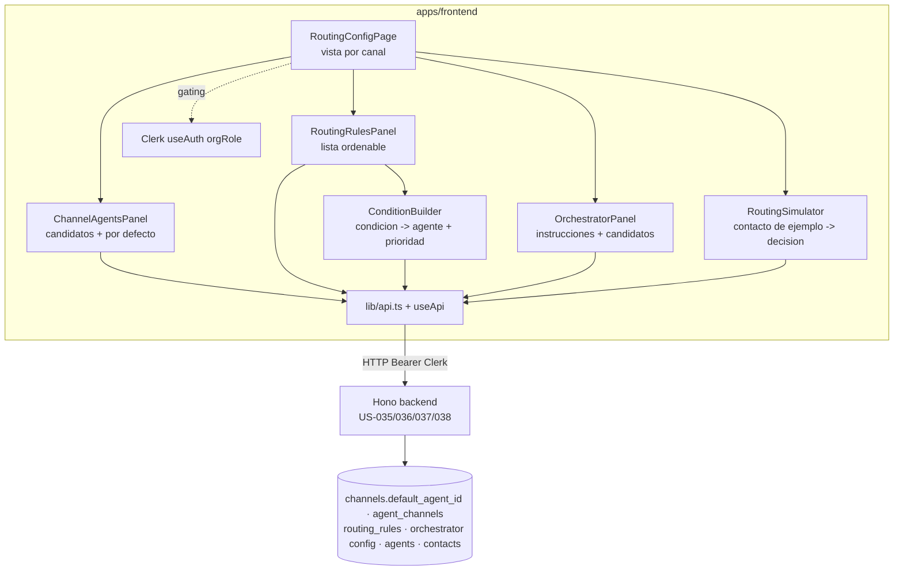
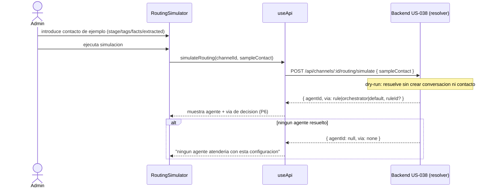

# Design — US-039 · UI de configuracion de ruteo multi-agente

## Overview

UI de administracion del ruteo multi-agente por canal en `apps/frontend`, montada sobre el stack existente (React + Vite + TanStack Query + Clerk `useAuth().orgRole` + primitivas `@/components/ui` + cliente `useApi`/`lib/api.ts`). Replica el patron de paneles por recurso (espejo de `AgentChannelsPanel` de US-034 y `ChannelsPanel`), pero contra los contratos de ruteo de E14: candidatos y agente por defecto del canal (US-035), reglas (`routing_rules`, US-036), orquestador (US-037) y resolver (US-038). La pagina organiza el trabajo en una vista por canal con secciones: Candidatos + agente por defecto, Reglas (constructor + lista ordenable), Orquestador, y un Simulador que llama al endpoint de resolucion en modo dry-run con un contacto de ejemplo. Esta historia no crea backend: consume DTOs ya definidos; el aislamiento por tenant y la autorizacion los garantiza el backend, y la UI solo los refleja. Reutiliza `Card`, `Badge`, `Button`, `Input`, `Select`, `Tabs`, `EmptyState`, `Loading`, `ErrorText`, `PageHeader` del design system (E09).

## Architecture



## Sequence Diagrams

### Carga de la vista y alta de una regla

```mermaid
sequenceDiagram
  actor Admin
  participant UI as RoutingConfigPage / RoutingRulesPanel
  participant API as useApi
  participant BE as Backend US-035/036
  Admin->>UI: abre configuracion de ruteo del canal
  UI->>API: getChannelRouting(channelId)
  API->>BE: GET /api/channels/:id/routing
  BE-->>API: { candidates[], defaultAgentId, rules[], orchestrator }
  API-->>UI: render (candidatos, reglas ordenadas, orquestador)
  Admin->>UI: crea regla (condicion + agente destino + prioridad)
  UI->>UI: valida agente destino ∈ candidates (P3)
  UI->>API: createRule(channelId, { condition, agentId, priority })
  API->>BE: POST /api/channels/:id/routing/rules
  alt agente no candidato / condicion invalida
    BE-->>API: 422 motivo
    API-->>UI: error inline; datos conservados (P7)
  else ok
    BE-->>API: 200 { rule }
    API-->>UI: invalida query; regla aparece ordenada por prioridad (P4)
  end
```

### Simulacion de la resolucion (dry-run)



## Components and Interfaces

### `RoutingConfigPage` — `apps/frontend/src/pages/channels/RoutingConfigPage.tsx`
Responsabilidades: cargar la configuracion de ruteo del canal (1.1, 6.1, 6.2), gatear acciones por `orgRole` (7.1, 7.2), componer las secciones (candidatos, reglas, orquestador, simulador), deshabilitar secciones cuando no hay candidatos (1.6).

```ts
type RoutingSection = "agents" | "rules" | "orchestrator" | "simulator";
```

### `ChannelAgentsPanel` — `apps/frontend/src/pages/channels/ChannelAgentsPanel.tsx`
Responsabilidades: listar candidatos y agente por defecto (1.1), agregar/quitar candidatos (1.2, 1.3), elegir agente por defecto entre candidatos (1.4), impedir baja de un candidato en uso como default o destino de regla (1.5), solo lectura para member (7.2).

```ts
interface ChannelAgentsPanelProps {
  channelId: string;
  candidates: RoutingAgent[];
  defaultAgentId: string | null;
  isAdmin: boolean;
}
interface RoutingAgent { id: string; name: string; status: "draft" | "active" | "paused" }
```

### `RoutingRulesPanel` — `apps/frontend/src/pages/channels/RoutingRulesPanel.tsx`
Responsabilidades: listar reglas por prioridad ascendente (3.1), reordenar (3.2), activar/desactivar (3.3), borrar con confirmacion (3.4), distinguir reglas deshabilitadas (3.5), abrir el editor de regla (2.1, 2.2), solo lectura para member (7.2).

### `ConditionBuilder` — `apps/frontend/src/pages/channels/ConditionBuilder.tsx`
Responsabilidades: construir la condicion con campos del contacto y operadores soportados (2.3), elegir agente destino entre candidatos (2.5), validar completitud antes de enviar (2.4), conservar datos ante rechazo del backend (2.6).

```ts
type ConditionField = "stage" | "tags" | "has_purchased" | `facts.${string}` | `extracted.${string}`;
type ConditionOp = "eq" | "ne" | "in" | "exists" | "gt" | "gte" | "lt" | "lte";
interface RuleDraft {
  condition: unknown;      // arbol DSL (and/or/not + comparaciones); contrato de US-036
  agentId: string | null;  // debe pertenecer a candidates (P3)
  priority: number;
  enabled: boolean;
}
```

### `OrchestratorPanel` — `apps/frontend/src/pages/channels/OrchestratorPanel.tsx`
Responsabilidades: mostrar y editar instrucciones del orquestador (4.1, 4.2), marcar/desmarcar candidatos elegibles (4.3), restringir elegibles a candidatos del canal (4.4), conservar valores ante error (4.5), solo lectura para member (7.2).

### `RoutingSimulator` — `apps/frontend/src/pages/channels/RoutingSimulator.tsx`
Responsabilidades: capturar un contacto de ejemplo (5.1), ejecutar la simulacion (5.1), mostrar agente y via de decision (5.2, 5.3), indicar no-resolucion (5.4), reiniciar resultado al cambiar la entrada (5.5), no persistir el ejemplo (5.6), disponible tambien para member (7.3).

```ts
interface SampleContact {
  stage: string | null;
  tags: string[];
  facts: Record<string, string>;
  extracted: Record<string, unknown>;
}
interface SimulationResult {
  agentId: string | null;
  agentName: string | null;
  via: "rule" | "orchestrator" | "default" | "none";
  ruleId: string | null;       // presente solo si via === "rule"
}
```

### Cliente API — `apps/frontend/src/lib/api.ts`
Añade metodos al cliente `useApi` (Bearer de Clerk, mismo `request`/`json.data` que el resto). Todos consumen contratos de US-035 a US-038; esta historia no los implementa en backend.

```ts
interface RoutingApi {
  getChannelRouting(channelId: string): Promise<ChannelRouting>;                                 // 1.1, 3.1, 4.1, 6.1
  addCandidate(channelId: string, agentId: string): Promise<void>;                               // 1.2
  removeCandidate(channelId: string, agentId: string): Promise<void>;                            // 1.3, 1.5
  setDefaultAgent(channelId: string, agentId: string | null): Promise<void>;                     // 1.4
  createRule(channelId: string, draft: RuleDraft): Promise<RoutingRule>;                          // 2.1, 2.5
  updateRule(channelId: string, ruleId: string, patch: Partial<RuleDraft>): Promise<RoutingRule>;// 2.2, 3.3
  reorderRules(channelId: string, orderedRuleIds: string[]): Promise<void>;                       // 3.2
  deleteRule(channelId: string, ruleId: string): Promise<void>;                                  // 3.4
  updateOrchestrator(channelId: string, patch: OrchestratorPatch): Promise<OrchestratorConfig>;  // 4.2, 4.3
  simulateRouting(channelId: string, sample: SampleContact): Promise<SimulationResult>;          // 5.1-5.4
}

interface ChannelRouting {
  candidates: RoutingAgent[];
  defaultAgentId: string | null;
  rules: RoutingRule[];               // ordenadas por priority asc
  orchestrator: OrchestratorConfig;
}
interface RoutingRule { id: string; condition: unknown; agentId: string; priority: number; enabled: boolean }
interface OrchestratorConfig { instructions: string; candidateAgentIds: string[] }
type OrchestratorPatch = { instructions?: string; candidateAgentIds?: string[] };
```

### Ruteo — `apps/frontend/src/App.tsx` y `apps/frontend/src/components/Layout.tsx`
Ruta `/channels/:channelId/routing` (o pestaña "Ruteo" dentro del detalle de canal de US-026); entrada de navegacion accesible desde el canal.

## Data Models

La UI no crea tablas; consume el modelo de E14. Mapeo UI ↔ DTO ↔ DB (nombres canonicos de US-035/036/037/038):

| Campo (UI) | DTO API | DB | Transformacion |
|---|---|---|---|
| Agentes candidatos | `candidates[]` | `agent_channels(agent_id, channel_id)` ⋈ `agents` | join por canal del tenant |
| Agente por defecto | `defaultAgentId` | `channels.default_agent_id` | `null` ⇒ "sin agente por defecto" |
| Regla: condicion | `rule.condition` | `routing_rules.condition` jsonb (DSL) | passthrough del arbol DSL de US-036 |
| Regla: agente destino | `rule.agentId` | `routing_rules.agent_id` | debe estar en `candidates` (P3) |
| Regla: prioridad | `rule.priority` | `routing_rules.priority` int | menor = se evalua primero (asc) |
| Regla: habilitacion | `rule.enabled` | `routing_rules.enabled` bool | passthrough |
| Orquestador: instrucciones | `orchestrator.instructions` | config de orquestador por canal (US-037) | passthrough |
| Orquestador: candidatos | `orchestrator.candidateAgentIds[]` | subconjunto de `agent_channels` del canal | ⊆ `candidates` (P3) |
| Contacto de ejemplo | `SampleContact` | — (no persiste) | dry-run; sin escritura en `contacts` (P5) |
| Resultado de simulacion | `SimulationResult` | derivado por resolver (US-038) | `via` ∈ {rule, orchestrator, default, none}; `ruleId` solo si `via=rule` |

## Algorithmic Pseudocode

```
function validRuleDraft(draft, candidates):
  precondicion: draft.agentId puede ser null; candidates = candidatos del canal
  postcondicion: true solo si el draft es enviable
  if draft.agentId == null: return false                 # 2.4
  if draft.agentId not in idsOf(candidates): return false # 2.5 (P3)
  if not conditionComplete(draft.condition): return false # 2.4
  return true
```

```
function describeDecision(result, rules):
  precondicion: result = SimulationResult devuelto por simulateRouting
  postcondicion: texto y referencia que explican la via de decision (P6)
  switch result.via:
    case "rule":         return ("Resuelto por regla", findById(rules, result.ruleId))  # 5.3
    case "orchestrator": return ("Resuelto por el orquestador", null)                   # 5.2
    case "default":      return ("Resuelto por el agente por defecto", null)            # 5.2
    case "none":         return ("Ningun agente atenderia con esta configuracion", null)# 5.4
```

```
function canWrite(orgRole):
  precondicion: orgRole en {org:admin, org:member}
  postcondicion: true solo si el usuario puede mutar la configuracion de ruteo
  if orgRole == "org:admin": return true   # 7.1
  return false                              # 7.2 (member solo lectura; simulador permitido 7.3)
```

## Correctness Properties

- **P1 (aislamiento por tenant)** — toda entidad mostrada (canal, agente candidato, regla, configuracion de orquestador) pertenece al tenant activo; la UI nunca presenta recursos de otro tenant.
- **P2 (gating por rol)** — para `org:member`, todos los controles de escritura (alta/baja de candidatos, agente por defecto, alta/edicion/orden/habilitacion/borrado de reglas, ajustes del orquestador) estan deshabilitados u ocultos; el simulador permanece disponible en solo lectura.
- **P3 (destino ⊆ candidatos)** — el agente destino de una regla y los candidatos elegibles del orquestador propuestos por la UI son siempre un subconjunto de los candidatos del canal; la UI no envia mutaciones que violen esa pertenencia.
- **P4 (orden por prioridad)** — la lista de reglas se presenta y se persiste ordenada por prioridad ascendente; tras reordenar, el orden mostrado coincide con el enviado.
- **P5 (simulacion no destructiva)** — ejecutar el simulador con un contacto de ejemplo no crea ni modifica contactos, reglas, conversaciones ni ningun otro dato del tenant.
- **P6 (decision explicada)** — todo resultado de simulacion expone una via de decision (regla, orquestador, agente por defecto o ninguno) y, cuando la via es una regla, identifica cual.
- **P7 (consistencia tras mutacion)** — tras una mutacion exitosa la vista refleja el nuevo estado (invalidacion de query); tras un fallo, el estado mostrado es el previo a la operacion y los datos del formulario se conservan.

## Error Handling

| Escenario | Respuesta | Recuperacion |
|---|---|---|
| Falla `getChannelRouting` | mensaje de error + boton reintentar | reintento manual (6.2) |
| Canal sin candidatos | secciones de reglas/orquestador/default deshabilitadas con aviso | agregar candidato primero (1.6) |
| Quitar candidato en uso (default o destino de regla) | aviso del motivo, sin mutacion | reasignar antes de quitar (1.5) |
| Regla sin destino o condicion incompleta | envio bloqueado + aviso inline | completar campos (2.4) |
| Destino no candidato | seleccion impedida / guardado bloqueado | elegir candidato valido (2.5, P3) |
| Backend rechaza alta/edicion de regla | error inline, datos conservados | corregir y reenviar (2.6, P7) |
| Backend rechaza cambio de orquestador | error inline, valores conservados | reintentar (4.5, P7) |
| Mutacion falla (cualquiera) | error + estado previo restaurado | reintentar (6.4, P7) |
| Rechazo por permisos | aviso del motivo, sin alterar estado | — (7.4) |
| Simulacion sin resolucion | mensaje "ningun agente atenderia" | ajustar reglas/default (5.4) |

## Testing Strategy

- Unit: `validRuleDraft` (sin destino, destino no candidato, condicion incompleta, draft valido); `describeDecision` (cada via); `canWrite` por `orgRole`; render de reglas deshabilitadas distinto de activas (3.5).
- Property-based (fast-check): P2 (para cualquier rol member ningun control de escritura habilitado, simulador si); P3 (para cualquier conjunto de candidatos y cualquier draft, la UI solo envia destinos ⊆ candidatos); P4 (para cualquier permutacion de reglas, el orden mostrado = orden enviado); P7 (mutacion ok ⇒ estado nuevo, mutacion error ⇒ estado previo) con cliente API fake.
- Integration (componentes con cliente mockeado): carga -> agregar candidato -> crear regla -> reordenar -> ver reflejado; simular contacto de ejemplo y ver via de decision (rule/orchestrator/default/none); member entra en solo lectura y puede simular; verificar que el simulador no dispara mutaciones (P5) interceptando el cliente.

## Performance / Security / Dependencies

- Depende de los contratos de backend de US-035 (candidatos + agente por defecto + etapa), US-036 (reglas y DSL), US-037 (orquestador) y US-038 (resolver con modo dry-run de simulacion); si esos endpoints cambian, ajustar `lib/api.ts`. El endpoint de simulacion (`POST /api/channels/:id/routing/simulate`) debe existir como dry-run del resolver de US-038 (dependencia declarada en Notes de `tasks.md`).
- Seguridad: la autorizacion real vive en backend (esta UI no es la frontera de seguridad); la UI solo refleja permisos (P2) y el aislamiento por tenant (P1). El token de Clerk con claims de org viaja en cada request (patron `useApi`). El simulador no escribe datos (P5).
- Performance: queries cacheadas con TanStack Query e invalidacion selectiva por canal; el reorden hace una sola mutacion `reorderRules` con los ids en orden; el simulador no se cachea (cada ejecucion es una accion explicita del admin).
- Reutiliza `Card`, `Badge`, `Button`, `Input`, `Select`, `Tabs`, `EmptyState`, `Loading`, `ErrorText`, `PageHeader` del design system (E09). El drag-and-drop del reorden reutiliza la primitiva existente o un fallback de botones subir/bajar.

## Trazabilidad

Cubre requisitos: 1.1, 1.2, 1.3, 1.4, 1.5, 1.6, 2.1, 2.2, 2.3, 2.4, 2.5, 2.6, 3.1, 3.2, 3.3, 3.4, 3.5, 4.1, 4.2, 4.3, 4.4, 4.5, 5.1, 5.2, 5.3, 5.4, 5.5, 5.6, 6.1, 6.2, 6.3, 6.4, 7.1, 7.2, 7.3, 7.4.
