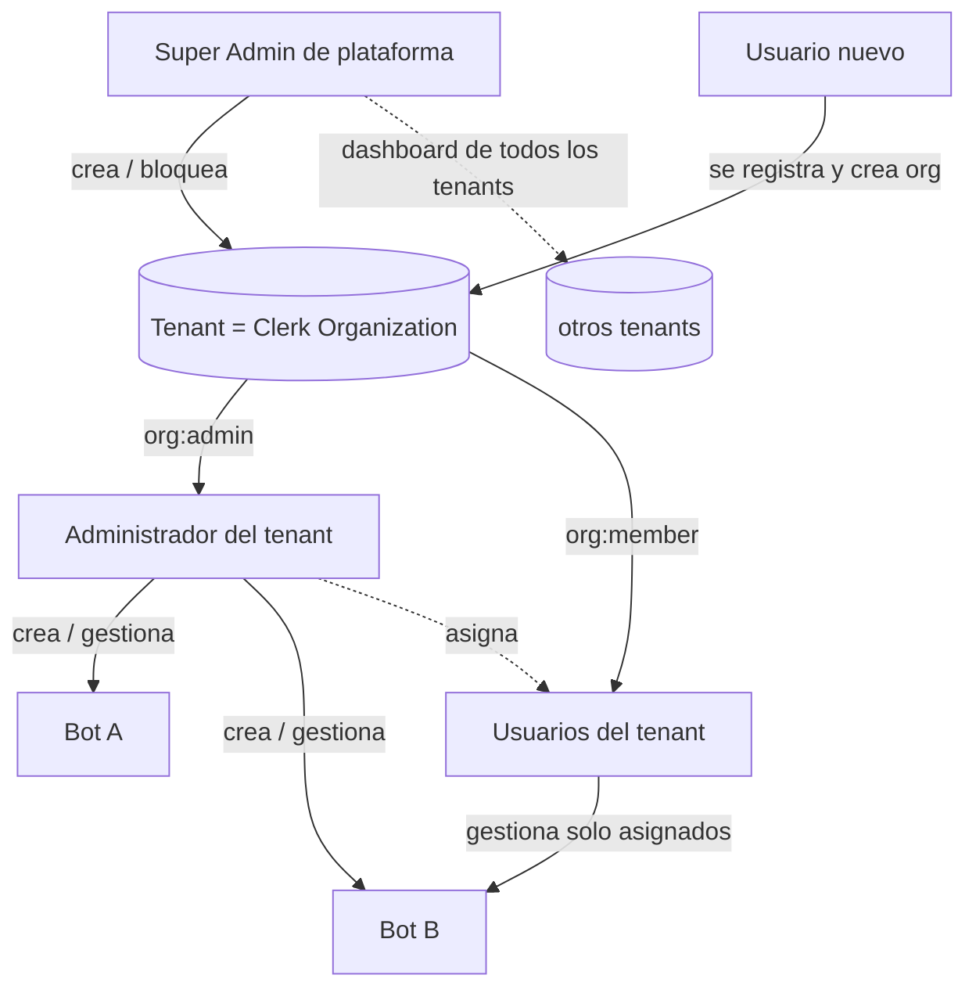
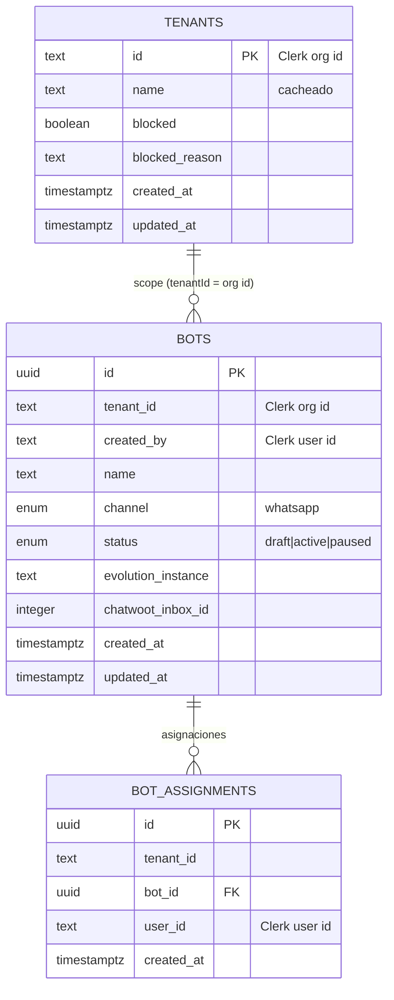
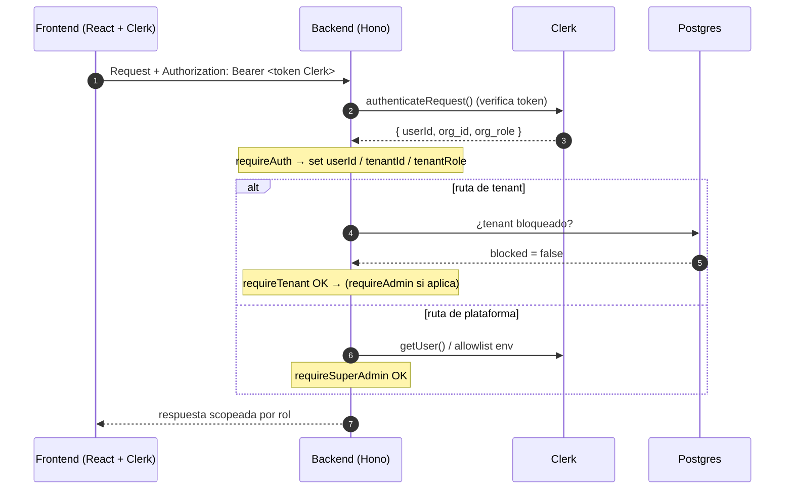

# Informe de avance — Autenticación, multitenancy y super admin

**Proyecto:** bot-plataform · **Sección:** capa de autenticación y control de acceso
**Estado:** ✅ implementado, compila y typecheck en verde · pendiente de commit y despliegue
**Stack afectado:** backend (Hono) · frontend (React) · paquete compartido · base de datos (Drizzle/Postgres)

---

## 1. Resumen ejecutivo

Se construyó la capa completa de autenticación y autorización de la plataforma sobre **Clerk (managed)** con un modelo **multitenant de tres niveles**:

1. **Super Admin de plataforma** — por encima de los tenants. Crea y bloquea organizaciones, ve un dashboard con todos los tenants.
2. **Administrador de tenant** (`org:admin`) — gestiona los bots de su organización, invita usuarios y les asigna bots.
3. **Usuario** (`org:member`) — gestiona únicamente los bots que le asignen.

El tenant se modela como una **Organización de Clerk**, evitando construir a mano el registro, login, invitaciones y gestión de roles. En la base de datos solo se guarda lo que Clerk no cubre: la asignación bot↔usuario y el estado de bloqueo de cada tenant.

---

## 2. Jerarquía de roles

| Rol | Nivel | Cómo se otorga | Puede |
|---|---|---|---|
| **Super Admin** | Plataforma | `SUPERADMIN_USER_IDS` (env, bootstrap) o `publicMetadata.role="superadmin"` en Clerk | Listar/crear/bloquear tenants; dashboard global; no requiere pertenecer a una org |
| **Admin de tenant** | Tenant | Rol Clerk `org:admin` (automático al crear la org) | Crear/editar/eliminar bots; invitar usuarios; asignar bots |
| **Usuario** | Tenant | Rol Clerk `org:member` (al ser invitado) | Ver y gestionar solo los bots asignados |

---

## 3. Decisiones de diseño

| Decisión | Elección | Motivo |
|---|---|---|
| Multitenancy | **Clerk Organizations** | Registro, login, invitaciones y roles ya resueltos; coherente con elegir Clerk por ser liviano. |
| Designación de super admin | **Env allowlist + metadata de Clerk** | El env permite *bootstrapear* el primer super admin; la metadata permite gestionarlos después sin redeploy. |
| "Bloquear" tenant | **Flag reversible en DB propia** (`tenants.blocked`) | No destructivo (no borra la organización ni sus datos); reversible; enforcement barato en cada request. |
| Asignación bot↔usuario | **Tabla propia `bot_assignments`** | Clerk no modela permisos a nivel de recurso; granularidad que el negocio requiere. |
| Enforcement del bloqueo | **Comprobación en `requireTenant`** | Un único punto de control; el super admin queda exento. |

---

## 4. Modelo de datos (nuevo)

> La **fuente de verdad de usuarios/membresías/roles es Clerk**. La DB solo guarda datos de negocio scopeados por `tenantId` más flags de plataforma.

**Migraciones generadas:** `0000_wise_frank_castle.sql` (bots + asignaciones) y `0001_quiet_mimic.sql` (tenants).

---

## 5. Flujo de autorización (backend)

**Middlewares** (`apps/backend/src/middleware/auth.ts`):

- `requireAuth` — verifica el token de Clerk y expone `userId`, `tenantId` (`org_id`), `tenantRole` (`org_role`).
- `requireTenant` — exige org activa y que **no esté bloqueada**.
- `requireAdmin` — exige rol `org:admin`.
- `requireSuperAdmin` — exige super admin de plataforma (`resolveSuperAdmin`).

---

## 6. Endpoints

| Método | Ruta | Acceso | Descripción |
|---|---|---|---|
| `GET` | `/api/me` | Autenticado | Identidad + tenant + rol + `isSuperAdmin` |
| `GET` | `/api/bots` | Tenant | Admin: todos los del tenant · Member: solo asignados |
| `POST` `PATCH` `DELETE` | `/api/bots[/:id]` | Admin de tenant | CRUD de bots |
| `GET` | `/api/team/members` | Admin de tenant | Miembros del tenant (desde Clerk) |
| `GET` `POST` | `/api/team/assignments` | Admin de tenant | Listar / crear asignaciones bot↔usuario |
| `DELETE` | `/api/team/assignments/:id` | Admin de tenant | Quitar asignación |
| `GET` `POST` | `/api/admin/tenants` | **Super Admin** | Listar (con métricas) / crear tenants |
| `POST` | `/api/admin/tenants/:id/block` · `/unblock` | **Super Admin** | Bloquear / desbloquear tenant |

---

## 7. Frontend

| Vista | Archivo | Acceso |
|---|---|---|
| Login / bienvenida | `App.tsx` (`Landing`) | Público |
| Crear tenant (onboarding) | `App.tsx` (`TenantGate` → `CreateOrganization`) | Usuario sin org |
| Bots | `pages/BotsPage.tsx` | Tenant (admin crea; member ve asignados) |
| Equipo (miembros × bots) | `pages/TeamPage.tsx` | Admin de tenant |
| **Dashboard de plataforma** | `pages/AdminPage.tsx` | **Super Admin** |
| Layout + navegación + `OrganizationSwitcher` | `components/Layout.tsx` | — |

**Gating de rutas** (`App.tsx`): `TenantGate` protege las vistas de tenant (y redirige al super admin sin org hacia `/admin`); `SuperAdminGate` protege `/admin`. El cliente API (`lib/api.ts` + `lib/useApi.ts`) adjunta automáticamente el token de Clerk con los claims de organización; `lib/useMe.ts` se re-consulta al cambiar de tenant activo.

---

## 8. Archivos entregados

**Nuevos**
- `apps/backend/src/routes/admin.ts` — dashboard de plataforma (listar/crear/bloquear tenants)
- `apps/backend/src/routes/me.ts` · `routes/team.ts` — identidad y gestión de equipo
- `apps/backend/src/lib/clerk.ts` — cliente Clerk compartido
- `apps/backend/drizzle/0000_*.sql` · `0001_*.sql` — migraciones
- `apps/frontend/src/pages/AdminPage.tsx` — UI del dashboard de super admin
- `apps/frontend/src/lib/useMe.ts` · `useApi.ts` — hooks de datos
- `apps/frontend/src/components/Layout.tsx` — layout y navegación por rol

**Modificados**
- `apps/backend/src/middleware/auth.ts` — middlewares de auth/tenant/admin/super admin
- `apps/backend/src/db/schema.ts` — tablas `bots`, `bot_assignments`, `tenants`
- `apps/backend/src/routes/bots.ts` — scoping por tenant y rol
- `apps/backend/src/env.ts` · `index.ts` — env y montaje de rutas
- `packages/shared/src/index.ts` — tipos/schemas compartidos
- `apps/frontend/src/App.tsx` · `lib/api.ts` — routing y cliente API
- `README.md` · `.env.example` (backend e infra) — documentación

---

## 9. Pendiente / requisitos antes de producción

1. **Habilitar Organizations en el dashboard de Clerk** (*Configure → Organizations*) — sin esto el registro de tenants no funciona.
2. **Definir el primer super admin** vía `SUPERADMIN_USER_IDS` (Clerk user id).
3. **Aplicar migraciones** (`pnpm db:migrate`) contra el Postgres `labs`.
4. **Variables de entorno** de Clerk (`sk_*` / `pk_*`) en backend y frontend.

### Mejoras opcionales propuestas (no incluidas)
- *Drill-down* de super admin a los datos de un tenant (`?tenantId=` con bypass) para "acceso absoluto a todo" a nivel de datos.
- Eliminación definitiva de tenants (hoy solo bloqueo reversible).
- Cambio de roles de miembros desde la propia UI (hoy vía la UI nativa de Clerk).

---

> Documento generado automáticamente como informe de avance de la sección de autenticación. Para el detalle operativo y de despliegue, ver `README.md` e `infra/dokploy/README.md`.
