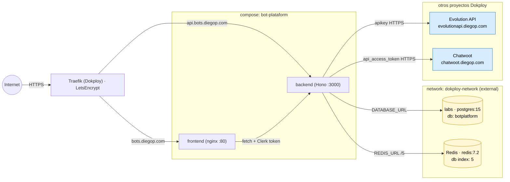

# Infra Dokploy — bot-plataform

Despliegue del monorepo (backend Hono + frontend React) en `https://dokploy.diegop.com`. Mismo patrón que [`evolutionapi`](../../../../dokploy/projects/evolutionapi) y `chatwoot`: compose + IDs en `dokploy.json` + este README. Los secretos viven solo en el Environment de Dokploy.

| Campo | Valor |
|---|---|
| Host Dokploy | `https://dokploy.diegop.com` |
| Proyecto | `bot-plataform` (ver `dokploy.json`) |
| Compose | build desde GitHub, `./infra/dokploy/docker-compose.yml` |
| Frontend | `https://bots.diegop.com` → service `frontend:80` |
| Backend | `https://api.bots.diegop.com` → service `backend:3000` |

## Arquitectura en el host



## Pre-requisitos

1. **DB en el postgres compartido `labs`.** Conéctate por SSH al host Dokploy (Cloudflare bloquea el puerto externo — ver memoria `dokploy_external_access`) y crea:
   ```sql
   CREATE USER botplatform WITH PASSWORD '<genera-uno>';
   CREATE DATABASE botplatform OWNER botplatform;
   GRANT ALL PRIVILEGES ON DATABASE botplatform TO botplatform;
   ```
2. **DNS** de `bots.diegop.com` y `api.bots.diegop.com` apuntando al host (Cloudflare).
3. **GitHub provider** conectado en Dokploy (Settings → Git Providers) y el repo del submódulo `bot-plataform` accesible.
4. **Clerk**: app creada, **Organizations habilitado** (Configure → Organizations) y claves `sk_*` / `pk_*` a mano. El multitenancy depende de Organizations.
5. **Tokens**: `apikey` de Evolution API y `api_access_token` de Chatwoot.

## Pasos de despliegue (skill dokploy-api)

> Ruta de la skill desde la raíz de cloud-manager: `_system/dokploy/skills/dokploy-api/scripts` (o `.claude/skills/dokploy-api/scripts`).

```bash
# 1) Crear proyecto (crea env "production" automáticamente)
python3 <skill>/dokploy_client.py POST /project.create \
  name=bot-plataform description="Bots sobre Evolution API + Chatwoot"

# 2) Crear el compose en el environment production
python3 <skill>/dokploy_client.py POST /compose.create \
  name=bot-plataform environmentId=<ENV_ID> composeType=docker-compose

# 3) Conectar GitHub + path del compose (build necesita el monorepo entero)
python3 <skill>/deploy_compose_from_github.py \
  --project-id <PROJECT_ID> --env-name production \
  --name bot-plataform --owner <owner> --repo bot-plataform --branch main \
  --compose-path infra/dokploy/docker-compose.yml --auto-deploy

# 4) Pegar el Environment (.env) del compose con los secretos (ver .env.example)
#    Dokploy UI -> Compose -> Environment, o vía compose.update env=...

# 5) Dominios
python3 <skill>/add_domain.py --compose-id <COMPOSE_ID> \
  --host bots.diegop.com --service-name frontend --port 80
python3 <skill>/add_domain.py --compose-id <COMPOSE_ID> \
  --host api.bots.diegop.com --service-name backend --port 3000

# 6) Migraciones de DB (una vez): generar y aplicar
#    Local, apuntando DATABASE_URL al postgres (vía SSH tunnel):
pnpm db:generate && pnpm db:migrate

# 7) Deploy + tail
python3 <skill>/dokploy_client.py POST /compose.deploy composeId=<COMPOSE_ID>
python3 <skill>/tail_deployment.py --compose-id <COMPOSE_ID> --watch
```

## Webhooks entrantes

Registrar en cada servicio apuntando al backend con el `WEBHOOK_SECRET`:

- **Evolution API** → `https://api.bots.diegop.com/webhooks/evolution?secret=<WEBHOOK_SECRET>`
- **Chatwoot** → `https://api.bots.diegop.com/webhooks/chatwoot?secret=<WEBHOOK_SECRET>`

## Operación

```bash
# Redeploy
python3 <skill>/dokploy_client.py POST /compose.deploy composeId=<COMPOSE_ID>
# Estado / logs
python3 <skill>/tail_deployment.py --compose-id <COMPOSE_ID>
```

## Archivos

| Archivo | Qué es |
|---|---|
| `docker-compose.yml` | Compose final (backend + frontend) para Dokploy. |
| `.env.example` | Plantilla de variables del compose. Sin secretos. |
| `dokploy.json` | IDs y metadatos para automatización. Sin secretos. |
| `README.md` | Este archivo. |
